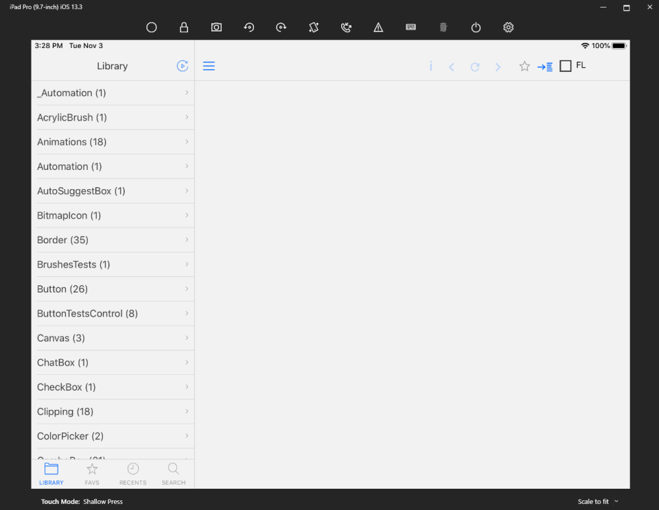

# Using the SamplesApp

The SamplesApp in Uno.UI is an Uno application containing a large number of UI and non-UI samples. It serves a few purposes:

* Allow for manually testing new features and investigating bugs,
* Provide UI for [automated UI tests](creating-ui-tests.md),
* Allow automated comparison of static snapshots between Uno versions,
* Document the functionality supported by Uno.

This article details how to run SamplesApp and how to add a new sample.

For instructions on working with automated UI tests, [go here](creating-ui-tests.md).

## Running SamplesApp

The SamplesApp from latest master branch for WebAssembly is available online: https://aka.platform.uno/wasm-samples-app

To run the SamplesApp locally:

1. Ensure [your environment is configured](xref:Uno.GetStarted.vs2022) for the platform you want to run on.
2. Open Uno.UI with the [correct target override and solution filter](building-uno-ui.md) for the platform you want to run on.
3. Select `SamplesApp.[Platform]` as the startup app. (Eg, `SamplesApp.iOS` if you're running on iOS.)
4. If you're testing on a mobile platform, use a tablet if possible, as the app is optimized for a tablet layout.
5. Run SamplesApp.

If everything builds successfully, the app will run. The app is a collection of samples, grouped into categories. You can navigate to a sample using the menu on the left.



### Running-debugging the WebAssembly app on a mobile device

By default, SamplesApp starts in debugging mode on localhost, making it inaccessible from external devices, even if they are on the same network. To remedy this, you can utilize Visual Studio 2022/2026 Dev Tunnels to establish an externally accessible URL for your application. For more details, refer to the [Microsoft Learn documentation](https://learn.microsoft.com/aspnet/core/test/dev-tunnels). If the option doesn't appear initially, consider running a rebuild of the `SamplesApp.Wasm` project.

## Sample organization

Samples are located in the [`UITests.Shared` project](https://github.com/unoplatform/uno/tree/master/src/SamplesApp/UITests.Shared). UI-related samples are generally grouped by control, or by functional area for samples that aren't specific to a particular control (eg `VisualStateTests`). Non-UI samples are generally grouped by namespace of the tested feature.

Note that there's no 'master list' of samples. Instead, individual samples are tagged with `SampleAttribute` (or `SampleControlInfoAttribute`, for older samples), and the SamplesApp automatically picks up all samples using the attribute.

### SampleAttribute

`SampleAttribute` accepts one or more optional categories, as well as an optional `Name` and `Description`, and a `ViewModelType` property which can be used to set a `Type` which will be instantiated and used as the `DataContext` of the sample control. If a category and/or a name aren't explicitly set, then the sample name and category will be automatically determined from the class name and the last part of the namespace.

**Examples:**

In the first example, no parameters are supplied to the `Sample` attribute. The sample will be included under the name `ToolTip_Long_Text`, in the `ToolTip` category.

```csharp
namespace UITests.Windows_UI_Xaml_Controls.ToolTip
{
 [Sample]
 public sealed partial class ToolTip_Long_Text : UserControl
```

In the second example, the category and name are manually specified, and a view-model type is specified to use as the `DataContext` of the sample.

```csharp
namespace UITests.Windows_Devices.Haptics
{
 [Sample("Windows.Devices", Name = "Haptics.VibrationDevice", ViewModelType = typeof(VibrationDeviceTestsViewModel))]
 public sealed partial class VibrationDeviceTests : Page
```

## Adding a new sample

To add a new sample to the SamplesApp:

1. Locate the folder corresponding to the control or class you want to create a sample for in the `UITests.Shared` project. The folder structure is typically `Namespace_In_Snake_Case/ControlNameTests`.
2. Create a new `UserControl` from the Visual Studio templates, with a meaningful name.
3. Add your sample UI to the `UserControl`.
4. Add the `[Uno.UI.Samples.Controls.Sample]` attribute to the class in the code-behind partial file.
5. Double-check that the category name matches other samples for the control.
6. Run the `SamplesApp` to check that your sample appears in the browser and works as expected.

## Adding a manual test sample

Some tests cannot be validated automatically, and need to be flagged with the `IsManualTest` property on `SampleAttribute`. These tests will be filtered in the Samples App to be validated by a human.

The content of those tests must describe a scenario to follow, what to expect, and which exceptional conditions may need to be validated. If the result is visual, an image or video resource file may be needed as well.

## Sample snapshots on the CI

Each CI build of Uno.UI records screenshots of each sample in the SamplesApp. A diff tool details screenshots that have changed from the previous master build, allowing unexpected changes in the visual output to be caught.

### Running the snapshot taker locally on WebAssembly

The WebAssembly head has the ability to be run through puppeteer, and displays all tests in sequence. Puppeteer runs a headless version of Chromium, suited for running tests in a CI environment.

To run the tests:

* Navigate to the `SamplesApp.Wasm.UITests` folder and run `npm i`. This will download Puppeteer and the Chrome driver.
* Build the `SamplesApp.Wasm.UITests.njsproj` project
* Press `F5`, node will start and run the tests sequentially
* The screen shots are placed in a folder named `out`

Note that the same operation is run during the CI, in a specific job running under Linux. The screen shots are located in the Unit Tests section under `Screenshots Compare Test Run` as well as in the build artifact.

## Validating the WebAssembly UI Tests results

In the CI build, an artifact named `wasm-uitests` is generated and contains an HTML file that shows all the differences
for screenshots taken for the past builds. Download this artifact and open the html file to determine if any screenshots
have changed.

### Troubleshooting the tests

It is possible to enable the chromium head using the configuration parameters in the [app.ts](https://github.com/unoplatform/uno/blob/master/src/SamplesApp/SamplesApp.Wasm.UITests/app.ts) file.

## Creating performance benchmarks with BenchmarkDotNet

Performance is measured using [BenchmarkDotNet](https://benchmarkdotnet.org/), in the suite located in the `SamplesApp.Benchmarks` shared project.

A few points to consider when adding benchmarks:

* Make a folder using the namespace separated by `_`
* Avoid putting a large number of benchmarks in a single class. Those tests are run synchronously under
WebAssembly, and this will allow for progress reporting to be visible.
