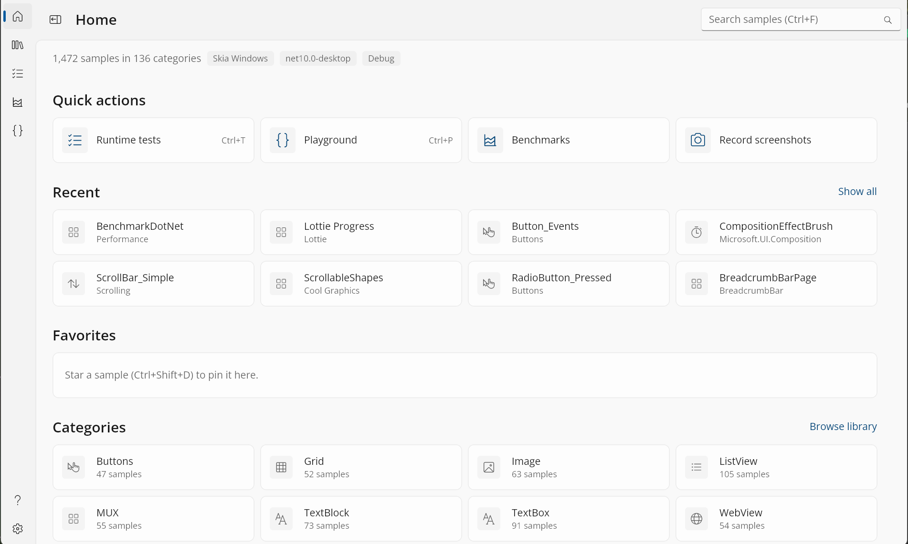

# Using the SamplesApp

The SamplesApp in Uno.UI is an Uno application containing a large number of UI and non-UI samples. It serves a few purposes:

* Allow for manually testing new features and investigating bugs,
* Provide UI for [automated UI tests](creating-ui-tests.md),
* Allow automated comparison of static snapshots between Uno versions,
* Document the functionality supported by Uno.

This article details how to run SamplesApp and how to add a new sample.

For instructions on working with automated UI tests, [go here](creating-ui-tests.md).

## Running SamplesApp

The SamplesApp from latest master branch for WebAssembly is available online: https://aka.platform.uno/wasm-samples-app

To run the SamplesApp locally:

1. Ensure [your environment is configured](xref:Uno.GetStarted.vs2022) for the platform you want to run on.
2. Open Uno.UI with the [correct target override and solution filter](building-uno-ui.md) for the platform you want to run on.
3. Select `SamplesApp` as the startup app. This is a single multi-targeted head that covers every platform.
4. Pick the platform from the target framework dropdown next to the run button — `net10.0-desktop`, `net10.0-browserwasm`, `net10.0-android`, `net10.0-ios`, `net10.0-tvos`, or the `windows10.0` (WinUI) target. Select the target explicitly the first time: `net10.0-browserwasm` comes first in the list, so it is what a fresh checkout defaults to.
5. If you're testing on a mobile platform, a phone works too: the app adapts its layout to the window width.
6. Run SamplesApp.

> [!NOTE]
> `SamplesApp` needs no bootstrap step. It imports the in-repo Uno.Sdk directly from `src/Uno.Sdk` by path, so the project loads and builds straight from a fresh clone without packing anything into a local NuGet feed first.

If everything builds successfully, the app will run and open on **Home**. The app is a collection of samples, grouped into categories. You can open one from Home, from the sample browser, or with the search box.



## Finding your way around

The app has a narrow **rail** on the left, a **header** on top, and the sample itself below the header.

* **Rail:** Home, Library (opens the sample browser), Runtime tests, Benchmarks (only in builds that include them), Playground, then Help and Settings at the bottom. On a phone-width window the rail is replaced by a menu button that opens the sample browser, with the same destinations at its bottom.
* **Sample browser:** a pane with three tabs. *Recent* lists the samples you opened last, *Favorites* the ones you starred, and *Library* every category. The *Manual tests* chip narrows the Library to samples flagged with `IsManualTest`.
* **Search:** type in the header search box. Enter opens the top result, Ctrl+Enter lists every result in the browser, and Esc clears the search.
* **Header:** shows the current sample with its category, plus previous, next and reload, Favorite, Info, Quick settings and a more menu. Info shows the sample type, link, launch argument and source file, each with a copy button.
* **Settings:** theme, right-to-left, Fluent styles, the FPS indicator, the startup page and other switches, grouped by purpose. Quick settings in the header has the most used ones.
* **Focus mode** (F11): hides the shell so only the sample remains.

> [!NOTE]
> Right-to-left mirrors the layout on every platform, but on Skia some text is still drawn left-aligned or with its punctuation reordered (see [#24904](https://github.com/unoplatform/uno/issues/24904)). That is an Uno Platform text rendering bug, not a SamplesApp one, so the shell intentionally does not work around it.

### Keyboard shortcuts

The shortcuts are defined once, in `ShellCommands.cs`, and the in-app **Help** page (F1) is built from that list. `/` is the one exception: it is a typed character rather than an accelerator, so Help adds it to the search row itself. Some shortcuts collide with browser shortcuts on WebAssembly, and Help says what to use instead in a browser.

| Shortcut | Action |
|---|---|
| Ctrl+F, `/`, Ctrl+K | Search samples (`/` only outside a text box) |
| Ctrl+B | Show or hide the sample browser |
| Ctrl+Shift+E | Library tab |
| Ctrl+Shift+F | Favorites tab |
| Ctrl+H, Alt+R | Recent tab (Alt+R also works in a browser) |
| Alt+Left, Alt+Right | Previous, next sample |
| F5 | Reload the sample |
| Ctrl+Shift+D | Add or remove from favorites |
| Ctrl+I | Sample info |
| Ctrl+Shift+L | Copy the sample's deep link |
| Ctrl+T, Ctrl+P | Runtime tests, Playground |
| Alt+Shift+H | Home |
| Ctrl+, | Settings |
| F1 | Help |
| F6, Shift+F6 | Move focus between rail, header, browser and sample |
| F11 | Focus mode |

### Launch arguments

On desktop, arguments go after `--`. `sample=` and `theme=` are joined with `&` in one argument, while each `--FeatureConfiguration` flag is its own, space-separated argument. In a browser they are query string parameters (`?sample=...`), and on Android they are passed as the `UnoArguments` intent extra.

```bash
dotnet run --project src/SamplesApp/SamplesApp -f net10.0-desktop -- "sample=Buttons/Button_Events&theme=Dark"
```

| Argument | Effect |
|---|---|
| `sample=Category/Name` | Opens that sample at startup. A bare sample name or the full type name works as well. |
| `theme=Light`, `Dark` or `System` | Starts with that theme, without saving it. |
| `--runtime-tests=<file>` | Runs the [runtime tests](creating-runtime-tests.md), writes the results to `<file>` and exits. |
| `--runtime-test-filter=<base64>` | Limits the run to the pipe-separated test names in the value, UTF-8 and base64 encoded. |
| `--runtime-tests-group=<n>`, `--runtime-tests-group-count=<total>` | Runs one slice of the tests. |
| `--auto-screenshots=<dir>` | Screenshots every sample into `<dir>` and exits. `--total-groups` and `--current-group-index` split the work. |
| `--FeatureConfiguration.<Class>.<Property>=<value>` | Sets a `FeatureConfiguration` flag on desktop. Pass each flag as a separate argument, not joined with `&`. |

The `UNO_SHOW_FPS`, `UNO_LOG_FPS` and `UNO_PERF_*` environment variables turn on the frame counter and the benchmark sweeps; the Help page lists them.

### Running-debugging the WebAssembly app on a mobile device

By default, SamplesApp starts in debugging mode on localhost, making it inaccessible from external devices, even if they are on the same network. To remedy this, you can utilize Visual Studio Dev Tunnels to establish an externally accessible URL for your application. For more details, refer to the [Microsoft Learn documentation](https://learn.microsoft.com/aspnet/core/test/dev-tunnels). If the option doesn't appear initially, consider running a rebuild of the `SamplesApp.Wasm` project.

## Sample organization

Samples are located in the [`SamplesApp.Samples` folder](https://github.com/unoplatform/uno/tree/master/src/SamplesApp/SamplesApp.Samples). UI-related samples are generally grouped by control, or by functional area for samples that aren't specific to a particular control (eg `VisualStateTests`). Non-UI samples are generally grouped by namespace of the tested feature.

Note that there's no 'master list' of samples. Instead, individual samples are tagged with `SampleAttribute`, and the SamplesApp automatically picks up all samples using the attribute.

### SampleAttribute

`SampleAttribute` accepts one or more optional categories, as well as an optional `Name` and `Description`, and a `ViewModelType` property which can be used to set a `Type` which will be instantiated and used as the `DataContext` of the sample control. If a category and/or a name aren't explicitly set, then the sample name and category will be automatically determined from the class name and the last part of the namespace.

**Examples:**

In the first example, no parameters are supplied to the `Sample` attribute. The sample will be included under the name `ToolTip_Long_Text`, in the `ToolTip` category.

```csharp
namespace UITests.Windows_UI_Xaml_Controls.ToolTip
{
 [Sample]
 public sealed partial class ToolTip_Long_Text : UserControl
```

In the second example, the category and name are manually specified, and a view-model type is specified to use as the `DataContext` of the sample.

```csharp
namespace UITests.Windows_Devices.Haptics
{
 [Sample("Windows.Devices", Name = "Haptics.VibrationDevice", ViewModelType = typeof(VibrationDeviceTestsViewModel))]
 public sealed partial class VibrationDeviceTests : Page
```

## Adding a new sample

To add a new sample to the SamplesApp:

1. Locate the folder corresponding to the control or class you want to create a sample for in `src/SamplesApp/SamplesApp.Samples/`. Folders form a nested hierarchy mirroring the API namespace — the same layout as `src/Uno.UI` — so a `Button` sample lives under `Microsoft/UI/Xaml/Controls/Button/` (WinUI 3 namespaces live under `Microsoft/`; pure WinRT APIs such as `Windows.Storage` keep `Windows/`). Note that the C# namespaces still use the older underscore form (`UITests.Shared.Windows_UI_Xaml_Controls.Button`), so copy the namespace from a neighboring sample rather than deriving it from the folder path.
2. Create a new `UserControl` from the Visual Studio templates, with a meaningful name.
3. Add your sample UI to the `UserControl`.
4. Add the `[Uno.UI.Samples.Controls.Sample]` attribute to the class in the code-behind partial file. The XAML and code-behind are picked up automatically — no project registration required.
5. Format your XAML file: `dotnet xstyler -f src/SamplesApp/SamplesApp.Samples/YourFolder/YourSample.xaml` (requires `dotnet tool restore` first, see [Code style](../contributing/guidelines/code-style.md#xaml-formatting-samplesapp)).
6. Double-check that the category name matches other samples for the control.
7. Run the `SamplesApp` to check that your sample appears in the browser and works as expected.

## Adding a manual test sample

Some tests cannot be validated automatically, and need to be flagged with the `IsManualTest` property on `SampleAttribute`. These tests will be filtered in the Samples App to be validated by a human.

The content of those tests must describe a scenario to follow, what to expect, and which exceptional conditions may need to be validated. If the result is visual, an image or video resource file may be needed as well.

## Sample snapshots on the CI

Each CI build of Uno.UI records screenshots of each sample in the SamplesApp. A diff tool details screenshots that have changed from the previous master build, allowing unexpected changes in the visual output to be caught.

The snapshots are taken during the CI, in a specific job running under Linux. They are located in the Unit Tests section under `Screenshots Compare Test Run` as well as in the build artifact.

## Validating the WebAssembly UI Tests results

In the CI build, an artifact named `wasm-uitests` is generated and contains an HTML file that shows all the differences
for screenshots taken for the past builds. Download this artifact and open the html file to determine if any screenshots
have changed.

## Creating performance benchmarks with BenchmarkDotNet

Performance is measured using [BenchmarkDotNet](https://benchmarkdotnet.org/), in the suite located in the `SamplesApp.Benchmarks` shared project.

A few points to consider when adding benchmarks:

* Make a folder using the namespace separated by `_`
* Avoid putting a large number of benchmarks in a single class. Those tests are run synchronously under
WebAssembly, and this will allow for progress reporting to be visible.
