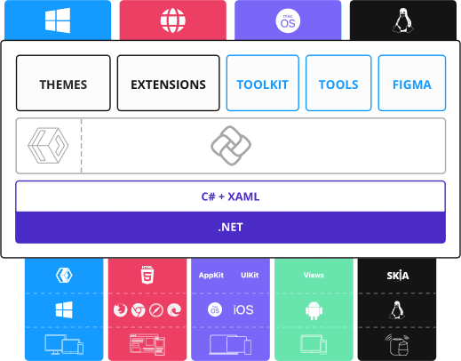

# About the Uno Platform

Uno Platform lets you write an application once in XAML and/or C#, and deploy it to [any target platform](getting-started/requirements.md).

Uno Platform also provides optional components to increase developer productivity:

- [C# Markup](xref:Uno.Extensions.Markup.Overview), to write UI using C# instead of XAML
- [MVUX](xref:Uno.Extensions.Mvux.Overview)
- [Uno Toolkit](xref:Toolkit.GettingStarted), to include new advanced UI controls
- [Figma](xref:Uno.Figma.GetStarted), to design your app in Figma and easily import XAML or C# from the design in your app
- [Uno Themes](external/uno.themes/doc/themes-overview.md), to include new advanced UI controls
- [Uno Extensions](external/uno.extensions/doc/ExtensionsOverview.md), to include large building blocks to complete your app faster

## High level architecture

Uno Platform's application API is compatible with Microsoft's [WinUI 3 API](https://docs.microsoft.com/en-us/windows/apps/winui/winui3/) and the older [UWP application API](https://docs.microsoft.com/en-us/windows/uwp/get-started/). In fact, when your application runs on Windows, it's just an ordinary WinUI 3 (or UWP) application.

This means that existing WinUI or UWP code is compatible with Uno Platform. Existing WinUI or UWP libraries can be recompiled for use in Uno Platform applications. A number of [3rd-party libraries](xref:Uno.Development.SupportedLibraries) have been ported to Uno Platform.

Uno Platform is pixel-perfect by design, delivering consistent visuals on every platform. At the same time, it rests upon the native UI framework on most target platforms, making it easy to [integrate native views](xref:Uno.Development.NativeViews) and tap into native platform features.

Learn more about [how Uno Platform works](xref:Uno.Development.HowItWorks).
