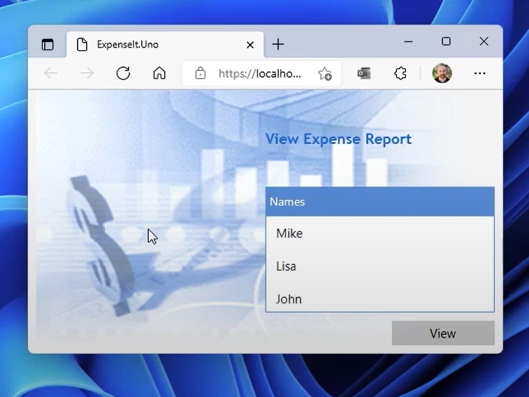

# Migrating WPF Apps to Uno Platform

This article covers architecture and implementation considerations for migrating WPF applications to multiple platforms (WebAssembly, Android, iOS, Mac Catalyst, Linux, macOS, and Windows) using Uno Platform and WinUI.

## Introduction

While improvements will continue to be made by Microsoft at the framework level to ensure the compatibility and reliability of your WPF application, it may be desirable to expand its reach to additional platforms. In this hybrid work era, previous assumptions and development decisions which served your customers well become less valid. For instance, applications targeting the Windows platform alone miss out on the benefits of cross-platform availability, including mobile devices (iOS, Android), web browsers (WebAssembly), and other desktop operating systems (Linux, macOS).

Uno Platform enables you to bring your WPF application to all these platforms, leveraging advancements such as [WebAssembly (WASM)](https://developer.mozilla.org/docs/WebAssembly) for the web, native mobile frameworks for iOS and Android, and Skia rendering for desktop platforms.

## Migrating the codebase

The Uno Platform not only allows you to maximize reuse of C#, XAML, and .NET investments, but also enables your team to naturally leverage their existing skill set. Alongside your existing investments, you may decide to further enhance your app, refreshing aspects to make use of new capabilities in the platform. Regardless, your goal is to consider what role your application will play several years or more into the future. Depending on your scenario, it may make sense to enhance the user interface layout for different form factors. In this article, the primary focus will be on rewriting as little as possible.

> [!TIP]
> Read the UWP/WinUI & Uno documentation first to better understand the capabilities of the platform.

## Limitations

The vast majority of your codebase will simply "move across". Existing XAML structure, business logic, and view models can simply be reused. You'll need to recompile old code, and won't have access to framework-only APIs. You may encounter APIs that aren't implemented or controls where a subset of the functionality is presently unsupported. Additionally, the following contain substantial enough differences from WPF to require extra research upfront:

* [Navigation](https://learn.microsoft.com/windows/apps/design/basics/navigate-between-two-pages)
* [Advanced binding functionality with x:Bind](https://learn.microsoft.com/windows/uwp/xaml-platform/x-bind-markup-extension)
* [Modern APIs are often async only](https://learn.microsoft.com/windows/uwp/threading-async/call-asynchronous-apis-in-csharp-or-visual-basic)
* [Uno has a streamlined set of XAML capabilities for performance reasons](https://learn.microsoft.com/windows/uwp/xaml-platform/xaml-overview)
* [Specific framework capabilities](https://github.com/robloo/PublicDocs/blob/master/UWPvsWPF.md)

## Understanding beforehand

Along the journey to bring your WPF app to multiple platforms with Uno Platform, you should become familiar with the Uno Platform documentation. Your team should thoroughly understand what is supported (and where) before you build a feature around it. Learn about:

* [Get started](xref:Uno.GetStarted)
* [How-tos and tutorials](xref:Uno.Tutorials.Intro)
* [Development deep-dives](xref:Uno.Development.Overview)
* [Reference](https://platform.uno/docs/articles/implemented-views.html)

## Architecture Considerations

### MVVM Libraries

Several of the popular MVVM libraries like MVVMLite, Prism, and the Windows Community Toolkit implementation have already been ported to Uno. If your existing app leverages something in-house, there's a chance it will just work.

### Navigation

Apps leveraging Page-based navigation are relatively straightforward to migrate. If your app has a different navigation stack, there may be additional implementation changes to consider.

### Custom Controls

One of the strengths of Uno is having access to the same, opinionated set of battle-tested controls that exist on Windows everywhere. For that reason, we recommend determining whether there is an included framework equivalent to your custom controls. Depending on your app's design goals, it may be desirable to switch to UX patterns more accommodative of your users' device categories.

There are also controls available from the [Windows Community Toolkit](uno-community-toolkit.md).

Either way, the ContentControls and DataTemplate pattern you make use of for variability in your WPF app's user interface are still supported.

### Data Access

If your WPF application currently connects directly to a database, you should consider whether this pattern makes sense across all target platforms. For web and mobile applications, you should look into making use of web services or REST APIs to access data remotely.

### Deprecated Technology

Full support for WCF and WCF Data Services are not included in modern .NET versions. Because these technologies lack a path forward, you should consider attempting to implement a service-oriented architecture with other frameworks like gRPC or REST services.

### Platform-Specific Integration

If your app relies on heavy access to Windows-specific constructs such as the registry or file system access, you should rethink your approach to fit a cross-platform app model. Uno Platform provides [platform-specific code capabilities](platform-specific-csharp.md) that allow you to handle platform differences when necessary, while keeping most of your codebase shared.
