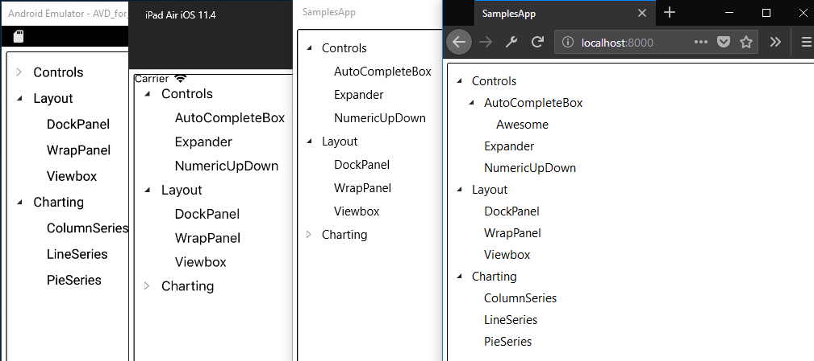

# Migrating the Silverlight Toolkit TreeView control to UWP and the Uno Platform

_You can find [the code of the `TreeView`](https://github.com/unoplatform/uno.UI.Toolkit.SL/tree/master/Uno.UI.Toolkit.SL/Controls/TreeView) for this article in the [Uno.UI.Toolkit.SL](https://github.com/unoplatform/uno.UI.Toolkit.SL) repository, in which we will add new controls and accept contributions for controls as they are made available._

In this blog post series, we're going to cover the migration of the code for the
[Silverlight Toolkit TreeView control](https://github.com/MicrosoftArchive/SilverlightToolkit) [TreeView control](https://github.com/MicrosoftArchive/SilverlightToolkit/tree/master/Release/Silverlight4/Source/Controls/TreeView) to UWP and the [Uno Platform](https://github.com/unoplatform/uno), a control widely used in many lines of business applications still in use today.



This includes parts of the features that may or may not work initially, as well as modifications that will have to be made in the Uno Platform to conform to UWP if required. While the Uno Platform includes all the APIs of the Spring Creators Update (17134), many of these APIs are not implemented yet and there may be some that are used by the Silverlight `TreeView` control.

Also, the point of this exercise is to walk through a migration process from a Silverlight code base, as there is already an existing `TreeView` control API in UWP. As of the writing of this article, the UWP `TreeView` is not implemented in the Uno Platform and migrating this Silverlight control is not an option, as the APIs are significantly different and not directly compatible.

## Importing the Silverlight TreeView control source

To migrate a control from Silverlight, there are a few things to do:

- Create a cross targeted project using the **Cross-Platform library** template from the [Uno Platform VS Add-in](https://marketplace.visualstudio.com/items?itemName=unoplatform.uno-platform-addin-2022)
- Replace Silverlight namespaces with UWP namespaces and selectively import the `TreeView` source files and dependencies
- Adjust the code for slightly changed APIs
- Temporarily comment out code for APIs that have significantly changed.
- Adjust the XAML

### Cross targeted project creation

To be able to build the control in a reusable way, in a NuGet package, we need to create a **Cross-platform library** using the **Uno Platform VS Add-in**, which does all the configuration to target Windows (uap10.0), iOS, Android and WebAssembly.

This project will contain all the XAML files and C# source files required for the `TreeView` to function properly. It uses the excellent [MSBuild.Sdk.Extras](https://github.com/onovotny/MSBuildSdkExtras) msbuild extensions to cross targeted library with minimal efforts, using the new and improved _sdk-style_ project format, and simplifies the creation of NuGet packages.

It will then be possible to create an installable NuGet package using the context menu [Pack option](https://docs.microsoft.com/en-us/nuget/quickstart/create-and-publish-a-package-using-visual-studio#run-the-pack-command) on the project.

### Importing the source

The process of importing the source is somewhat straightforward. Microsoft, in all its XAML variants, kept many of the APIs signature-compatible. This means that in a large majority of cases, [simply changing the namespaces](https://github.com/unoplatform/uno.UI.Toolkit.SL/commit/d4da7a8ff33da6c9d45bebafa8c8ca65f6182612#diff-b35234eeeb3bdb81d82b850985bf37b3L9) from `System.Windows` to `Windows.UI` is making the code compatible with UWP.

Here are some examples:

- `System.Windows.Controls` -> `Windows.UI.Xaml.Controls`
- `System.Windows.Input` -> `Windows.Devices.Input`
- `System.Windows.Media` -> `Windows.UI.Xaml.Media`

One tip here to simplify the migration is to temporarily remove all non-windows targets in the cross-targeted projects to keep only `uap10.0`. This helps in keeping the compilation errors limited to the UWP apis, and avoids some of the API differences that may happen, including iOS/Android/Wasm targets. Once the Windows target builds, adding back the other targets will allow for special adjustments, if any.

Most of the exercise of the code import is about making a heavy use of the Intellisense by importing files one by one, starting by `TreeView.cs` and removing all the red squiggles. The `TreeView` controls uses `TreeViewItem`, which in turn uses `HeaderedItemsControl`, etc...

After the first pass of changing namespaces, and importing dependent files, we end up with a self-contained set of C# source files, but not yet compiling.

### Adjusting for slightly changed APIs

When trying to resolve the API differences when moving from UWP, after adjusting the namespaces, the first low hangings are the ones that are slightly different. For instance, it can be member visibility differences, or just name updates.

Some examples:

- `FrameworkElement.OnApplyTemplate` has been moved from `public` to `protected`
- The `PropertyMetadata` does not have a constructor that only contains a `PropertyChangedCallback` parameter
- `GeneralTransform.Transform` is called `GeneralTransform.TransformPoint`
- `Binding` does not contain a constructor taking a string path as a parameter
- `Control.Focus` now requires a `FocusState` parameter

Those are pretty easy to adjust, and the UWP runtime behavior has a great chance of being identical to the one Silverlight had.

### The case of ItemsControl.OnItemsChanged

There's one significant change with `ItemsControl.OnItemsChanged` where the method is not present anymore. This is a pretty important part of behavior of the control, used to create and manipulate `TreeViewItem` instances and link them to the `TreeView` instance. Removing the code of this method would make the control unusable.

This method can be replaced by the `ItemsControl.Items.VectorChanged` event, but not completely. `ItemsControl` in Silverlight was based on `ObservableCollection` which provided the `NotifyCollectionChangedAction` property, whereas the `ItemsCollection` in UWP is based on `ObservableVector`. This new implementation notably does not provide the `Replace`
action and it's raising `ItemRemoved` then `ItemInserted` instead.

In this case, we must remove the part that dealt with `NotifyCollectionChangedAction.Replace`, keeping
only `Remove`, `Reset` and `Insert`. The new API also does not provide the items being notified for, which means we
have to use the `Items` property directly instead.

### Temporarily commenting out incompatible features

In other cases, the APIs are significantly different and we'll for now comment those out for the sake of chewing a comfortable piece of code. Parts of this include keyboard support, parts of the mouse support, localization and Peer Automation related support.

UWP provides support for those features, not as virtual methods but rather as events that are not directly compatible with the Silverlight implementation. We will take a look at those features in a later part of the series.

### Adjusting the XAML

Another part of the migration to UWP is the adjustment of the XAML. The syntax is the same, but parts differ :

- The custom namespace syntax is now using `using:` instead of `clr-namespace:`, and in many cases simply replacing one with the other is enough
- The `VisualStateManager` related classes are now in the default xml namespace, meaning that the `vsm:` namespace is not required anymore.
- The `system` namespace is now part of the `x:` namespace

We'll also comment out the support for `Cursor` adjustments, as the property is not directly mapped to UWP.

## Creating the sample app

To be able to test the imported code, we can create a sample application using [the Uno Platform VS add-in](), reference our imported project and add a simple sample like this one:

```xml
<controls:TreeView Margin="5">
 <controls:TreeViewItem Header="Controls">
 <controls:TreeViewItem Header="AutoCompleteBox">
  <controls:TreeViewItem Header="Properties" />
 </controls:TreeViewItem>
 <controls:TreeViewItem Header="Expander" />
  <controls:TreeViewItem Header="NumericUpDown" />
 </controls:TreeViewItem>
 <controls:TreeViewItem Header="Layout">
  <controls:TreeViewItem Header="DockPanel" />
  <controls:TreeViewItem Header="WrapPanel" />
  <controls:TreeViewItem Header="Viewbox" />
 </controls:TreeViewItem>
 <controls:TreeViewItem Header="Charting">
  <controls:TreeViewItem Header="ColumnSeries" />
  <controls:TreeViewItem Header="LineSeries" />
  <controls:TreeViewItem Header="PieSeries" />
 </controls:TreeViewItem>
</controls:TreeView>
```

and test it first on Windows, then iOS, Android and WebAssembly.

## Next steps

When running the sample, a few things stand out:

- The `TreeView` is displaying content properly
- The nodes expand and collapse properly
- The glyph next to the nodes changes state once, but does not animate back
- There are some exceptions regarding the `ItemContainerGenerator` which has been deprecated in UWP.

We'll take a look at those in the next parts of this series.
