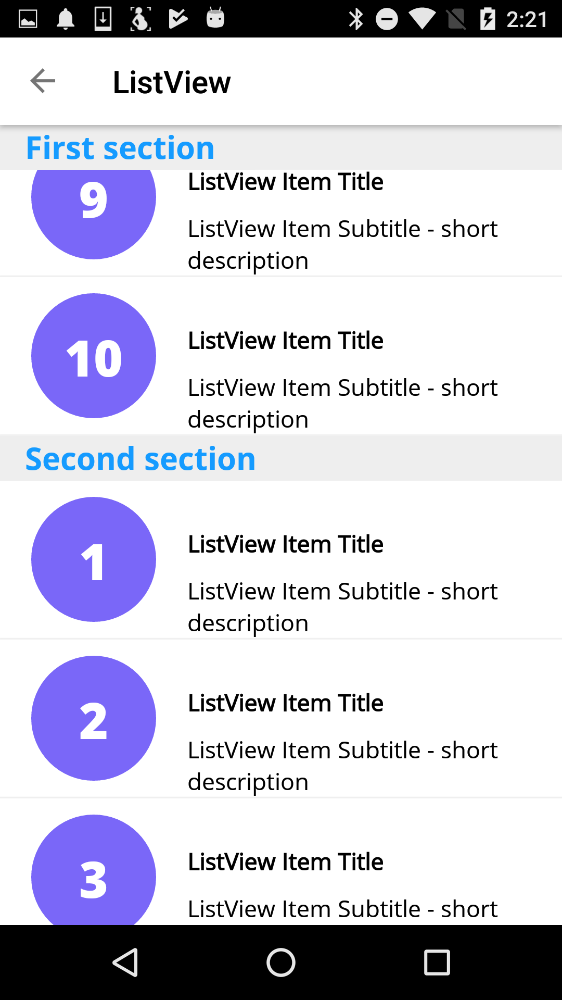

# Uno Under the Hood: A Tale of Too Many ListViews

One of the core controls of any UI framework is the list abstraction. This is the control, or family of controls, responsible for displaying large numbers of similar items to the user - the contacts in your address book, the songs in your music library, etc.

*Uno's ListView in action*

This is also normally one of the most complicated views in the framework. The list has to scroll, which is complex to start with. It also has to [virtualize](https://docs.microsoft.com/en-us/windows/uwp/debug-test-perf/optimize-gridview-and-listview). Consider that music library, which might contain 10k songs or more. As a user I expect to scroll through that list as fast as my fingers can fling, with 'buttery smooth' performance. We can't create 10k views at once, and even creating new views and destroying old ones as we scroll is too expensive to be performant. The solution is to recycle items as they scroll out of view and rebind them to display the newly-visible items.

Another requirement is to be able to dynamically insert, remove, or replace items. Eg, you're browsing your inbox and archive an email, and it neatly animates out of existence. This seemingly innocuous behaviour is the source of innumerable corner cases and errors: there are [hundreds of questions](https://www.google.com/search?q=nsinternalinconsistencyexception+uicollectionview+site%3Astackoverflow.com%2Fquestions%2F) on StackOverflow containing the terms 'UICollectionView' and 'NSInternalConsistencyException', one of the banes of iOS developers. 

Add to that multiple layouts (eg a single-column 'list' versus a multi-column 'grid'), bunching grouped items under subheaders (eg A, B, C... in an index), templating, selection management, pagination/data virtualization, programmatic scroll manipulations, 'snapped' scrolling, and more, and you end up with a daunting set of features. Which must furthermore work correctly in any arbitrary combination. 

Unsurprisingly, Uno's [ListView](https://github.com/nventive/Uno/blob/master/doc/articles/ListViewBase.md) didn't spring from a stone egg fully formed. 

## Growing pains 

Uno has had to work for a living nearly since its inception. At the time our story begins, it had already been used in production in a number of [our](http://legacy.nventive.com/) apps, but the UWP API was poorly supported in some areas. One of the most glaring was `ListView`, or more precisely, [ListViewBase](https://docs.microsoft.com/en-us/uwp/api/windows.ui.xaml.controls.listviewbase). 

On UWP, `ListViewBase` is the base class for [ListView](https://docs.microsoft.com/en-us/uwp/api/windows.ui.xaml.controls.listview) and [GridView](https://docs.microsoft.com/en-us/uwp/api/windows.ui.xaml.controls.gridview), which essentially differ only in the way they lay out items on screen. It inherits (via `Selector`) from [ItemsControl](https://docs.microsoft.com/en-us/uwp/api/windows.ui.xaml.controls.itemscontrol), which is the base 'shows a bunch of items' view. `ItemsControl` has several other important derived types (such as [ComboBox](https://docs.microsoft.com/en-us/uwp/api/windows.ui.xaml.controls.combobox) and [FlipView](https://docs.microsoft.com/en-us/uwp/api/windows.ui.xaml.controls.flipview)). `ItemsControl` inherits from `Control` and hence from [FrameworkElement](https://docs.microsoft.com/en-us/uwp/api/windows.ui.xaml.frameworkelement) (UWP's equivalent of [UIView](https://developer.apple.com/documentation/uikit/uiview) or [Android.View](https://developer.android.com/reference/android/view/View)). 

In Uno-at-the-time, this Biblical genealogy was nowhere to be found. On iOS, `ListViewBase` inherited directly from the native [UICollectionView](https://developer.apple.com/documentation/uikit/uicollectionview) type. Functionally, a subset of what UWP offered was implemented. 

The most painful limitation back then with the `ListView` on iOS was the inability to support items with different sizes, or more precisely, items whose sizes differed when they were databound. Imagine a list of messages in a chat window: the height of each item will vary depending on how many lines of text the message wraps over.  At the time, Uno.iOS was stymied by this not-uncommon scenario. 

Uno.Android's `ListView` was able to handle dynamically-sized items, but it had more serious inheritance problems. There was no shared `ListViewBase class`. Uno's `ListView` and `GridView` were inheriting from Android's [ListView](https://developer.android.com/reference/android/widget/ListView) and [GridView](https://developer.android.com/reference/android/widget/GridView) classes. Worse, because the Android classes didn't support horizontal scrolling, we had to have two more classes, `HorizontalListView` and `HorizontalGridView`.  

At time of writing, `HorizontalListView` and `HorizontalGridView` are still in the codebase, left there for internal legacy support. (I don't think we actually use them anymore.) Following the twisted inheritance hierarchy gives me cold sweats. [HorizontalGridView](https://github.com/nventive/Uno/blob/26c5cc5992cae3c8c25adf51eb77ca4b0dd34e93/src/Uno.UI/UI/Xaml/Controls/ListViewBase/Legacy/HorizontalGridView.Android.cs) inherits from an identically-named class in a different namespace(!), which itself inherits from `BindableHorizontalListView`, which inherits from `NativeHorizontalListView`, which finally inherits from Android's `AdapterView<BaseAdapter>` type. 

Apart from polymorphism going out the window, this made maintenance and support a nightmare. Whenever one of our app developers came to the Uno team to ask if the `ListView` supported such-and-such a feature, we had to ask, 'which ListView?'  

Frequently, when a new feature was added, (eg, the [ScrollIntoView()](https://docs.microsoft.com/en-us/uwp/api/windows.ui.xaml.controls.listviewbase.scrollintoview#Windows_UI_Xaml_Controls_ListViewBase_ScrollIntoView_System_Object_) method), it was added for a single class for which it was immediately necessary, partly in the face of the usual get-it-done-yesterday time pressures, and partly because everyone knew that `ListView` would be refactored 'soon' and any investment in the current implementation would get flushed down the drain. This of course only exacerbated the maintenance problem. 

## A New Hope 

I end this shameful part of the story on a happy note: we eventually found the breathing room to pay down some of our technical debt, and `ListViewBase` was the first target. But before we could overhaul it, we had to answer some questions: 

- Which `ListView` features did we want? 
- Which features could we have, in a reasonable timeframe? 
- How closely did we intend to match UWP's API? The gold standard for Uno is 100% code reuse: could we make that happen?

Next time, I'll describe the plan we came up with, and how we decided to implement UWP's `ListView` in the worlds of Android and iOS.  
