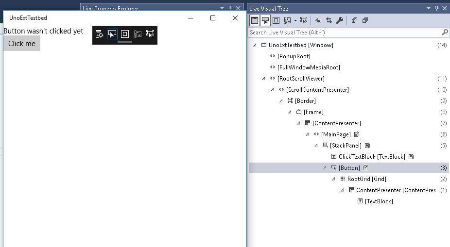
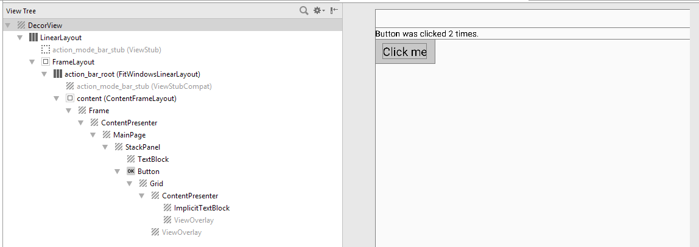
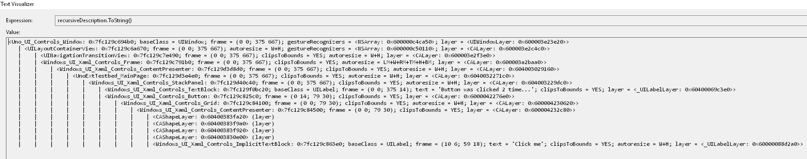
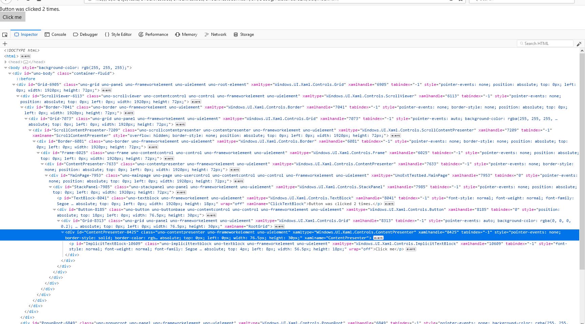
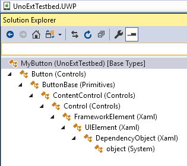
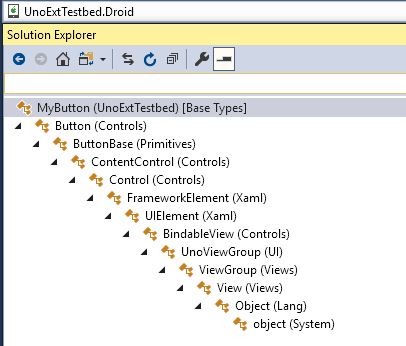
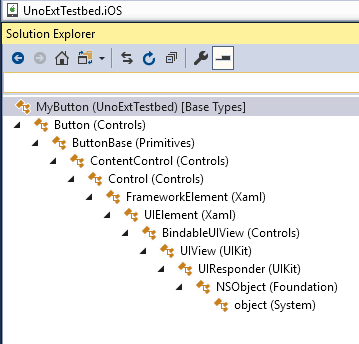
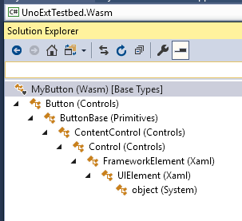

# Pushing the right buttons: How Uno implements views

In a [previous article](./201808-UnoUnderTheHoodIntro.md), I outlined the three main jobs of the [Uno Platform](https://platform.uno/) in order to run a UWP app on iOS, Android, and in the browser:

1. Parse XAML files;

2. Implement data-binding;

3. Implement the suite of views in the [UWP framework](https://docs.microsoft.com/en-us/windows/uwp/design/controls-and-patterns/controls-by-function) for each platform.

In this article I want to focus on that last point. How does Uno implement UWP's views? As a case study I'm going to use that humbly ubiquitous UI control, the button.

## The number goes up

I present the simplest interactive application imaginable, one step above 'Hello World':

XAML:

```` xml
<Page x:Class="UnoExtTestbed.MainPage"
      xmlns="http://schemas.microsoft.com/winfx/2006/xaml/presentation"
      xmlns:x="http://schemas.microsoft.com/winfx/2006/xaml"
      xmlns:d="http://schemas.microsoft.com/expression/blend/2008"
      xmlns:mc="http://schemas.openxmlformats.org/markup-compatibility/2006"
      mc:Ignorable="d">

    <StackPanel>
        <TextBlock x:Name="ClickTextBlock"
                   Text="Button wasn't clicked yet" />
        <Button Content="Click me"
                Click="Button_Click" />
    </StackPanel>
</Page>
````

code-behind:

```` csharp
using System;
using Windows.UI.Xaml;
using Windows.UI.Xaml.Controls;

namespace UnoExtTestbed
{
    public sealed partial class MainPage : Page
    {
        public MainPage()
        {
            this.InitializeComponent();
        }

        private int _clickCount = 0;
        private void Button_Click(object sender, RoutedEventArgs e)
        {
            _clickCount++;
            ClickTextBlock.Text = $"Button was clicked {_clickCount} times.";
        }
    }
}
````

I made a blank app using the [Uno Solution template](https://marketplace.visualstudio.com/items?itemName=unoplatform.uno-platform-addin-2022) and put this code on the main page. Whenever the [Button](https://docs.microsoft.com/en-us/uwp/api/windows.ui.xaml.controls.button) is clicked, the number goes up. Add a bit more chrome and we could have a [viral hit](https://en.wikipedia.org/wiki/Cow_Clicker).

Note that the XAML is useful here but not obligatory, either on UWP or Uno. We could have defined and created all our views in C#, had we really wanted to. That flexibility is handy to have.

## Exhibit A - the visual tree


*Visual tree information for UWP*

*Visual tree information for Android*

*Visual tree information for iOS*

*Visual tree information for WASM*

So what does that get us? You can see the resulting visual trees on each target platform. They're all substantially similar. The top-level wrapping varies a little, but inside we can see the `MainPage`, `StackPanel`, `TextBlock` and `Button` we defined in XAML. (The `Frame` is created in the stock `App.xaml.cs` code that comes with the project template.)

You might notice there are a couple of extra views inside the `Button` that weren't explicitly defined in the XAML. These are part of Button's [default template](https://msdn.microsoft.com/en-us/library/windows/apps/mt299109.aspx). If you're not familiar with UWP/WPF/Silverlight/etc's concept of control templating, there's a lot to say about [the subject](https://docs.microsoft.com/en-us/windows/uwp/design/controls-and-patterns/control-templates), but the gist of it is that any view which inherits from `Control` is a tabula rasa, an empty vessel which will be filled with inner views as defined in its template. (Some of these child views might be templated controls themselves.) It's a powerful means to customize the look of a reusable control.

How do we go from a logical tree defined in XAML to a native visual tree?

Let's keep the visual aids rolling. We'll create an empty class inheriting from `Button`, and take a look at its inheritance hierarchy.

   
*Inheritance chains for the Button class on UWP, Android, iOS, and WASM*

Like the visual tree, the platform-specific inheritance chains are pretty similar (identical in fact) at the 'leafward' end, and  diverge a bit at the root. Let's focus on where they diverge: after the UIElement class, the [base view type](https://docs.microsoft.com/en-us/uwp/api/windows.ui.xaml.uielement) in UWP.

On UWP, `UIElement` inherits from [DependencyObject](https://docs.microsoft.com/en-us/uwp/api/windows.ui.xaml.dependencyobject), the base class for types which support data-binding using [DependencyProperty](https://docs.microsoft.com/en-us/windows/uwp/xaml-platform/dependency-properties-overview) values.

In Uno.Android and Uno.iOS, any `UIElement` is an instance of the native base view type ([Android.Views.View](https://developer.android.com/reference/android/view/View) and [UIKit.UIView](https://developer.apple.com/documentation/uikit/uiview) respectively, mapped to managed types via the magic of [Xamarin](https://visualstudio.microsoft.com/xamarin/)). So views defined in XAML are also native views. This means, for example, that it's possible to incorporate native views that know nothing about Uno directly into your app's XAML. The following works on iOS:

```` xml
<Page x:Class="UnoExtTestbed.MainPage"
            ...
            xmlns:uikit="using:UIKit">
    ...
    <StackPanel>
            <uikit:UILabel Text="Native label"/>
    </StackPanel>
</Page>
````

This is uniquely easy to do in Uno. We talk about 'leaving an escape hatch': the goal is 100% code reuse, but if you positively have to use a platform-specific feature or view library, the flexibility is there.

But wait, what about `DependencyObject`?

Since it's an important part of the UWP contract, we didn't want to leave `DependencyObject` out of the picture, but we also have to be able to support `DependencyObjects` that aren't views at all. ([Brushes](https://docs.microsoft.com/en-us/windows/uwp/design/style/brushes) and [Transforms](https://docs.microsoft.com/en-us/windows/uwp/design/layout/transforms), to name just a few.) In Uno therefore `DependencyObject` is defined as an [interface](../articles/api-differences.md#dependencyobject-type-is-an-interface-all-non-windows-platforms). It's a 'special' interface however: Uno's code generation automatically adds the backing methods when it finds a class like `MyDependencyObject : DependencyObject`, allowing code written for UWP to mostly 'just work.' I'll talk more about it in a future article on code generation in Uno.

In WebAssembly, for now the inheritance hierarchy is a bit simpler and `UIElement` is at the root of the type tree. As you can see in the screenshot, Uno.WASM is generating `<div>` elements for each view in the visual tree.

## Style points

The code above nets us a very plain, workaday button, but we could easily spice it up. We set the `Content` property to a text string, but `Content` can be anything, even another view. Our button could be an [image](https://github.com/unoplatform/uno.Playground/blob/master/src/Uno.Playground.Shared/Samples/Image.xaml), a [shape](https://github.com/unoplatform/uno.Playground/blob/master/src/Uno.Playground.Shared/Samples/Shapes.xaml), or a complex visual hierarchy. It could even have another button inside of it.

What if we want to go in the opposite direction? What if we want to abdicate control over our button's appearance entirely?

A number of controls implemented by Uno, `Button` included, support the concept of a 'native' style. Instead of a button that's consistent across all versions of your app, you get a button that looks the way a user of the target platform would expect it to look.

It's supported by setting a pre-defined [Style](https://docs.microsoft.com/en-us/windows/uwp/design/controls-and-patterns/xaml-styles) that puts an instance of the native control inside the XAML control. In our code above, we could have written:

```` xml
        <Button Content="Click me"
                Click="Button_Click"
      Style="{StaticResource NativeDefaultButton}" />
````

Since Android's default button looks rather similar to UWP's, I'm going with a more visually obvious illustration using a different control, [ToggleSwitch](https://docs.microsoft.com/en-us/uwp/api/windows.ui.xaml.controls.toggleswitch). I'll use the [sample](https://github.com/unoplatform/uno.Playground/blob/master/src/Uno.Playground.Shared/Samples/ToggleSwitch.xaml) from the [Uno Gallery](https://github.com/unoplatform/uno.Playground#uno-playground) app.

 
*Uno's ToggleSwitch control on Android and iOS, using default and native styles.*

The `ToggleSwitch` with the default style looks the same on all platforms, both statically and in motion. On Android and iOS, however, the `ToggleSwitch` with the `NativeDefaultToggleSwitch` style replicates the native toggle control of each platform. Of course you can still bind to its properties in XAML as you normally would. This is another powerful option to have: for some apps it makes sense to look as 'native' as possible, for others its desirable to have a rich, customized UI. You may even want to mix and match different approaches for different screens in your app. With Uno it's straightforward.

## What if I don't like buttons?

In fact `UIElement` implements primitive interaction events like [PointerPressed](https://docs.microsoft.com/en-us/uwp/api/windows.ui.xaml.uielement.pointerpressed), `PointerReleased`, etc, so all views in Uno can handle touches/clicks, not just `Button`. (The big advantage of using `Button`, apart from the MVVM-friendly `Command` property, is that it implements [visual states](https://docs.microsoft.com/en-us/previous-versions/windows/apps/jj819808(v=win.10)) to animate your button with.)

There's plenty more to talk about, like the way that UWP's API is hooked into each platform's native input detection, or the way that layouting is done, but that's all for now. [Try out](https://github.com/unoplatform/uno.QuickStart) Uno, and [hit us up](https://gitter.im/uno-platform/Lobby) if you have any questions.
