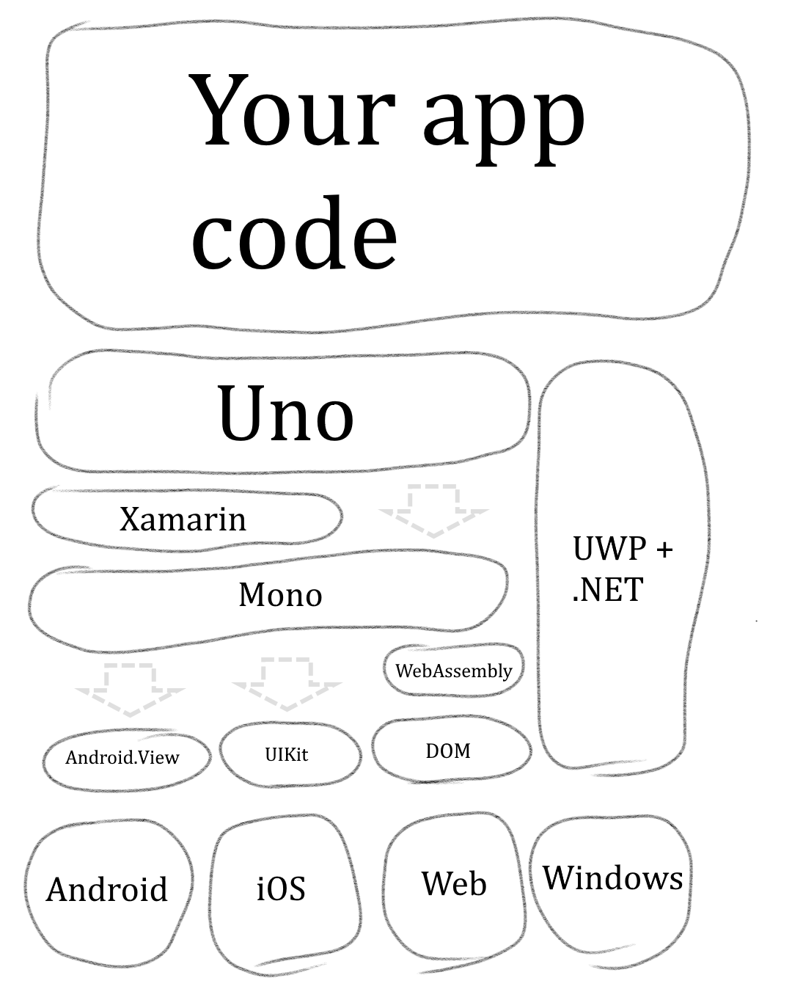

# Uno Under the Hood: An Introduction

By now you've heard about [Uno](https://github.com/unoplatform/uno). In
this post series I want to lay bare Uno's technical innards. We'll
look at the critical code that powers the platform, and chart the ups
and downs of building a UI platform. 

First, let's get the lay of the land. 

## The Uno Stack

Uno is a cross-platform UI framework. You write an app in C\#
and [UWP-flavoured XAML
markup](https://docs.microsoft.com/en-us/windows/uwp/xaml-platform/). It
runs on Windows because it's a UWP app. With Uno, it runs on Android,
iOS, and (for the brave) in the browser via Web Assembly as well. 

I drew a neat sketch of the tech stack. On iOS and Android, Uno
uses [Xamarin](https://visualstudio.microsoft.com/xamarin/) to access
the platform's native framework.  In the web version it’s running directly
on top of [Mono](https://github.com/mono/mono), which in turn is running on 
top of [WebAssembly](https://webassembly.org/).

 

## So what's Uno doing?

There are a few things that need to be done to get your app running: 

-  At compile time, Uno parses XAML files into C\# code, creating the
   information needed to build the app's visual tree; 

-  It implements a
   complete [databinding](https://docs.microsoft.com/en-us/windows/uwp/xaml-platform/dependency-properties-overview) engine,
   optimised for static type-checking where possible; 

-  It implements the views and controls in the
   [UWP framework](https://docs.microsoft.com/en-us/windows/uwp/design/controls-and-patterns/controls-by-function),
   using each platform's native UI framework as a basis.

Each of those items warrants a post on its own, so I'll move on before
I get bogged down. 

## The Tao of Uno

Before I end this introductory post, I want to briefly lay out the
philosophy of Uno, which has guided our major architectural decisions as
we've built this thing. 

-   **Leverage existing tools** 

    > We stand on the shoulders of  giants. Microsoft's tooling is a
    > treat to work with:
    > [Edit and Continue](https://docs.microsoft.com/en-us/visualstudio/debugger/edit-and-continue), 
    > [Live Visual Tree](https://docs.microsoft.com/en-us/visualstudio/debugger/inspect-xaml-properties-while-debugging),
    > the list goes on. The promise of Uno is to build your app with
    > those tools and then deploy it to iOS, Android, and ultimately
    > to the web. 

-   **Create rich, responsive UIs** 

    > Bland apps don't quite cut it these days. Strong support for
    > animations, templating, and custom visual effects is a must.
    > And when phones come in all sizes and manufacturers
    > are [gouging holes out of the screen
    > area](https://www.cnet.com/pictures/phones-with-notches/),
    > your app's layout had better be responsive. 

-   **Let views do views** 

    > Separation of model, view and presentation keeps your code
    > loosely coupled and easy to maintain. Features like
    > databinding and attached properties let you write clean,
    > elegant MVVM-style code. 

-   **Native intercompatibility (leave an escape hatch)** 

    > 100% code reuse is the ideal, but it should also be easy to
    > access functionality specific to a single platform, or to
    > incorporate native third-party libraries. 

-   **Performance is a feature** 

    > The slow antelope gets eaten, and the slow app gets 1-star
    > ratings. We've done a lot of optimisation on the basis of
    > profiling in real-world use cases, and we'll continue to do
    > so. 

That's a good place to stop. In the next post I'll take up the tale of
my favourite UI
control: [ListView and GridView](https://docs.microsoft.com/en-us/windows/uwp/design/controls-and-patterns/listview-and-gridview).
