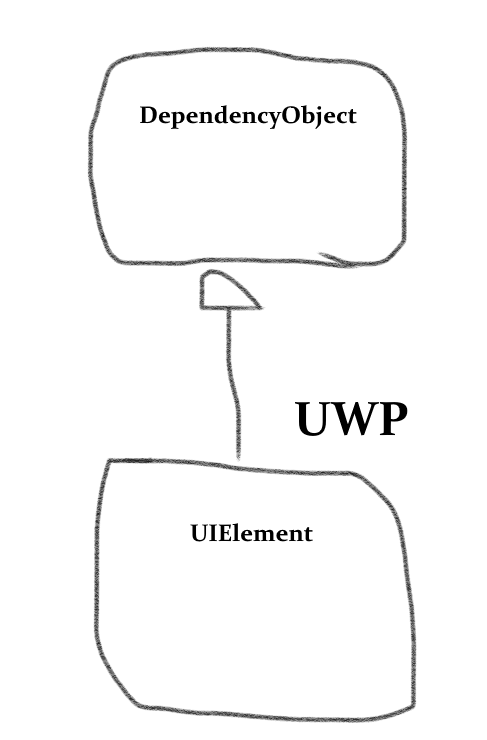
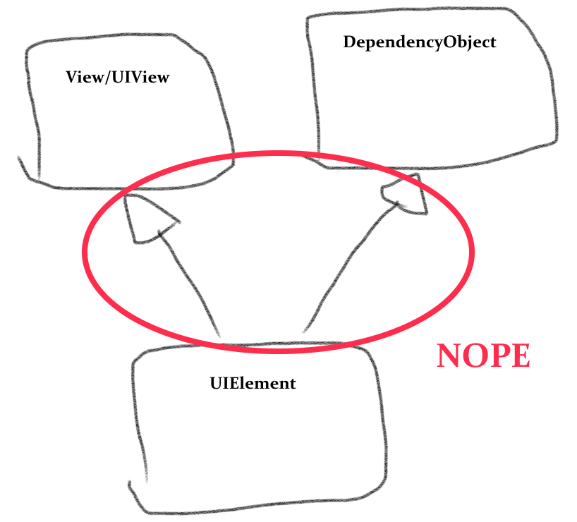

# Talkin' 'bout my generation: How the Uno Platform generates code, part 2

[Previously](https://medium.com/@unoplatform/talkin-bout-my-generation-how-the-uno-platform-generates-code-part-1-under-the-hood-7664d83c4f90) we looked at how the [Uno Platform](https://platform.uno/) turns XAML mark-up files into C# code.  In this article, I'll talk about another way Uno uses code generation, allowing us to make native Android and iOS views conform to UWP's API, and tackle the thorny problem of [multiple inheritance](https://en.wikipedia.org/wiki/Multiple_inheritance). 
 
## Wanting it all
Part of the power of Uno on Android and iOS is the ability to easily mix UWP view types with purely native views. This is possible because, in Uno, all views inherit from the native base view type: [View](https://developer.android.com/reference/android/view/View) on Android, [UIView](https://developer.apple.com/documentation/uikit/uiview) on iOS. 

 

But as I alluded to in an earlier article, this poses a challenge for reproducing UWP's inheritance hierarchy. UIElement is the primitive view type in UWP, but it in turn derives from the DependencyObject class. `DependencyObject` is the base class for anything that has `DependencyProperties`, that is, anything that supports databinding. That includes all views, as well as some non-view framework types like [Transforms](https://docs.microsoft.com/en-us/windows/uwp/design/layout/transforms) and [Brushes](https://docs.microsoft.com/en-us/windows/uwp/design/style/brushes). 

 

We want to inherit from `ViewGroup` or `UIView`. We also want to inherit from `DependencyObject.` C# doesn't permit multiple inheritance, so what do we do? Since we can't change the iOS or Android frameworks, we opted instead within Uno to make `DependencyObject` an [interface](https://docs.microsoft.com/en-us/dotnet/csharp/programming-guide/interfaces/index). That allows an Uno `FrameworkElement` to be a `UIView` and at the same time to be a `DependencyObject`. But that alone isn't enough. 

 
What if you have code like this in your app? 

```` csharp
    public class MyBindableObject : DependencyObject 

    { 

        public string MyProperty 

        { 

            get { return (string)GetValue(MyPropertyProperty); } 

            set { SetValue(MyPropertyProperty, value); } 

        } 

  

        // Using a DependencyProperty as the backing store for MyProperty.  This enables animation, styling, binding, etc... 

        public static readonly DependencyProperty MyPropertyProperty = 

            DependencyProperty.Register("MyProperty", typeof(string), typeof(MyBindableObject), new PropertyMetadata(default(string))); 

    } 
````
 

We're inheriting from `DependencyObject` and defining a `DependencyProperty` using the standard syntax, which uses the `DependencyObject.GetValue` and `DependencyObject.SetValue` methods. On UWP these are defined in the base class, but if `DependencyObject` is an interface then there _is_ no base class. In fact, if it's just an interface, then the code won't compile, because the interface hasn't been implemented. 

Luckily `DependencyObject` isn't _just_ an interface in Uno, and the code above will compile as-is on Android and iOS, just as it does on UWP. Code generation makes it happen. Here's some programmer art to illustrate the point. The detailed explanation is below.


*On UWP, `UIElement` inherits from the `DependencyObject` class.*

*Multiple inheritance - not an option.*

*In Uno, `DependencyObject` is an interface, with the implementation automagically supplied by code generation.*
 
We face a weaker form of this problem - wanting to have two base types - in other cases is well. In a few places in the framework we inherit from a more derived native view type. For example, `ScrollContentPresenter` inherits from the native scroll view on Android and iOS. But we also want `ScrollContentPresenter` to expose the methods and properties of `FrameworkElement`.

We successfully addressed both of these problems by using code generation to implement mixins in C#.
 
## Mixing things up 
Most statically-typed languages don't permit multiple base classes on account of the added complexity it brings, a.k.a. the ['diamond problem'](https://en.wikipedia.org/wiki/Multiple_inheritance#The_diamond_problem). (C++ is a notable exception.) In dynamically-typed languages, however, it's quite common to bolt on extra functionality to a class in a reusable way with [mixins](https://en.wikipedia.org/wiki/Mixin).  
 
C#, as a statically-typed language, doesn't support mixins as a first-class language feature. Code generation allows us to simulate it, though. Uno  uses code generation to add mixins in (at least) two different ways. 
 
I'll start with the simpler approach: using 'T4' templates. To quote Microsoft's documentation: 
> In Visual Studio, a T4 text template is a mixture of text blocks and control logic that can generate a text file. The control logic is written as fragments of program code in Visual C# or Visual Basic. In Visual Studio 2015 Update 2 and later, you can use C# version 6.0 features in T4 templates directives. The generated file can be text of any kind, such as a web page, or a resource file, or program source code in any language. 
 
*Source:* https://docs.microsoft.com/en-us/visualstudio/modeling/code-generation-and-t4-text-templates?view=vs-2017
 
T4 templates ('.tt files') have been around for quite a while. They're essentially a mix of static text (which is C# code, in our case) and conditional logic. Here's a snippet:

```` csharp
namespace <#= mixin.NamespaceName #> 
{ 
    public partial class <#= mixin.ClassName #> : IFrameworkElement 
    {  
    #if !<#= mixin.IsFrameworkElement #> 
        /// <summary> 
        /// Gets the parent of this FrameworkElement in the object tree. 
        /// </summary> 
        public DependencyObject Parent => ((IDependencyObjectStoreProvider)this).Store.Parent as DependencyObject; 
#endif 
 
#if <#= mixin.HasAttachedToWindow #> 
    partial void OnAttachedToWindowPartial() 
    { 
        OnLoading(); 
        OnLoaded(); 
    } 
�
````
 
That's from the [template](https://github.com/unoplatform/uno/blob/be4f4e938a861d5802c228efc314c1f3ea314027/src/Uno.UI/UI/Xaml/IFrameworkElementImplementation.iOS.tt#L30-L46) which adds `IFrameworkElement` functionality in Uno. It implements properties like `Width`/`Height`, `Opacity`, `Style`, etc. At compile time, the template runs and creates a [partial class](https://docs.microsoft.com/en-us/dotnet/csharp/programming-guide/classes-and-structs/partial-classes-and-methods) with those members for `ScrollContentPresenter` and several other classes (including `FrameworkElement` itself).  
 
The T4 approach is well-tested and works well in this scenario. It has a couple of limitations though: 
 
1. It requires manual set-up: each class that wants to use the mixin has to be explicitly registered. 
2. It requires manual flags to make sure that the generated code doesn't 'step on' the authored code, e.g. by generating a `Foo()` method when the authored code already defines `Foo()`.  
3. It doesn't support external code. You can't use the mixin above in your app (short of copy-pasting the templates into the app). 
 
For that reason, in order to have a mixin to implement `DependencyObject`'s features, we went with something a little more complex and a little more magical. 
 
## DependencyObjectGenerator - Making the magic happen 
The release of [Roslyn](https://github.com/dotnet/roslyn), aka the '.NET Compiler Platform', was a boon to code generation. With Roslyn, Microsoft open-sourced the C# compiler, but they also exposed a powerful API for code analysis. With Roslyn it's easy to access all the syntactic and semantic information that the compiler possesses.  
 
To leverage this power for code generation, we created the [Uno.SourceGeneration](https://github.com/unoplatform/uno.SourceGeneration) package. Like the Uno Platform, it's free and open source. It creates a build task and allows you to easily add generated code based on Roslyn's analysis of your solution. This might be partial class definitions which augment existing types, or it might be entirely new classes. 
 
In Uno, this used by the [DependencyObjectGenerator](https://github.com/unoplatform/uno/blob/master/src/SourceGenerators/Uno.UI.SourceGenerators/DependencyObject/DependencyObjectGenerator.cs) class. This generator looks for every class in the solution that implements the `DependencyObject` interface, like our `MyBindableObject` example above. For each such class, it automatically generates the methods and properties of `DependencyObject`. 

Since the generator has a full set of semantic information from Roslyn, it can do this in a smart way. For instance, if it detects that the class is a view type, it adds methods to update binding information when the view is loaded or unloaded. 

Here's a [small snippet](https://github.com/unoplatform/uno/blob/74ba91756c446107e7394e0423527de273154f5d/src/SourceGenerators/Uno.UI.SourceGenerators/DependencyObject/DependencyObjectGenerator.cs#L218-L250) of code from `DependencyObjectGenerator`:

```` csharp
			private void WriteAndroidAttachedToWindow(INamedTypeSymbol typeSymbol, IndentedStringBuilder builder)
			{
				var isAndroidView = typeSymbol.Is(_androidViewSymbol);
				var isAndroidActivity = typeSymbol.Is(_androidActivitySymbol);
				var isAndroidFragment = typeSymbol.Is(_androidFragmentSymbol);
				var isUnoViewGroup = typeSymbol.Is(_unoViewgroupSymbol);
				var implementsIFrameworkElement = typeSymbol.Interfaces.Any(t => t == _iFrameworkElementSymbol);
				var hasOverridesAttachedToWindowAndroid = isAndroidView &&
					typeSymbol
					.GetMethods()
					.Where(m => IsNotDependencyObjectGeneratorSourceFile(m))
					.None(m => m.Name == "OnAttachedToWindow");

				if (isAndroidView || isAndroidActivity || isAndroidFragment)
				{
					if (!isAndroidActivity && !isAndroidFragment)
					{
						WriteRegisterLoadActions(typeSymbol, builder);
					}

					builder.AppendLine($@"
#if {hasOverridesAttachedToWindowAndroid} //Is Android view (that doesn't already override OnAttachedToWindow)
#if {isUnoViewGroup} //Is UnoViewGroup
					// Both methods below are implementation of abstract methods
					// which are called from onAttachedToWindow in Java.
					protected override void OnNativeLoaded()
					{{
						_loadActions.ForEach(a => a.Item1());
						BinderAttachedToWindow();
					}}
````

In this method we have an [INamedTypeSymbol](https://docs.microsoft.com/en-us/dotnet/api/microsoft.codeanalysis.inamedtypesymbol?view=roslyn-dotnet), an object from Roslyn that encapsulates information about a type. We've already determined that `typeSymbol` implements `DependencyObject`; here we check if it's an Android `View` and, if so override the loaded method. You can notice that we're also checking that the type doesn't _already_ override the same method, so we don't accidentally generate code that clashes with authored code and causes a compiler error. All this goes on under the hood without user intervention, whenever your app compiles.
 
The end result is that `DependencyObject` can be used almost exactly the same way with Uno as with UWP, even though it's an interface and not a class! There are edge cases: some generic constraints won't work the same way, for example. But in general it works remarkably well. 
 
 ---

That's all for now. Let us know what other 'under the hood' aspects of Uno you'd like to hear more about!
