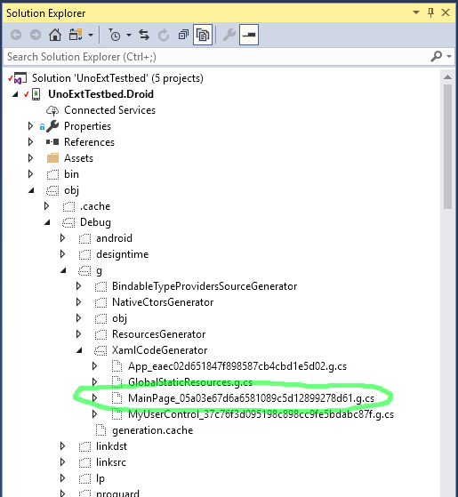

# Talkin' 'bout my generation: How the Uno Platform generates code, part 1

In [previous](https://medium.com/@unoplatform/under-the-hood-an-introduction-to-uno-platform-6064a765d6a) [articles](https://hackernoon.com/pushing-the-right-buttons-how-uno-implements-views-under-the-hood-a5e93ea86688) we've covered how the [Uno Platform](https://platform.uno/) takes a visual tree defined in the [XAML](https://learn.microsoft.com/windows/uwp/xaml-platform/xaml-overview) markup language and creates it on iOS, Android, and WebAssembly. In this article I want to dive into a key intermediate step: how the XAML is parsed and mapped to generated C# code. In an upcoming part 2, we'll look at a few other ways in which Uno leverages code generation to make the wheels turn.

## Parsing XAML

XAML stands for eXtensible Application Markup Language. It's an XML-based syntax. Although it can be used to describe [pretty much anything](https://learn.microsoft.com/dotnet/framework/windows-workflow-foundation/serializing-workflows-and-activities-to-and-from-xaml), it's geared toward describing the structure of an application. It was first used in [Windows Presentation Foundation](https://en.wikipedia.org/wiki/Windows_Presentation_Foundation), and since then has been used (with minor syntactic differences) in a number of contexts, including Silverlight (RIP), WinRT, Xamarin.Forms, and the Universal Windows Platform.

XAML hits a sweet spot: it's human readable, expressive, and sufficiently structured to support design tools like [Blend](https://learn.microsoft.com/visualstudio/designers/creating-a-ui-by-using-blend-for-visual-studio?view=vs-2017) and [XAML Designer](https://learn.microsoft.com/visualstudio/designers/creating-a-ui-by-using-xaml-designer-in-visual-studio?view=vs-2017). One nice feature is that it can be seamlessly intermingled with C# via [code-behind](https://learn.microsoft.com/dotnet/framework/wpf/advanced/code-behind-and-xaml-in-wpf) files.

To tap into that power, Uno needs to be able to read a XAML file and convert it into compilable C# code.  

The first step is to parse the file into a Xaml object tree, using the [System.Xaml](https://learn.microsoft.com/dotnet/api/system.xaml?view=netframework-4.7.2) namespace. Next, the Xaml object tree is processed into a C# class definition. The bulk of the heavy lifting is done in the mammoth [XamlFileGenerator](https://github.com/unoplatform/uno/blob/master/src/SourceGenerators/Uno.UI.SourceGenerators/XamlGenerator/XamlFileGenerator.cs) class. We lean on the [Microsoft.CodeAnalysis API](https://github.com/dotnet/roslyn) here (aka 'Roslyn') to match types used in XAML to types defined in the app assembly or its dependencies. The output is saved to a generated file.  

All this happens behind the scenes whenever you build an Uno head.

## The end result

Let's look at a concrete example. This is part of the markup we put in `MainPage.xaml` in a previous article:

```` xml
    <StackPanel> 
        <TextBlock x:Name="ClickTextBlock" 
                   Text="Button wasn't clicked yet" /> 
        <Button Content="Click me" 
                Click="Button_Click" /> 
    </StackPanel> 
````

The generated output can be found in the 'obj' folder under the project head.



*The code file generated from MainPage.xaml.*

This is a part of the generated code, showing the output for the XAML snippet above:

```` csharp
    public sealed partial class MainPage : Windows.UI.Xaml.Controls.Page 
    { 
        private void InitializeComponent() 
        { 
            var nameScope = new global::Windows.UI.Xaml.NameScope(); 
            NameScope.SetNameScope(this, nameScope); 
            // Source ..\..\..\..\..\..\UnoExtTestbed.Shared\MainPage.xaml (Line 1:2) 
            Content =             new global::Windows.UI.Xaml.Controls.StackPanel 
            { 
                // Source ..\..\..\..\..\..\UnoExtTestbed.Shared\MainPage.xaml (Line 8:3) 
                Children =  
                { 
                    new global::Windows.UI.Xaml.Controls.TextBlock 
                    { 
                        Name = "ClickTextBlock", 
                        Text = "Button wasn't clicked yet", 
                        // Source ..\..\..\..\..\..\UnoExtTestbed.Shared\MainPage.xaml (Line 9:4) 
                    } 
                    .MainPage_05a03e67d6a6581089c5d12899278d61_XamlApply((MainPage_05a03e67d6a6581089c5d12899278d61XamlApplyExtensions.XamlApplyHandler0)(c0 =>  
                    { 
                        nameScope.RegisterName("ClickTextBlock", c0); 
                        this.ClickTextBlock = c0; 
                    } 
                    )) 
                    , 
                    new global::Windows.UI.Xaml.Controls.Button 
                    { 
                        Content = @"Click me", 
                        // Source ..\..\..\..\..\..\UnoExtTestbed.Shared\MainPage.xaml (Line 11:4) 
                    } 
                    .MainPage_05a03e67d6a6581089c5d12899278d61_XamlApply((MainPage_05a03e67d6a6581089c5d12899278d61XamlApplyExtensions.XamlApplyHandler1)(c1 =>  
                    { 
                        c1.Click += Button_Click; 
                    } 
                    )) 
                    , 
                } 
            }
````

What a mouthful! Bear in mind that generated code tends to be optimized for machine readability, rather than for human readability. For example, the explicit casts to `XamlApplyHandler` were added when we found that the compiler was having to do a lot of computationally-expensive type inference. That one change **doubled** the compilation speed for large XAML files.

In the normal course of Uno development you don't need to look at code generated from XAML or even know that it's there, though occasionally it's useful to take a peek when debugging.

You can see that something called `Button_Click` is subscribed to the Button's Click event. Recall that `Button_Click` is defined in [the code-behind](https://medium.com/@unoplatform/pushing-the-right-buttons-how-uno-implements-views-under-the-hood-a5e93ea86688#the-number-goes-up) in `MainPage.xaml.cs`. As far as the compiler is concerned, both the authored and generated files are just [partial definitions](https://learn.microsoft.com/dotnet/csharp/programming-guide/classes-and-structs/partial-classes-and-methods) of the same class.

One last fun fact: when building on macOS using [Visual Studio for Mac](https://visualstudio.microsoft.com/vs/mac/) (which Uno tentatively supports in preview), Uno uses an internal port in place of the System.Xaml namespace which isn't available on Mac. The same code backs Uno's support for runtime Xaml interpretation via [Windows.UI.Xaml.Markup.XamlReader](https://learn.microsoft.com/uwp/api/windows.ui.xaml.markup.xamlreader). That in turn is used in the [interactive mode](https://github.com/unoplatform/uno.Playground/blob/master/src/Uno.Playground.Shared/Samples/Playground.xaml) of the [Uno Gallery app](https://github.com/unoplatform/uno.Playground) and [Uno.Playground website](https://playground.platform.uno/), which allows you to edit snippets of XAML and see the results in realtime. Check it out!
