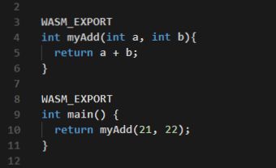

# Introduction to WebAssembly for the Uno Platform (Part 1)

WebAssembly, or Wasm for short, is a hot topic these days and for good reasons. It has lots of promise, and for the Uno Platform it promises to open up the Web to other languages and frameworks.

## What is WebAssembly ?

[WebAssembly](https://webassembly.org/) is a low-level byte code for the web, meant to be used as a compilation target for any language, much like ARM or x86. It has been built over the past few years by a W3C group, composed of various people from mostly browser, framework and hardware vendors. They have the simple concrete goal of being able to [securely run arbitrary binary code with near native performance](https://webassembly.org/docs/high-level-goals/).

It's currently supported by all major browsers, making it a viable target **today**.

WebAssembly is agnostic in its definition. Even though its name contains "Web", it is designed as a generic byte code. That's what allows for projects like [Ethereum](https://github.com/ewasm/design), [Life](https://medium.com/perlin-network/life-a-secure-blazing-fast-cross-platform-webassembly-vm-in-go-ea3b31fa6e09), [Nebulet](https://github.com/nebulet/nebulet) or [WebAssembly for .NET](https://github.com/RyanLamansky/dotnet-webassembly) to run without any browser in sight. As [Jay Phelps often mentions](https://twitter.com/_jayphelps/status/1034663875839504384), WebAssembly is neither Web nor Assembly, and can be adapted to many scenarios. It has the potential to ultimately be a true universal binary format, for any kind of programming.

Other good resources can be found in [Matteo Basso's Awesome Wasm](https://github.com/mbasso/awesome-wasm) curated list.

## What does WebAssembly look like ?

WebAssembly being a binary format, it's not human readable, but it has a textual representation that makes it easier to reason with.

[WebAssembly Studio](http://webassembly.studio/) is a good way have a peek inside the generated WebAssembly, where building this C code :

becomes this WebAssembly literal code:

It's not particularly easy to read, as would any similar assembler code, but it gives an idea on how a stack based virtual machine language works.

WebAssembly is a target that most developers will never have to interact with directly, in the same way that most developers never have to interact with x86_64 or ARM64 directly. It will mostly remain a build target, an element in a drop down list next to x86 and ARM64.

Consuming a WebAssembly module is generally composed of a `.wasm` file and a JS _glue_ file, as can be found in the default `main.js` sample of [WebAssembly Studio](http://webassembly.studio/). The JS file is present to use the [WebAssembly.instantiate](https://developer.mozilla.org/en-US/docs/Web/JavaScript/Reference/Global_Objects/WebAssembly/instantiate) method to load WebAssembly code.

## Why WebAssembly ?

WebAssembly is mainly trying to solve the issues that makes it difficult to optimize performance for large applications, provide access to binary-producing languages and improve the security of running the resulting code.

WebAssembly modules are defined as self-contained units of byte code. It's possible to use [streaming compilation](https://webassembly.github.io/spec/web-api/index.html#streaming-modules) to concurrently process the byte code as it is being downloaded, unlike Javascript where the source file needs to be fully parsed to make sense.

It also provides a way for any language to have a compilation back-end (such as LLVM and [Emscripten](http://emscripten.org/)) to target the Web. That opens a path for C, C++, Rust, [.NET based languages via Mono](https://github.com/mono/mono/tree/master/sdks/wasm), Java, Go, and many other languages to finally reach the web. It provides choices for developers targeting the Web, whether they need full type safety or not, to reuse that complex C++ library that is proving very difficult to port to Javascript. Such portability also enables runtimes and frameworks to follow, such as [QT-Wasm](https://wiki.qt.io/Qt_for_WebAssembly), and Mono and a very large part of the .NET ecosystem.

Security-wise, WebAssembly is very different from previous attempts to run arbitrary binary code in the browser, such as Flash, Java applets, VBA, Silverlight, ActiveX, ... which all had (and continue to have) security and portability issues. For instance, security features include the inability to execute arbitrary memory locations. While this makes optionally JIT'ed languages (such as .NET based languages) a difficult target, it promises a [higher security](https://i.blackhat.com/us-18/Thu-August-9/us-18-Lukasiewicz-WebAssembly-A-New-World-of-Native_Exploits-On-The-Web-wp.pdf) execution environment than its similar add-in based predecessors.

## WebAssembly and .NET

Microsoft has been working on a WebAssembly [port of the Mono runtime for a while now](https://www.mono-project.com/news/2017/08/09/hello-webassembly/), and [progress has been steady](https://www.mono-project.com/news/2018/01/16/mono-static-webassembly-compilation/) since the beginning of 2018. The runtime is looking as stable as it is on iOS and Android using the [Uno Platform](https://github.com/unoplatform/uno) as a point of reference, which is quite the achievement.

There's also the .NET Core Runtime (CoreRT) team who are working [on a WebAssembly port of the .NET Native engine](https://github.com/dotnet/corert/blob/master/Documentation/how-to-build-WebAssembly.md), and significant progress is being made there as well.

The security aspect of WebAssembly, with the [inability to execute data segments of memory](https://webassembly.org/docs/modules/#function-index-space), makes for a difficult time running IL code. Commonly, Just-In-Time (JIT) compilation is used to emit code using the underlying platform's instructions in data memory segments, then the CPU executes that data as code. The security constraint in WebAssembly is similar to the constraints found in iOS and watchOS, which do not allow such a compilation technique. The Mono team already worked under those constraints, and WebAssembly support requires the same kind of treatment to get around this limitation.

The obvious answer to this is the use of _Ahead-of-Time Compilation_ (AOT), employing the same technique used for iOS and watchOS. [Due to technical considerations](https://gitter.im/aspnet/Blazor?at=5b1ab670dd54362753f8a168) such as the integration of [Emscripten](https://kripken.github.io/emscripten-site/index.html) and its `libc` implementation over Javascript, AOT is not yet available. While [AOT integration is currently being worked on](https://github.com/mono/mono/issues/10222) by Microsoft, the current path for running .NET code in a WebAssembly environment is through the revived Mono interpreter.

The Mono interpreter is similar to a piece of code that to one that has been around for a long while ([mint](https://www.mono-project.com/news/2017/11/13/mono-interpreter/)), used in the early days of Mono when the JIT engine (mini) wasn't yet available. Its role is to take IL instructions one-by-one and execute them on top of a natively compiled runtime. It allows for IL code to instantly run in the proper environment, at the expense of execution performance.

While this makes for a good kick start solution, such an implementation contains a [_giant switch_](https://github.com/mono/mono/blob/7c19f9d443136cd76bd50bde3e13c4b43c98000f/mono/mini/interp/interp.c#L2686) for each and every available opcode in the IL specification. This is [giving a hard time](https://bugs.chromium.org/p/v8/issues/detail?id=7838) to browsers when going through this hot execution path. It is also not really playing nice with CPU data caches, such as devices with i5 CPU or below with limited L2 cache size.

This situation is fortunately only temporary. When Mono's AOT will be available, the code will instantly be a lot faster, even though by how much remains to be seen. The size aspect of the generated WASM binary is also an unknown variable, and it can also be difficult to extrapolate from other similar looking AOT target CPU architectures.

The interpreter mode will stay in Mono as a mixed execution mode. This will allow for [scenarios of dynamic code generation using Roslyn](https://github.com/jeromelaban/Wasm.Samples/blob/master/RoslynTests/RoslynTests/Program.cs) to be viable in a non-JIT friendly environment, and enable pieces of the BCL such as [Expression compilation](https://docs.microsoft.com/en-us/dotnet/api/system.linq.expressions.expression-1.compile?redirectedfrom=MSDN&view=netframework-4.7.2#System_Linq_Expressions_Expression_1_Compile) to be functional.

## Bootstrapping the mono-wasm SDK

The current challenge when using the mono-wasm SDK is its barrier to entry. There are still lots of things to fiddle around with and it's not integrated in any way to Visual Studio or VS Code.

Based on the work from [Frank A. Krueger on OOui](https://github.com/praeclarum/Ooui), we built [Uno.Wasm.Bootstrap](https://github.com/unoplatform/uno.Wasm.Bootstrap), a simple NuGet package with no ties to any framework (not even the Uno Platform), other than mono-wasm. This allows the user to take a simple .NET Standard 2.0 library, and run it in the browser, using `Console.WriteLine` to write text to the browser's debugging console. Anything else more advanced that interacts with the browser needs to go through the Javascript evaluation API.

We expect this package to change significantly in the near future. This includes the addition of new Mono features (such as the AOT and debugger support), Nuget integration, VS integration, etc...

Head over to the [Uno.Wasm.Bootstrap readme](https://github.com/unoplatform/uno.Wasm.Bootstrap#how-to-use-the-package) to create your own app and experiment with C# in the browser in minutes. See those two [examples for additional scenarios](https://github.com/jeromelaban/Wasm.Samples) using Json.NET and Roslyn.

## Up next  

In the second part of this article, we'll touch on more advanced topics about the integration of Mono in WebAssembly and upcoming features.
