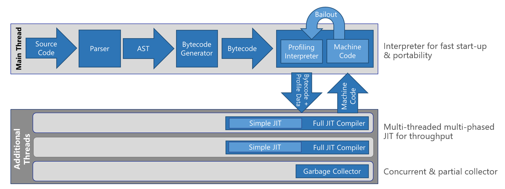
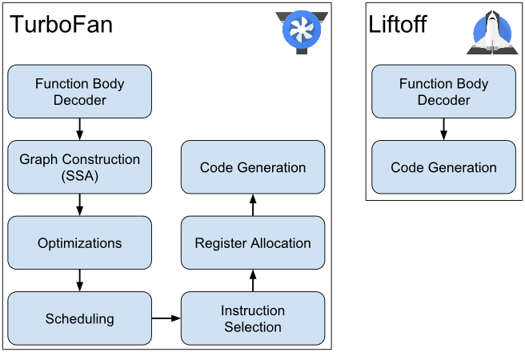

# Introduction to WebAssembly for the Uno Platform (Part 1)

WebAssembly, Wasm for shorts, is a hot topic these days and for good reasons. It has lots of promises and particularly one that interests the Uno Platform: Open up the Web to other languages and frameworks.

## What is WebAssembly ?

[WebAssembly](https://webassembly.org/) is a low-level byte code for the web, meant to be used as a compilation target for any language, much like ARM or x86. It has been built for the past few years by a W3C group, composed of various people from mostly browser, framework and hardware vendors. They have simple yet concrete goal of being able to [securely run arbitrary binary code with near native performance](https://webassembly.org/docs/high-level-goals/).

It's currently supported by all major browsers, making it a viable target **today**.

The consuming side of WebAssembly is generally composed of a `.wasm` file and a JS _glue_ file. The JS file is present to use the [WebAssembly.instantiate](https://developer.mozilla.org/en-US/docs/Web/JavaScript/Reference/Global_Objects/WebAssembly/instantiate) method which is the only entry point to invoke WebAssembly code.

The secure part of the goal is very important. It makes WebAssembly very different from the previous attempts to run arbitrary binary code, such as Flash, Java applets, VBA, Silverlight, ActiveX, ... which all had (and continue to have) security and portability issues. For instance, security features include the inability to execute arbitrary memory locations. While this makes optionally JIT'ed languages (such as .NET based languages) a difficult target, this provides [higher security](https://i.blackhat.com/us-18/Thu-August-9/us-18-Lukasiewicz-WebAssembly-A-New-World-of-Native_Exploits-On-The-Web-wp.pdf) about the execution environment being safer than its similar predecessors.

The performance aspect is also very important. 

_[Chakra & ChakraCore’s multi-tiered execution pipeline](https://blogs.windows.com/msedgedev/2015/12/05/open-source-chakra-core)_

JS execution engines have become very fast since the language origins, and they have also become very complex. Those are full of JITing tiered engines that can optimize, de-optimize and re-optimize portions of code based on various performance heuristics. 

_[V8's new compilation pipeline (Liftoff)](https://v8project.blogspot.com/2018/08/liftoff.html)_

Wasm on the other hand, because of the relative simplicity of the instruction set, is able to [perform compilation optimizations](https://v8project.blogspot.com/2018/08/liftoff.html) on the fly through [streaming compilation](https://webassembly.github.io/spec/web-api/index.html#streaming-modules) concurrently as the code is being downloaded.

Another aspect of WebAssembly is in its agnostic definition. Even though its name contains "Web", it is meant to be used a generic byte code. That's what allows for projects like [Ethereum](https://github.com/ewasm/design), [Nebulet](https://github.com/nebulet/nebulet) or [WebAssembly for .NET](https://github.com/RyanLamansky/dotnet-webassembly) to run without any browser in sight. As [Jay Phelps often mentions](https://twitter.com/_jayphelps/status/1034663875839504384) WebAssembly is neither Web nor Assembly, and can fit in many scenarios. It has the potential to ultimately be a true universal binary format, for kind of programming.

## Who's the WebAssembly target ?

Depending on the audience, the targets can be very different. 

For Web non-Microsoft crowds, for which the development model is quite mature, the usual pitch is to present WebAssembly as provider of [performance-optimized native libraries](https://www.codepool.biz/web-worker-load-webassembly-barcode.html), generally built with C/C++ or Rust.

For Web Microsoft crowds, there's the [Blazor experiment](https://blazor.net/) which is aiming at making C# and .NET the only development language for making web sites or Web Apps, using HTML.

For other crowds more in the mobile or desktop sides, there's not a lot to experiment with yet. Good examples found in [awesome-wasm](https://github.com/mbasso/awesome-wasm) such as [OOui](https://github.com/praeclarum/Ooui), [QT-Wasm](https://wiki.qt.io/Qt_for_WebAssembly) are worth checking out, and that's where the Uno Platform is trying to be an answer using C# and XAML for application developers, for .NET UWP, WPF, Xamarin and Silverlight developers.

In fine, WebAssembly is a target that most developers will never have to interact with directly, in the same way most developers never have to interact with x86_64 or ARM64 directly. It may become important if you want to dive deep into AOT engines, LLVM backends or similar technologies. Otherwise, it will mostly stay a compilation target, an element in a drop down list next to x86 and ARM64.

## WebAssembly and non-Web application developers

In a lot of cases, developers and companies have been avoiding the web altogether for a variety of reasons. It can be because of the deployment model, the limitations of the platform, the choice of languages (or the lack thereof), being forced to use HTML/CSS, the cost of migrating existing code to Javascript, the ever expanding choice of quickly deprecated frameworks...

Those reasons are obviously debateable, but the single-language environment is one  main blocker. Yet, the deployment ease and ubiquitous presence of browsers make it difficult to ignore, and Wasm is allowing for the software industry to benefit from those two aspects. Software developed for the past 30 years is now able to reach the Web as a deployment target and execution environment.

## Website, WebApp, App, Mobile App, Single Page Application (SPA), Rich Internet Application (RIA), Application or Program ?

The basic notion of a program has changed significantly over the years. It was caused by the evolving data locality, mobility, processing power, web/native environments, and the blending of those environments. In all of this, to be able to name a combination of all these constraints, terms have appeared to ease up the understanding.

Now that it is possible to install a C#/C++/Rust program from an URL installed as a **Progressive WebApp** that uses OpenGL or XAML, what makes it that much different from a Mobile App that is downloaded from an app store using an internal API call? Is it a WebApp because it uses Javascript? Or HTML? Is it still a WebApp is there is no Javascript code, once browsers can run wasm without JS ?

For now, the name that makes the most sense would be WebApp or SPA when run in a browser, though App does also make a lot of sense. The term may also be diluted if the same code runs in an electron shell, for instance.

There are concerns over the _Seach Engine Optimizations_ (SEO) aspect of such WebAssembly apps. Wasm apps can be easily compared to Mobile Apps in their searchable aspect, or to large desktop or SPAs (like GMail) for which the searchable aspect is not particularly relevant.

## Wasm, Performance and .NET JITing

Microsoft has been working on a WebAssembly [port of the Mono runtime for a while now](https://www.mono-project.com/news/2017/08/09/hello-webassembly/), and [progress has been steady](https://www.mono-project.com/news/2018/01/16/mono-static-webassembly-compilation/) since the beginning of 2018. The runtime is looking as stable as it is on iOS and Android using the [Uno Platform](https://github.com/nventive/Uno) as a point of reference, which is quite the achievement.

There's also the .NET Core Runtime (CoreRT) team that is working [on a WebAssembly port of the .NET Native engine](https://github.com/dotnet/corert/blob/master/Documentation/how-to-build-WebAssembly.md), and significant progress is made there as well.

The security aspect of WebAssembly, with the [inability to execute data segments of memory](https://webassembly.org/docs/modules/#function-index-space) makes it for a difficult task of running IL code. Standard Just-In-Time compilation is used to emit the underlying platform's instructions as data and get the CPU execute it. Fortunately, in the same way iOS and watchOS do not allow such a compilation technique, wasm requires a special treatment around this limitation.

The obvious answer to this is the use of AOT, employing the same technique used for iOS and watchOS. [For technical considerations](https://gitter.im/aspnet/Blazor?at=5b1ab670dd54362753f8a168) such as the integration of [emscripten](https://kripken.github.io/emscripten-site/index.html) and its `libc` implementation over Javascript, AOT is not yet available. While [the AOT integration](https://github.com/mono/mono/issues/10222) is currently being worked on by Microsoft, the current path for running .NET code in a WebAssembly environment is done through the revived mono interpreter.

The mono interpreter is similar to piece of code that to one that has been around for a long while ([mint](https://www.mono-project.com/news/2017/11/13/mono-interpreter/)), used in the early days of mono when the JIT engine (mini) wasn't yet available. Its role is to take IL instructions one-by-one and execute them on top of a natively compiled runtime. It allows for IL code to instantly run in the proper environment, at the expense of execution performance.

While this makes for a good kick start solution, such an implementation contains a [_giant switch_](https://github.com/mono/mono/blob/7c19f9d443136cd76bd50bde3e13c4b43c98000f/mono/mini/interp/interp.c#L2686) for each an every available opcode in the IL specification. This is [giving a hard time](https://bugs.chromium.org/p/v8/issues/detail?id=7838) for browsers when going through this hot execution path. It is also not play really nice with CPU data caches, such as devices with i5 CPU or below with limited L2 cache size.

This situation is fortunately only temporary. When Mono's AOT will be available, the code already be instantly a lot faster, even though by how much remains to be seen. The size aspect of the generated WASM binary is also an unknown fact, and it can also be difficult to extrapolate from other similar looking AOT target CPU architectures.

The interpreter mode will stay in mono as a mixed execution mode. This will allow for [scenarios of dynamic code generation using Roslyn](https://github.com/jeromelaban/Wasm.Samples/blob/master/RoslynTests/RoslynTests/Program.cs) to be viable in a non-JIT friendly environment, and enable pieces of the BCL such as [Expression compilation](https://docs.microsoft.com/en-us/dotnet/api/system.linq.expressions.expression-1.compile?redirectedfrom=MSDN&view=netframework-4.7.2#System_Linq_Expressions_Expression_1_Compile) to be functional. 

## About the binary size

There have been discussions around the binary size of WebAssembly apps when compared to existing SPA Javascript based frameworks such as React, Angular, Vue, etc... Those concerns are legitimate, though the constraints are mostly similar to those found for app stores. The Web provides more flexibility in terms of the deployment methods (e.g. module splitting) that are generally not available in app stores.

Expectations of binary size, compression, caching, cold and hot startup time, and runtime performance will probably need to be adjusted based on the scenarios and advantages/drawbacks of each target. 

For instance, can a Wasm cached application startup time perform better than a similar JS-only based application by JIT output caching ? Those expectation will also evolve based on the optimization and code speed/size tradeoffs that code generation tools will provide, along with the evolution of the WebAssembly specifications.

For .NET specific applications, the [IL Linker](https://github.com/dotnet/announcements/issues/30) can ease up the final binary by removing parts of the code that is not referenced. It can be also be a source of trouble if the application uses .NET reflection extensively (such as the [one found in Json.NET](https://github.com/nventive/Uno.Playground/blob/6aa5a222c5ee37f7df7a8ff91cce6d229cc99d93/src/Uno.Playground.WASM/LinkerConfig.xml#L6)).

## What's next for Wasm and Mono ?

There's a lot on the WebAssembly group and the most hyped features are [GC](https://github.com/WebAssembly/design/issues/1079), [Threads](https://github.com/WebAssembly/design/issues/1073) and [Host Bindings](https://github.com/WebAssembly/design/issues/1148).

There's also progress to be made in the debugging front. It's [currently possible to debug in a very basic way](https://github.com/mono/mono/tree/master/sdks/wasm#debugging), such as creating/hitting break points, watch primitive values but not complex values. The integration with the VS/Code tooling is also non-existent at this point. The debugging experience is entirely relying on the [Chrome DevTools protocol](https://chromedevtools.github.io/devtools-protocol/) and its integration in the chrome debugger UI.

### Garbage Collection
GC support is generally touted as a must-have feature for managed languages support in WebAssembly.

While GC will improve the interop performance with the **Host Bindings** provided objects, as it will avoid having [large hash tables](https://github.com/nventive/Uno/blob/5f75e5ec6e3620d8c60bea69297d0f03d2d7c6d6/src/Uno.UI.Wasm/ts/WindowManager.ts#L31) for mapping JS to WebAssembly pointers/IDs, the reality is that the .NET GC [semantics and behavior](https://docs.microsoft.com/en-us/dotnet/api/system.runtime.compilerservices.conditionalweaktable-2?redirectedfrom=MSDN&view=netframework-4.7.2) will most probably better off doing its own work to keep its own implementation (currently [SGen](https://www.mono-project.com/docs/advanced/garbage-collector/sgen/working-with-sgen/)).

The Mono GC will optionally have to better integrate with the Wassm provided GC. This is a similar environment to those found in mono-android and mono-ios SDKs with Android's ART and reference counting, respectively. This will provide a way to create advanced coordinated memory management scenarios.

### Host bindings
**Host Bindings** will help a lot in order to avoid having to write Javascript glue code to invoke host features. Accessing host features currently requires the use of Javascript evaluations which, while being interestingly particularly fast, requires a lot of string manipulations back and forth between JS and the Wasm world.

That being said, optimizations can still be made by taking advantage of the [linear memory memory access](https://github.com/nventive/Uno/blob/4a340f36e833e74c84e046bf527f0a2c3dbee173/src/Uno.UI.Wasm/ts/WindowManager.ts#L557). It is possible to [pass a memory pointer from wasm](https://github.com/nventive/Uno.RoslynQuoter/blob/f4efa2b1434c43340f5d9248d92ef37c7bdcbf28/src/uno/RoslynQuoter.Shared/MainPage.xaml.cs#L110) using standard [GCHandle.Alloc](https://docs.microsoft.com/en-us/dotnet/api/system.runtime.interopservices.gchandle.alloc?redirectedfrom=MSDN&view=netframework-4.7.2#System_Runtime_InteropServices_GCHandle_Alloc_System_Object_) native memory allocations APIs and [read the memory  into a javascript array](https://github.com/nventive/Uno.RoslynQuoter/blob/f4efa2b1434c43340f5d9248d92ef37c7bdcbf28/src/uno/RoslynQuoter.Wasm/WasmScripts/CreateDownload.js#L7). This does not make for particularly pretty code, but has the advantage of limiting the performance impacts of string conversions.

The mono team has been working on [TStoCSharp](https://github.com/mono/TsToCSharp)  that uses the recent integration of preliminary support for [JSObject](https://github.com/mono/mono/blob/00f64d2998c36660cbc4dd848fe25d1a7343630a/sdks/wasm/bindings.cs#L229) to ease up the interop. This tool can provide a good abstraction until Host Bindings are implemented.

### Threading
Threads will allow for using a lot more of the hardware's power. Currently, WebAssembly code is running in the same context as the Javascript code, meaning that it can only run single threaded. All threading APIs in Mono are currently throwing `NotSupportedException`.
 
To be able to simulate threading and concurrency, C# `async` and `await` use a similar pattern to the one found in a [CoreDispatcherSynchronizationContext](https://github.com/nventive/Uno/blob/8dcc6f2d3aa5d57fd3ee96efe5fe73855a45a0da/src/Uno.UWP/UI/Core/CoreDispatcherSynchronizationContext.cs), where work is queued but can never block. This allows [Uno.Rx.NET](https://github.com/nventive/Uno.Rx.NET) to have a [WasmScheduler](https://github.com/nventive/Uno.Rx.NET/blob/ec26ca4640f96925d47a1dbc5454431b10a49c1c/Rx.NET/Source/src/System.Reactive/Concurrency/WasmScheduler.cs#L12) which uses the underlying Javascript [setTimeout](https://www.w3schools.com/jsref/met_win_settimeout.asp) method to schedule work in a consistent way. 

Once threading is available, it will be mostly like flipping a switch and most Rx.NET applications will be able to run effectively concurrently.

## Bootstrapping the mono-wasm SDK

The current challenge when using the mono-wasm SDK is its barrier to entry. There are still lots to fiddle around and it's not integrated in any way to Visual Studio or VS Code.

Based on the work from [Frank A. Krueger on OOui](https://github.com/praeclarum/Ooui), we built [Uno.Wasm.Bootstrap](https://github.com/nventive/Uno.Wasm.Bootstrap) a simple nuget package with no ties to any framework (not even the Uno Platform), other than mono-wasm. This allows to take a simple .NET Standard 2.0 library, and run it in the browser, using `Console.WriteLine` to write text to the browser's debugging console. Anything else more advanced that interacts with the browser needs to go through Javascript evaluation API.

We expect this package to change significantly in the near future. This includes the addition of new Mono features (such as the AOT and debugger support), Nuget integration, VS integration, etc...

Head over to the [Uno.Wasm.Bootstrap readme](https://github.com/nventive/Uno.Wasm.Bootstrap#how-to-use-the-package) to create your own app and experiment with C# in the browser in minutes. See those two [examples for additional scenarios](https://github.com/jeromelaban/Wasm.Samples) using Json.NET and Roslyn.

## Nuget integration in the ecosystem

The integration of WebAssembly in the Nuget ecosystem is [still in flux](https://github.com/NuGet/NuGet.Client/pull/2159). Runtimes will inevitably provide [WebAssembly specific APIs](https://github.com/mono/mono/blob/00f64d2998c36660cbc4dd848fe25d1a7343630a/sdks/wasm/bindings.cs#L20), `setTimeout` and `eval` for starters. There is currently no officially supported way to statically compile code for the WebAssembly target, other than do runtime switches around [RuntimeInformation.OSPlatform](https://github.com/mono/mono/blob/396559769d0e4ca72837e44bcf837b7c91596414/mcs/class/corlib/System.Runtime.InteropServices.RuntimeInformation/RuntimeInformation.cs#L55). Another avenue is to use the obscure _runtime_ feature found in Nuget, exposed by Oren's [MSBuild SDK Extras](https://github.com/onovotny/MSBuildSdkExtras), but we're not there yet with the Uno Platform.

The Uno Platform is currently aliasing the .NET Standard 2.0 as WebAssembly. This is possible because the `netstandard2.0` is currently not a supported "platform" per se, but this will change once the Nuget client recognize the `wasm` platform properly.

## Up next...  

In the second part of this article, we'll touch on the integration of the Uno Platform in WebAssembly, such as the way the Uno Platform XAML controls are rendered, or how platform features will be mapped to UWP APIs.