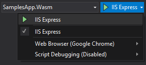
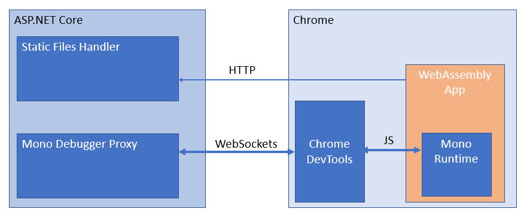

# Introducing Uno Platform WebAssembly Projects and C# Debugging

The progress on the Uno Platform support for WebAssembly has been steady, along with the mono runtime making large improvements in the support for a debugging experience.

We've added support for a better Visual Studio project integration as well as an experimental debugging experience.

The next release of the [Uno Visual Studio add-in](https://marketplace.visualstudio.com/items?itemName=unoplatform.uno-platform-addin-2022) will contain the new project format and the debugger, but you can try it today using the [latest experimental release](https://github.com/unoplatform/uno/releases) of the Uno Platform.

## WebAssembly Project Support for Visual Studio

Originally, the support for WebAssembly was done with Uno through the creation of a .NET Standard 2.0 project, relying on the use of mono-provided python server. The sole purpose of this server is to serve files with the `application/wasm` mime type, which can be done through a normal WebApp project.

As the mono-wasm debugger has progressed a lot, we decided to look into the first step of improving the Visual Studio support for Uno WebAssembly projects. The newer experience is what a developer would expect in terms of integration. It is similar to a normal Web Project: Pressing Ctrl+F5 now starts the WebAssembly project in your preferred browser.

As for most web projects, refreshing the web page is enough for the application to pick up the new changes.

Using the standard `Microsoft.NET.Sdk.Web` in project definitions gives all the integrated features such as publishing to Azure or other supported targets :

```xml
<Project Sdk="Microsoft.NET.Sdk.Web">
  <PropertyGroup>
    <OutputType>Exe</OutputType>
    <TargetFramework>netstandard2.0</TargetFramework>
    <WasmHead>true</WasmHead>
    <DefineConstants>__WASM__</DefineConstants>
  </PropertyGroup>

  <ItemGroup>
    <PackageReference Include="Uno.UI" Version="1.42.0-dev.395" />
    <DotNetCliToolReference Include="Uno.Wasm.Bootstrap.Cli" Version="1.0.0-dev.112" />
  </ItemGroup>
```

For those of you that are already running WebAssembly Uno projects, there are not many changes to make, aside from adding `Microsoft.NET.Sdk.Web` at the top and add the new `DotNetCliToolReference` to `Uno.Wasm.Bootstrap.Cli`, which enables the Visual Studio integration.

## Debugging C# in WebAssembly

The Mono team has been working for a while on the debugging experience, and recent improvements have made it easier to work with it. It is still experimental, but still gives significant help in debugging WebAssembly projects.

There is only one important constraint: the debugging only works with Chrome. It is using the [Chrome DevTools Protocol](https://chromedevtools.github.io/devtools-protocol/).

The debugger provides access to all local sources, as well as [Source Link enabled assemblies](https://docs.microsoft.com/en-us/dotnet/standard/library-guidance/sourcelink) when available, provide single stepping, breakpoints, stack trace walking, local variables and watches. Currently, watching local variables is limited to primitives and strings.

To give you an example of the debugging experience, this is a step-into the `DateTime.Now` property in the mono source tree, from a normal user program:
 

The Mono team recently added the ability to get the source files from debugging information for the Mono binaries, making it quite easy for debuggers to pull exact source files for published binaries.

**One bit of a warning**, the debugging experience is very rough on the edges. The debugger may crash frequently (with Chrome saying a WebSocket got disconnected) as there are many non-sunny-path scenarios that have not been tested yet. This means that you may not be able to set breakpoints, step into or step out of some specific code sections (e.g. partial methods).

## Using the WebAssembly C# Debugger

- Create an **Uno Platform Cross-Targeted application** from the Uno Solution Template (See at the end of this post for more details)
- Set the Wasm project as a startup project
- Ensure that
  - **IIS Express** is enabled in your debugging toolbar
  - **Chrome** is active WebBrowser
  - 

- Press *Ctrl+F5*
- Once your application is loaded, press **Alt+Shift+D**, a new tab will open
- You will get an error message telling you that Chrome has not been opened


- Close all your chrome instances and run Chrome again using the provided command line
- Once again, once your application is loaded, press **Alt+Shift+D**, a new tab will open.
- You will now get the Chrome DevTools to open listing all the .NET loaded assemblies on the Sources tab:


- You can now set break points in the available source files
- Since the app's initialization has already started, you can refresh the original website tab, or use the smaller refresh button in the preview section of the Chrome DevTools:


## How does it work?

The structure of the application is a bit complex, and a drawing is more informative than a thousand words:



The debugger proxy is an ASP.NET Core component from Mono, that is embedded inside the ASP.NET Core static file server used during development. Its role is mainly to provide access to PDB files, interpret the Chrome DevTools debugger commands and translate them back for the mono-wasm runtime to understand. This includes setting breakpoints, getting watch values, getting source files, etc...

For the moment, the Uno Platform is using a custom build of the debugging proxy which adds support for Mono sources and source link, as well as other fixes. Those will make their way into the main Mono repository soon.

If you're familiar with Blazor, you'll notice that the debugger experience is very similar, and it is, the ASP.NET Core integration layer is directly inspired by Blazor's 0.7.0 debugger support implementation.

## What's next?

We've been using the debugger for a few days now, and it's allowed us to improve our troubleshooting velocity. Having a proper stack trace and variable watch is always of great help, where Console.Write can fall short.

We'll continue to work with the mono team to improve the deployment and debugging experience of mono-wasm applications.

Let us know what you think!
