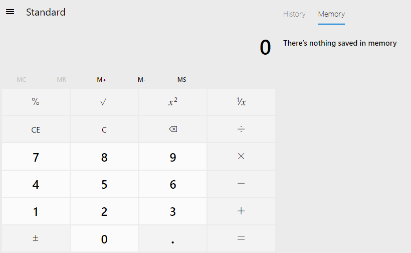
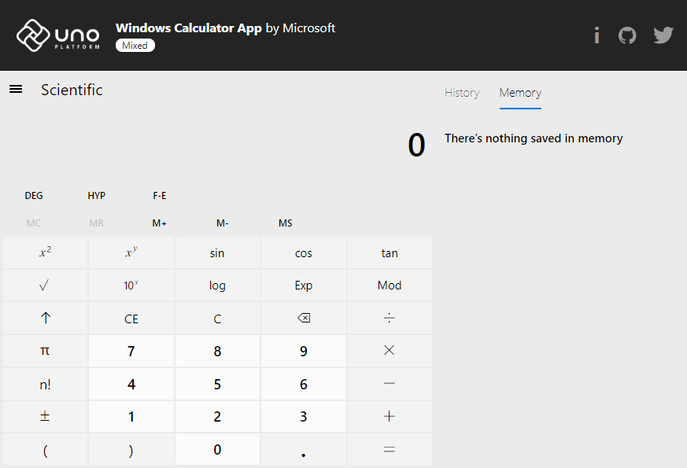
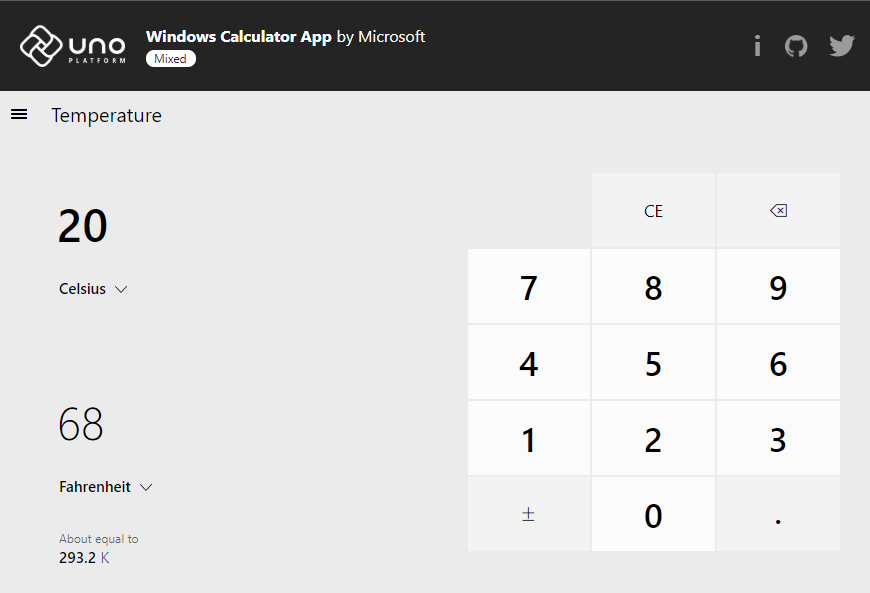
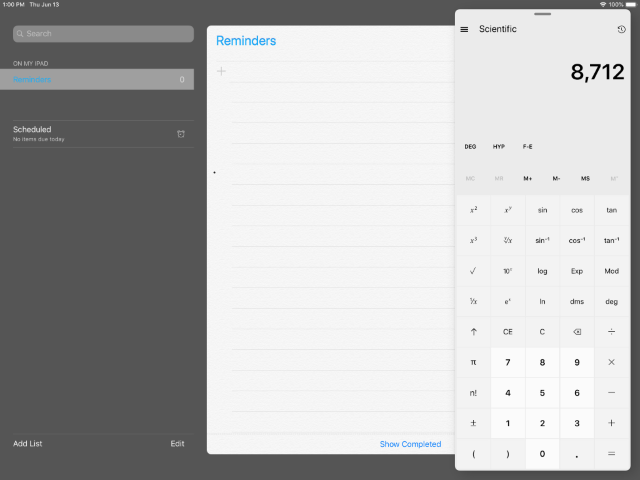
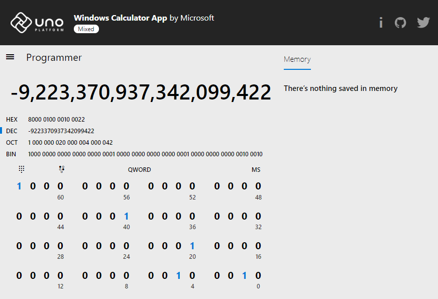

# A piece of Windows 10 is now running on WebAssembly, natively on iOS and Android

A few months ago, Microsoft [open sourced the Windows Calculator](https://blogs.windows.com/buildingapps/2019/03/06/announcing-the-open-sourcing-of-windows-calculator/), the very Calculator that ships with Windows 10.

We decided to [port it to C# and the Uno Platform](https://github.com/unoplatform/calculator), so that iOS and Android users could use it, but also use it from the Web using Web Assembly. Why – well that’s what we at Uno Platform do 😊 – enable the same C# and XAML code to run on the Web, Mobile and Desktop.

You can use it today on:
- [Apple App Store](https://bit.ly/calc-ios)
- [Android Play Store](https://play.google.com/store/apps/details?id=uno.platform.calculator)
- WebAssembly: https://calculator.platform.uno
-	Windows 10 – well, just open it on Windows 10 😊



## Anatomy of the Windows Calculator

The Windows Calculator is an interesting and not-so-simple piece of software. The simple
initial UI you see upon launch can be deceiving. Of course, that is a good UX
choice Microsoft made as most uses of the calculator are rather simple ones. However, the
calculator is complex both in the way it was coded over the years, as well as the advanced
functions it has.

First, it's built entirely using standard C++ 11 and C++/CX, with [a calculation engine that dates back from 1995](https://github.com/microsoft/calculator/blob/master/src/CalcManager/Ratpack/conv.cpp#L7). Historically, parts of the C++ code were actually built in C.



Second, the calculator contains features such as: Standard mode, Scientific mode, a Programmer mode with multiple bases conversion, shifting operations, and an interactive bit field view, Dates calculator, a large set of converters (currency, volume, length, temperature, angles, ...), infinite precision arithmetic operations, an expression view with parenthesis support, a history view with selectable items, and an editable memory view. It also boasts responsive design for windowed and orientation-aware devices, with buttons and history dynamic visibility, localization for 65 languages, narrator/voice-over accessibility support, clipboard support, etc...



## Porting the engine to the Uno Platform

The Uno platform being developed in C#, to be able to support the Calculator on iOS, Android and WebAssembly, some parts of the code needed to be translated to C#. Others needed to be adjusted to be compliant with clang's C++ 11 support.

In the following part we will dissect the challenges we needed to solve in order to port this code to Web, via WebAssembly support of Uno Platform, as well as native iOS and Android apps.

### Challenge #1: Adjusting the C++ of the Calculation Engine

The main reason for keeping C++ code as-is is the use of pointers and low-level memory techniques that do not map easily to C#, but also the fact that the Calculation Engine does not use any UI directly. The code is encapsulated using the `CalculatorManager` class, an `IResourceProvider`  callback interface and `ICalcDisplay` UI updates callbacks interface.

Most of this part of the code did not need to be updated, except for the use of the C99 **[flexible array member feature](https://en.wikipedia.org/wiki/Flexible_array_member)**. This feature is not supported in C++ (for good reasons), but Microsoft engineers added an exclusion for that feature. Clang however does not have that and the code that relied on it needed some adjustments to use normal arrays.

Build scripts are used for [iOS](https://github.com/unoplatform/calculator/blob/uno/src/CalcManager/build_ios.sh) and [WebAssembly](https://github.com/unoplatform/calculator/blob/uno/src/CalcManager/build.sh) to generate their native payloads, whereas Windows and Android use their own `C++` Visual Studio projects for integration.

Android's NDK also has its surprises, where the handling of exceptions is not enabled by default for NDKs below r19 for ARM32 ABIs. The calculation engine relies on the use of exceptions to handle cases such as divisions by zero, making the app crash in such conditions. Adding the `-lunwind` library to the linker solved that issue.

### Challenge #2: Native code interop specifics

There are multiple subtleties for building and using native code:
- For iOS, it is [required to use the `__Internal`](https://github.com/unoplatform/calculator/blob/2657413f889ba26f2e3d78e82d384794fdad3aec/src/Calculator.Shared/CalcManager/CalculatorManager.Interop.cs#L16) known name, as native libraries are statically linked to main executable.
- For Android, the integrated VS project does not automatically build for all target platforms (x86, armv7 and arm64), which means that [additional CI builds steps](https://github.com/unoplatform/calculator/blob/2657413f889ba26f2e3d78e82d384794fdad3aec/.vsts-ci.Windows.yml#L37) have to be executed so the proper binaries are used all at once when creating the final APK. Also, standard project dependencies cannot be used (because of the multi ABI builds), and the [`AndroidNativeLibrary`](https://github.com/unoplatform/calculator/blob/2657413f889ba26f2e3d78e82d384794fdad3aec/src/Calculator.Droid/Calculator.Droid.csproj#L101) items must be added in the project.
- For WebAssembly, the module needs to be built using the `-s SIDE_MODULE=1` support, with additional support for C++ standard library, as it is [not automatically added by emscripten](https://github.com/emscripten-core/emscripten/wiki/Linking#system-libraries) for dynamic modules.

### Challenge #3: Converting the C++/CX code to C#

The rest of the application is using Microsoft's C++/CX to use WinRT APIs and particularly WinUI APIs. This makes for a very C#-like code that can be converted to C# using a set of regular expressions that convert `::` to `.`, or `dynamic_cast<FrameworkElement>(fe)` to `((FrameworkElement)fe)`, and the rest of the WinRT API calls just match directly, as Uno provides the full APIs signatures of WinRT.

That conversion converts roughly 80% of C++/CX code to C#-compatible code, with some manual adjustments to get fully functional C#. For instance, C++ iterators need to be converted to `foreach` loops, or string to numbers conversions using .NET built-in conversions.

Some other parts of the code could not be converted as-is, particularly those that are relying on Win32 APIs, such as current culture properties like currency or calendar features. Those needed to be converted to use .NET's own APIs as much as possible.

### Challenge #4: Converting the XAML

That part is very easy: there's nothing to convert!

The only thing needed was to adjust to Uno's differences, such as the missing support for Theme Resources or RevealBrush support.



The Calculator's interface layout is also very responsive, and can adjust to many break points. This enables multitasking and docking scenarios on the iPad very easily.

### Challenge #5: Localization Resources

The Uno Platform supports the use of resw files, which means that those files are the exact same files that the original calculator uses.

Note that the resources use the [attached property syntax](https://github.com/microsoft/calculator/blob/06c0dd9bd0f5971db9b17a782e1386037da38026/src/Calculator/Resources/de-DE/Resources.resw#L460) for narrator and tooltip support, such as:

```xml
  <data name="MemoryPivotItem.[using:Windows.UI.Xaml.Automation]AutomationProperties.Name" xml:space="preserve">
    <value>Arbeitsspeicher</value>
    <comment>The automation name for the Memory pivot item that is shown when Calculator is in wide layout.</comment>
  </data>
```

making for a clutter free localized XAML.

Image assets are also supported directly by the Uno Platform, though some of the original assets cannot be used directly as they use semantic features such as high contrast that are not yet supported by Uno. Those have been excluded for the time being.

## Connecting the C++ and C# together

This part is the heart of the porting effort that makes use of [P/Invoke](https://docs.microsoft.com/en-us/cpp/dotnet/how-to-call-native-dlls-from-managed-code-using-pinvoke?view=vs-2019).

### Challenge #6: Mono for WebAssembly Dynamic and Static Linking support

To be able to invoke WebAssembly code directly from C# using P/Invoke, [Mono had to be updated](https://github.com/mono/mono/pull/14259) to support it. Two modes are available, one for interpreter-based builds and another for AOT-based builds.

The interpreter-based mode uses [emscripten's dynamic linking feature](https://github.com/emscripten-core/emscripten/wiki/Linking#overview-of-dynamic-linking), and is required to be able to build a Wasm application under windows without having to rely on emscripten's tooling. This ensures that the development loop is as efficient as possible, though at the expense of runtime performance.

The AOT-based mode uses emscripten's and [Mono's static linking feature](https://github.com/mono/mono/pull/14253), where Mono generates a set of "known p/invoke" methods into LLRM bitcode modules. This mode is the most efficient, but also the slowest to generate. It's generally best to use it in release CI builds.



### Challenge #7: The C adaptation layer
P/Invoke is only able to call C functions, exposed here through the `extern "C" { }` cdecl calling convention. This means that to be able to invoke the C++ part of the Calculation Engine, a [C to C++ translation layer](https://github.com/unoplatform/calculator/blob/uno/src/CalcManager/CCalcManager.h) needed to be created. It exposes a set of methods that can [create C++ instances](https://github.com/unoplatform/calculator/blob/2657413f889ba26f2e3d78e82d384794fdad3aec/src/CalcManager/CCalcManager.h#L86) and returns opaque identifiers that are [passed thereafter explicitly](https://github.com/unoplatform/calculator/blob/2657413f889ba26f2e3d78e82d384794fdad3aec/src/CalcManager/CCalcManager.h#L87) to C++ class instance methods.

This technique requires manual work, but since the Calculation Engine is not particularly complex, adding all the needed methods was easy work.

### Challenge #8: The case of C++ to C# callbacks

Callbacks are generally handled in C# via [`Marshal.GetFunctionPointerForDelegates`](https://github.com/unoplatform/calculator/blob/2657413f889ba26f2e3d78e82d384794fdad3aec/src/Calculator.Shared/CalcManager/CalculatorManager.cs#L139).

While this works well for JIT-compatible platforms (Android and Windows) through the creation of stubs or trampolines at runtime, iOS and WebAssembly not support that.

For iOS, [`UnmanagedFunctionPointer`](https://github.com/unoplatform/calculator/blob/2657413f889ba26f2e3d78e82d384794fdad3aec/src/Calculator.Shared/CalcManager/CalculatorManager.Interop.cs#L128) needs to be added to that the callback pointer is generated at compile time.

Mono-wasm does not yet support this feature, and [there's a need to rely](https://github.com/unoplatform/calculator/blob/2657413f889ba26f2e3d78e82d384794fdad3aec/src/Calculator.Wasm/WasmScripts/CalcManager.js#L18) on the [emscripten reserved function pointers](https://emscripten.org/docs/porting/connecting_cpp_and_javascript/Interacting-with-code.html#calling-javascript-functions-as-function-pointers-from-c) and `addFunction` helper function to get WebAssembly invocable callbacks to C#. Each Javascript registered function then calls back to C# using Mono's binding helper.

### Challenge #9: String Marshalling

String marshalling is a tricky piece. Windows systems use UTF16 encoding, while \*nix systems use UTF32 encoding. Default p/invoke marshalling does not support the implicit conversion from and to UF32, and some [explicit management of strings](https://github.com/unoplatform/calculator/blob/2657413f889ba26f2e3d78e82d384794fdad3aec/src/Calculator.Shared/CalcManager/CalculatorManager.Interop.cs#L326) needed to be added to support the C++ `wchar_t` type.

### Challenge #10: Adding features to Uno

In the course of porting the Calculator, we had to add support for many of the XAML and WinRT features that the calculator is relying on.

Features such as Grid's [RowDefinitions.MaxWith/MaxHeight support](https://github.com/unoplatform/uno/pull/1048), [Attached Property localization using resources](https://github.com/unoplatform/uno/pull/966), fixes such as [text measuring](https://github.com/unoplatform/uno/pull/1034) and [caching](https://github.com/unoplatform/uno/pull/931) for WebAssembly, performance improvements with [VisualState Triggers](https://github.com/unoplatform/uno/pull/1008), [Javascript marshaling](https://github.com/unoplatform/uno/pull/970), and support for the new [`x:Load` attribute](https://github.com/unoplatform/uno/pull/870) are some of the improvements we made to Uno.

There are other adjustments that have been made to the original source code of the calculator to adjust for Uno, and we're going to be adding support for those in the future as we progressively add new features to the Uno Platform.

## Additional notes

The Currency converter uses an API call to be able to get up-to-date rates, and the endpoint is not CORS-enabled, which makes invocation from a web browser difficult. The API call is for now going through the [CORS-anywhere sample app](https://cors-anywhere.herokuapp.com/), but eventually Microsoft may be updating its endpoint to support it properly.


Also, if you are trying the calculator, or any other WASM-related apps, because of WebAssembly limitations you should keep the following in mind.

1. WebAssembly is work in progress – performance is getting better and better, as emscripten, LLVM, Mono and Uno get improvements.
1. A lot of devs use Chrome as their primary browser. Currently Chrome’s own support for WebAssembly is not quite there (the current canary is much better!), so you may want to try the Calculator using one of the other browsers.

### About the C++ Conversion

Translating for C++ to C# is very useful to understand the code, and make it more familiar to the general population of Windows developers, but it has the disadvantage of making change tracking against the original source code harder.

This is the reason why we chose to refactor as little as possible the code (e.g. no adjustments to conform to C# general naming conventions) and keep the C# code as close to the original C++ code as possible. This eases the process of applying upstream C++ updates to the C# code base.

### Final thoughts

The porting of the Calculator is a very interesting project to work on, and also makes for a very good calculator to use on all platforms.

You can try building it yourself [by heading over to the GitHub repo](https://github.com/unoplatform/calculator).

We’d like to help developers write single-codebase applications that run natively on Web, Mobile and Desktop. To help you do that we have [created a simple tutorial](https://platform.uno/docs/articles/getting-started-tutorial-1.html) so you can test it out in your own environment. We’d appreciate if you give it a try.

Let us know what you think!

_Special thanks to the team at nventive for the hard work of making the porting of this application a reality !_
