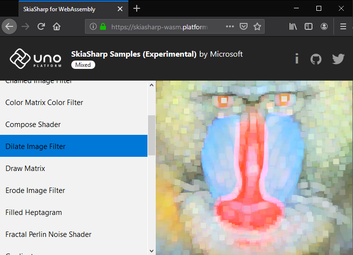

# SkiaSharp support for WebAssembly via Uno Platform

Today we are proud to announce that the Uno Platform now has initial support for Skia via the [Uno.SkiaSharp.Views](https://www.nuget.org/packages/Uno.SkiaSharp.Views) package which was published to NuGet moments ago. Skia is an open source 2D graphics library which provides common APIs that work across a variety of hardware and software platforms. It serves as the graphics engine for Google Chrome and Chrome OS, Android, Mozilla Firefox and Firefox OS, and many other products. 

Head on over [skiasharp-wasm.platform.uno](https://skiasharp-wasm.platform.uno) to see Skia, the Uno Platform and WebAssembly working together. For the best experience we recommend using a desktop computer and the latest canary version of your favourite browser as the [specification is under construction](https://github.com/WebAssembly/spec) and support for WebAssembly is rapidly improving.



You can find the source code for [skiasharp-wasm.platform.uno](https://skiasharp-wasm.platform.uno) over at [unoplatform/Uno.SkiaSharp](https://github.com/unoplatform/Uno.SkiaSharp). Internally this application uses [SkiaSharp](https://github.com/mono/SkiaSharp), a .NET binding to [P/Invoke the Skia API](https://github.com/mono/SkiaSharp/blob/master/binding/Binding/SkiaApi.cs#L96-L97) and a [custom Skia build](https://github.com/mono/skia) to provide the [C API to allow for the .NET interop](https://github.com/mono/skia/blob/xamarin-mobile-bindings/include/c/sk_canvas.h#L18).

Inside of the `Uno.SkiaSharp.Views` package you'll find support for the [SKXamlCanvas](https://docs.microsoft.com/en-us/dotnet/api/skiasharp.views.uwp.skxamlcanvas?view=skiasharp-views-uwp-1.68.0) UWP control which enables drawing using Skia in a specific section of the XAML visual tree. You can experiment with `SKXamlCanvas` by playing with [this sample](https://github.com/unoplatform/uno.Samples/tree/master/UI/SkiaSharpTest)  in our samples repository. Alternatively, you can take it for a spin with the following XAML and Code Behind.

XAML:
```xaml
<Grid Background="{ThemeResource ApplicationPageBackgroundThemeBrush}">
    <skia:SKXamlCanvas x:Name="test" PaintSurface="OnPaintSurface" />
</Grid>
```

Code Behind:

```csharp
private void OnPaintSurface(object sender, SKPaintSurfaceEventArgs e)
{
    // the canvas and properties
    var canvas = e.Surface.Canvas;

    // get the screen density for scaling
    var display = DisplayInformation.GetForCurrentView();
    var scale = display.LogicalDpi / 96.0f;
    var scaledSize = new SKSize(e.Info.Width / scale, e.Info.Height / scale);

    // handle the device screen density
    canvas.Scale(scale);

    // make sure the canvas is blank
    canvas.Clear(SKColors.Yellow);

    // draw some text
    var paint = new SKPaint
    {
        Color = SKColors.Black,
        IsAntialias = true,
        Style = SKPaintStyle.Fill,
        TextAlign = SKTextAlign.Center,
        TextSize = 24
    };

    var coord = new SKPoint(
        scaledSize.Width / 2, 
        (scaledSize.Height + paint.TextSize) / 2);
    canvas.DrawText("SkiaSharp", coord, paint);
}
```

## How we made SkiaSharp work with WebAssembly

We started by proving that it was possible to run the full SkiaSharp API on top of a custom interop layer, as Mono did not support proper WebAssembly dynamic linking. During our initial experiments with CanvasKit the user experience was pretty slow, but it worked.

Thanks to the wonders of open-source we were able to work with the Mono team to fix dynamic linking and it enabled the [Windows Calculator's calculation engine to be ported over to WebAssembly](https://platform.uno/a-piece-of-windows-10-is-now-running-on-webassembly-natively-on-ios-and-android/). Getting dynamic linking was also key to enabling Skia to be compiled to WebAssembly and used by .NET code through P/Invoke.

To enable this, we're using a [fork of the Skia engine](https://github.com/unoplatform/skia) that adds support for both CanvasKit and SkiaSharp's C API, while disabling all the Javascript support. This is required as [double-based APIs are not exportable to JavaScript](https://github.com/emscripten-core/emscripten/commit/ccaf4e74fa9abf51cff8d1d4823f0b4d84bf3eab). This basically makes the Skia module look like a dll, as far as SkiaSharp is concerned.

Thankfully, Mono supports static linking pretty well out-of-the-box and it enabled us to embed the Skia engine directly into [skiasharp-wasm.platform.uno](https://skiasharp-wasm.platform.uno) which is a Mono AOT-compiled WebAssembly application via Uno. Considering how cutting edge this technology is, we are really impressed with how responsive Mono is _right now_.

## The road ahead

There are a few items outstanding before we will consider support for Skia as complete: 

**First**, we needed to fork SkiaSharp to enable WebAssembly support because of the specificities of the native interop layer, notable because [`Marshal.GetFunctionPointerForDelegate`](https://docs.microsoft.com/en-us/dotnet/api/system.runtime.interopservices.marshal.getfunctionpointerfordelegate?view=netframework-4.8) is not supported yet, and [emscripten's `addFunction`](https://emscripten.org/docs/porting/connecting_cpp_and_javascript/Interacting-with-code.html) function pointers feature [needs to be used](https://github.com/unoplatform/Uno.SkiaSharp/blob/uno/binding/SkiaSharp.Wasm/ts/SkiaSharpCanvasKit.ts#L21-L32) for the time being. 

We're [working with the SkiaSharp team](https://github.com/mono/SkiaSharp/issues/876) to add an adjustable interop layer that would enable WebAssembly support to be plugged-in at runtime, allowing proper support for packages such as [`SkiaSharp.Extended`](https://www.nuget.org/packages/SkiaSharp.Extended) to be used without being forked to be supported by WebAssembly.

**Second**, WebAssembly specifics in terms of function exports require a very specific set of pre-defined methods ([declared here](https://github.com/mono/mono/blob/8d80ccc897c678d7bdae645ca8629b0c5cc0b667/mono/mini/m2n-gen.cs#L30) in mono-wasm). Altering the existing Skia C API signatures to match those "known" methods is possible to some extent, but not for all methods. This is why some methods are still missing from the Skia implementation, and need to be adjusted to use structures instead of parameters, and avoid updating the Mono runtime to be supported.

**Finally**, we'll be adding support for the GPU-accelerated OpenGL back-end which will greatly improve performance as currently only the software rendering engine is available.

You can follow the progress with [this GitHub issue](https://github.com/unoplatform/uno/issues/1116).

Let us know what you think!

_If you are new to Uno Platform and are wondering how to get started, we've created a
step-by-step tutorial which gets you from zero to a small, fully working app on WebAssembly, iOS and
Android - [Get Started now](https://platform.uno/docs/articles/getting-started-tutorial-1.html)_
