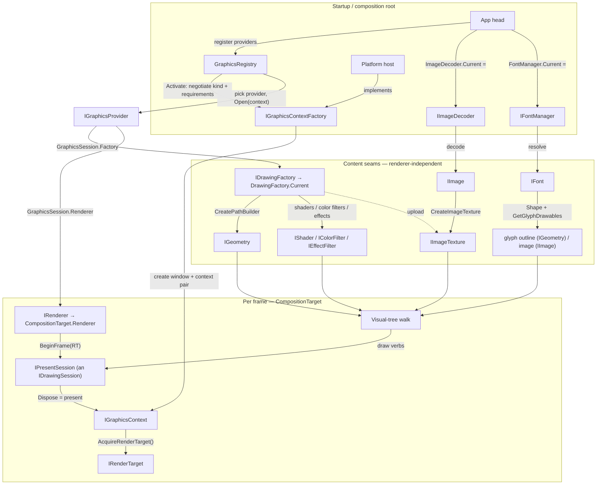

# Uno Drawing / Graphics — Target Design

Status: **design** (the shape we're implementing toward). The current, partially-implemented state lives in
`uno-drawing-backend-abstraction.md`; this document supersedes it where they differ.

Types are introduced **bottom-up in dependency order** — nothing is referenced before it's defined.

---

## Guiding principles

1. **Three independent concerns.**
   - **Content production** — geometry, images, fonts, SVG. Produces *neutral currency* (`IGeometry`, `IImage`),
     is **independent of the renderer**, and is supplied through its own seams.
   - **The renderer** — a *matched pair*: a resource factory (`IDrawingFactory`) + a frame renderer
     (`IRenderer`), bound to a GPU device.
   - **Graphics negotiation** — window/context creation + provider selection (`IGraphicsContext`,
     `IGraphicsContextFactory`, `IGraphicsProvider`, `GraphicsRegistry`).
2. **Class vs. interface.** Interface = per-implementer behavior with no shared implementation. Class = inert
   data, *or* a real shared implementation. (So render targets are classes; contexts and providers are interfaces;
   per-kind context bases are abstract classes.)
3. **Neutral vs. opaque handles.** *Neutral/introspectable* handles (`IGeometry`, `IImage`, `IFont` output) are
   read by the framework (bounds, hit-test, pixels) → any renderer can consume any producer's → managed impls
   possible. *Opaque* handles (`IShader`, `IColorFilter`, `IEffectFilter`) are consumed only by their matched
   renderer, which downcasts them → empty interfaces.
4. **Paint is by-value, inline, per verb.** No combined paint object; each draw verb takes exactly the inputs it
   honors (a solid fill and a shader fill are distinct overloads). Expensive things cross as handles.
5. **No GPU-library types on the seam.** The seam carries GPU-*API* primitives (handles, proc loaders) but never
   GPU-*library* wrappers (`GRContext`, `SKSurface`, wgpu-sharp) — those are built inside the renderer.

---

## Vocabulary (the word "backend" is retired)

The old `*Backend` names conflated three different jobs. The abstractions are now named for what they *do*:

| Concept | Type | Kind | Role |
|---|---|---|---|
| Resource factory | `IDrawingFactory` (`DrawingFactory.Current`) | interface + static | manufactures the renderer's handles — geometry, shaders, filters, textures, offscreen |
| Frame renderer | `IRenderer` (`CompositionTarget.Renderer`) | interface + static | draws a frame **immediately** and presents; retained record/replay is an optional add-on |
| Graphics provider | `IGraphicsProvider` | interface | the pluggable **pair** (factory + renderer) for one device; the unit you register |
| Graphics registry | `GraphicsRegistry` | static | registers providers, negotiates, activates the winner |
| Graphics context | `IGraphicsContext` | interface | a live GPU device + swapchain + present |
| Context factory | `IGraphicsContextFactory` | interface | host-supplied; creates the window+context pair |
| Image decoder | `IImageDecoder` (`ImageDecoder.Current`) | interface + static | encoded bytes → neutral pixels — an independent content seam |
| Font manager | `IFontManager` (`FontManager.Current`) | interface + static | family / bytes / codepoint → `IFont` — an independent content seam |

So: the render/drawing "backends" become a **renderer** and a **factory**; their pluggable bundle is a **provider**;
the content seams are **decoders**/**managers**.

---

## The buckets (what we abstract, and why)

The high-level map — one row per area, the Skia (or HarfBuzz / Unicode) it rests on today, whether abstracting it
changes a type an app can reference, and the abstraction. The lettered sections **§A–R** carry the per-type
detail; this is the overview.

| Bucket | Rests on today | Breaks public API? | Abstraction |
|---|---|---|---|
| **Geometry** | `SKPath`, `SKPathBuilder`, `SKPath.Op`, path measure (trim) | No | `IGeometry` + path/primitive builders — neutral; managed engine proven (§B) |
| **Paint** — shaders, color filters, effects | `SKShader`, `SKColorFilter`, `SKImageFilter` (effect input is WinUI `IGraphicsEffect`/D2D) | No | opaque `IShader`/`IColorFilter`/`IEffectFilter`; effect graph lowered to typed `EffectNode` records (§D) |
| **Images** — decode + upload | `SKCodec` (+EXIF), `SKImage` / GPU upload | No | `IImageDecoder` (independent seam) → `IImage`; `IImageTexture` to draw (§C, §K) |
| **Fonts** — resolution + font handle | `SKFontManager`/`SKTypeface`, HarfBuzz shaping, `SKFont` metrics/`GetPath`, COLR/CBDT glyphs | No | `IFontManager` (independent seam) → `IFont` (shape + metrics/coverage + `GetGlyphDrawables`) (§E) |
| **Drawing & frame cycle** — verbs, record/replay, present | `SKCanvas`, `SKPicture`, `SKSurface`/`GRBackendRenderTarget` | No | `IDrawingSession` verbs; immediate `IRenderer`/`IPresentSession` + `IRenderTarget`; retaining opt-in (§F–I) |
| **Graphics device & selection** | `GRContext.CreateGl/CreateVulkan`, GLX/EGL/Metal surfaces; hardcoded Skia + `RenderSurfaceType`/`UseOpenGL*` knobs | **Yes** — removes those public knobs | `IGraphicsContext` + host `IGraphicsContextFactory`; `IGraphicsProvider` + `GraphicsRegistry` negotiation (§L–O) |
| **SVG** | `Svg.Skia` / managed SVG | No | `ISvgProvider`/`ManagedSvg` → `IImage` — **done** |

**Rasterization isn't a bucket.** Turning primitives into pixels (fill/AA/gradients/blend/clip) is the renderer's
own internal job — Uno only *emits verbs* into `IDrawingSession`, and whichever `IRenderer` is plugged in decides
how to draw them (GPU or CPU). It's not a seam we define. Skia is the only implementation of that seam today; a
fully managed (zero-Skia-at-runtime) renderer is *another implementation behind the same interface*, not another
abstraction — so it's implementation work, not a row here.

### Deliberately *not* abstracted

- **Text layout** — bidi, script itemization, segmentation, line-breaking, justification. These are Unicode
  algorithms, *not* Skia; one uniform framework engine is required for cross-platform consistency + WinUI parity, and
  the variation worth having (fonts + shaping) is captured one layer down in the **Fonts** bucket. (§Q)
- **Raw-Skia app island** (`SKCanvasElement`/`SKCanvasVisual`) — a deliberate "draw with raw Skia" escape hatch in a
  separate package; neutralizing it would defeat its purpose.

---

## End-to-end flow



The base path is **immediate**: `BeginFrame(target)` → draw the tree straight into the `IPresentSession` → dispose
presents. Retaining (recording a `Visual`'s subtree or a whole frame into `IRenderData` and replaying it) is the
optional `IRetainedRenderingSession` layer, guarded with `is IRetainedRenderingSession` at the call-sites.

---

## A. Enums & value types (depend on nothing)

```csharp
// --- graphics negotiation vocabulary ---
public enum GraphicsContextKind { OpenGL, OpenGLES, Vulkan, Metal, WebGpu, Software }
public enum GraphicsColorFormat { Bgra8888, Rgba8888 }   // memory byte order; alpha is always premultiplied

public readonly struct GraphicsRequirements   // HARD: a context that can't meet these must refuse to be created
{
    public bool RequiresDepth { get; init; }
    public int RequiresStencilBits { get; init; }
    public int RequiresSampleCount { get; init; }
    public GraphicsColorFormat? RequiresColor { get; init; }   // null = any
}
public readonly struct GraphicsPreferences     // SOFT: honored if possible, else legitimately degraded
{
    public int PreferredStencilBits { get; init; }
    public int PreferredSampleCount { get; init; }
    public GraphicsColorFormat PreferredColor { get; init; }
}
public readonly struct GraphicsContextRequest  // per-kind needs, bundled — a renderer lists these in preference order
{
    public GraphicsContextKind Kind { get; init; }
    public GraphicsRequirements Requirements { get; init; }
    public GraphicsPreferences Preferences { get; init; }
}

// --- drawing vocabulary ---
public enum GeometryFillRule { EvenOdd, NonZero }
public enum GeometryCombineMode { Union, Intersect, Difference, Xor }
public enum StrokeCap { Butt, Round, Square, Triangle }
public enum StrokeJoin { Miter, Round, Bevel, MiterOrBevel }
public enum BlendMode { /* Skia/D2D-parity blend modes */ }
public enum GradientTileMode { Clamp, Repeat, Mirror }
public enum ImageSampling { /* nearest / linear / … */ }

public readonly struct RoundRectangle          // per-corner elliptical radii (covers Border CornerRadius)
{
    public Rect Rect { get; init; }
    public Vector2 TopLeft, TopRight, BottomRight, BottomLeft { get; init; }
}
public readonly struct StrokeStyle             // full stroke spec (TRIM removed — trim is a geometry op)
{
    public float Thickness { get; init; }
    public StrokeCap StartCap, EndCap, DashCap { get; init; }
    public StrokeJoin LineJoin { get; init; }
    public float MiterLimit { get; init; }
    public float[]? DashArray { get; init; }
    public float DashOffset { get; init; }
}
```

**Decisions baked in:** hard **requirements** vs soft **preferences** are distinct (an unmet *requirement*
fails context creation loudly via negotiation; a preference degrades silently); they're bundled **per kind** in
`GraphicsContextRequest`. Premultiplied alpha is universal (not in the enum). `StrokeStyle` no longer carries
trim — trimming is a geometry operation.

---

## B. Geometry (depends on value types)

```csharp
public readonly record struct FlattenedContour(Vector2[] Points, bool Closed);

public interface IGeometry : IDisposable
{
    // query — read by the framework, no canvas involved
    Rect Bounds { get; }
    GeometryFillRule FillRule { get; }
    bool IsEmpty { get; }
    bool FillContains(Vector2 point);                       // hit-testing
    // derive
    IGeometry Transform(Matrix3x2 matrix);
    IGeometry Combine(IGeometry other, GeometryCombineMode mode);
    IGeometry GetTrimmed(float start, float end);           // the single trim op (moved off StrokeStyle)
    IGeometry GetStrokeFillGeometry(in StrokeStyle style);  // stroke → fillable outline
    // readback
    IReadOnlyList<FlattenedContour> Flatten(float tolerance);   // curves subdivided; tolerance in device px
}
```

```csharp
public interface IGeometryBuilder { GeometryFillRule FillRule { get; set; } IGeometry Build(); }

public interface IPathBuilder : IGeometryBuilder            // pen: imperative
{
    void MoveTo(Vector2 p); void LineTo(Vector2 p);
    void CubicTo(Vector2 c1, Vector2 c2, Vector2 end); void QuadraticTo(Vector2 c, Vector2 end);
    void ArcTo(Vector2 radius, float rotationAngle, bool isLargeArc, bool clockwise, Vector2 end);
    void Close();
}
public interface IPrimitiveGeometryBuilder : IGeometryBuilder   // whole shapes
{
    void AddRectangle(Rect rect);
    void AddRoundedRectangle(Rect rect, float radiusX, float radiusY);
    void AddRoundedRectangle(Rect rect, Vector2 tl, Vector2 tr, Vector2 br, Vector2 bl);
    void AddEllipse(Vector2 center, float radiusX, float radiusY);
    void AddGeometry(IGeometry geometry);                   // GeometryGroup
}
```

**Decisions:** `IGeometry` is the flagship **neutral/introspectable** handle — that's why a managed
`ManagedGeometry` can implement it and be consumed by any renderer. `Flatten` **returns** contours (no
push-sink) because tessellation is cached per stable geometry, so flattening isn't a per-frame hot path; it
takes a **tolerance** (resolution-dependent). Trim is here (`GetTrimmed`), once. Two builders by construction
*mode* (pen vs whole-shape); single-primitive shortcuts (`Rectangle`/`Ellipse`/…) are **shared helpers over the
builder**, not per-shape factory methods.

---

## C. Images (depend on value types)

```csharp
public interface IImage                          // neutral CPU bitmap; NOT IDisposable (its container owns it)
{
    int PixelWidth { get; } int PixelHeight { get; }
    void CopyPixels(Span<byte> destination);      // readback → introspectable → managed decoders produce it
}
public interface IImageFrames : IDisposable      // a decode result; owns the frames
{
    IReadOnlyList<IImage> Frames { get; }         // 1 still / many animated
    IReadOnlyList<int> DurationsMs { get; }
}
public interface IImageTexture : IDisposable     // draw-ready (GPU-uploaded); deterministically released
{
    int PixelWidth { get; } int PixelHeight { get; }
    void CopyPixels(Span<byte> destination);
}
```

**Decision:** images split **decode (neutral CPU pixels = `IImage`) vs. upload (GPU texture = `IImageTexture`)**.
The type system encodes **decode → upload → draw**: `DrawImage` takes `IImageTexture`, never a raw `IImage`, so
you must upload first. A **single** image is a bare `IImage`; **`IImageFrames` means animation only** (a real
multi-frame sequence + per-frame durations), never a wrapper-for-one-image. `IImage` isn't disposable (its
producer/`IImageFrames` container owns it); `IImageTexture` is (a scarce GPU resource, never GC-cached).

---

## D. Opaque paint handles + effects (depend on images, color format)

```csharp
public interface IShader { }        // gradient color source for a fill (opaque, matched-downcast)
public interface IColorFilter { }   // per-pixel color remap (opaque)
public interface IEffectFilter : IDisposable { }   // pixel→pixel, neighborhood-capable transform (opaque; heavy → disposable)
```

The three paint handles, by role:

| handle | role | neighborhood? |
|---|---|---|
| `IShader` | generates a fill's color (gradient) | no |
| `IColorFilter` | remaps a fill/image/layer's colors | no |
| `IEffectFilter` | transforms a layer/backdrop's pixels (blur, graphs) | **yes** |

**Effects are decoded by the framework into a neutral graph; the renderer consumes it cast-free.** The public
WinUI graph (`IGraphicsEffect` + `IGraphicsEffectD2D1Interop`, GUID/boxed props) is walked **once, framework-side**
into a typed node graph, with color-adjust presets **lowered to `IColorFilter`** (they *are* color remaps —
`Contrast`, `Sepia`, `Saturation`, `Opacity`, …). No builder — the finished graph is handed over:

```csharp
public abstract record EffectNode;
public sealed record BackdropInput : EffectNode;
public sealed record ImageInput(IImageTexture Image) : EffectNode;
public sealed record Flood(Color Color) : EffectNode;
public sealed record ColorFiltered(EffectNode Source, IColorFilter Filter) : EffectNode;  // all color-adjusts land here
public sealed record Blur(EffectNode Source, float SigmaX, float SigmaY) : EffectNode;
public sealed record DropShadow(EffectNode Source, float Dx, float Dy, float SigmaX, float SigmaY, Color Color) : EffectNode;
public sealed record Blend(EffectNode Background, EffectNode Foreground, /*D2D1BlendEffectMode*/ int Mode) : EffectNode;
public sealed record Composite(IReadOnlyList<EffectNode> Sources, /*D2D1CompositeMode*/ int Mode) : EffectNode;
public sealed record Border(EffectNode Source, /*edge modes*/ int ExtendX, int ExtendY) : EffectNode;
public sealed record Transform(EffectNode Source, Matrix3x2 Matrix) : EffectNode;
public sealed record Lighting(EffectNode Source, /*LightingSpec*/ object Spec) : EffectNode;
// the renderer realizes via one cast-free `switch` expression over these records
```

---

## E. Fonts (depend on geometry, images) — an independent content seam

```csharp
public readonly struct GlyphRun { public ushort[] Glyphs; public Vector2[] Offsets; public float[] Advances; public int[] Clusters; }

public abstract record GlyphDrawable;
public sealed record GlyphOutline(IGeometry Geometry) : GlyphDrawable;                     // fill with text color
public sealed record GlyphImage(IImage Image, float X, float Y, float Width, float Height) : GlyphDrawable;

public interface IFont
{
    GlyphRun Shape(ReadOnlySpan<char> text, TextDirection direction /*, features */);       // shaping is a font capability
    IReadOnlyList<GlyphDrawable> GetGlyphDrawables(ReadOnlySpan<ushort> glyphs, ReadOnlySpan<Vector2> positions, float baselineY);
    bool ContainsGlyph(int codepoint);                                                       // coverage → fallback
    float Ascent { get; } float Descent { get; } float LineGap { get; } /* underline/strikeout */
}

public interface IFontManager   // resolution + fallback; own seam (FontManager.Current), render-independent
{
    IFont GetDefaultFont(FontWeight w, FontStretch s, FontStyle st, float size);
    IFont? MatchFamily(string family, FontWeight w, FontStretch s, FontStyle st, float size);
    IFont? MatchCharacter(int codepoint, FontWeight w, FontStretch s, FontStyle st, float size);
    IFont? CreateFont(byte[] data, string? familyHint, FontWeight w, FontStretch s, FontStyle st, float size);
}
```

**Decisions:** **shaping lives on `IFont`** (a font capability), so the shaper (HarfBuzz / CoreText / DirectWrite)
is an implementation detail — no raw sfnt tables (`GetFontTable`) leak onto the seam. Glyph rendering is **one
method** returning a list of `GlyphDrawable` (outline *or* color image), with consecutive outline glyphs
pre-combined so ordinary text is one `GlyphOutline` → one fill. Resolution + shaping are **one pluggable unit**
(the font stack), because shaping is inseparable from font data. Outputs are neutral (`IGeometry`/`IImage`).

---

## F. Drawing session (consumes B–E handles + value types)

```csharp
public interface IDrawingSession
{
    // transform + balanced state stack
    Matrix4x4 TotalMatrix { get; }
    void SetMatrix(in Matrix4x4); void Concat(in Matrix4x4); void Translate(float,float); void Scale(float,float);
    void Save(); void Restore();
    void SaveLayer(bool aa=false); void SaveLayer(IColorFilter,bool); void SaveLayer(BlendMode,bool); void SaveLayer(IEffectFilter);
    // clip — always intersect
    void ClipRect(in Rect, bool aa=false);
    void ClipRoundRect(in RoundRectangle, bool aa=false);
    void ClipPath(IGeometry, bool aa=false);
    // fill / stroke — paint is Color | IShader over ANY geometry
    void Fill(IGeometry, Color, bool aa=false);            void Fill(IGeometry, IShader, bool aa=false);
    void Stroke(IGeometry, Color, float width, bool aa=false); void Stroke(IGeometry, IShader, float width, bool aa=false);
    void FillRect(in Rect, Color, bool aa=false);          void FillRect(in Rect, IShader, bool aa=false);
    void FillRoundRect(in RoundRectangle, Color, bool aa=false); void FillRoundRect(in RoundRectangle, IShader, bool aa=false);
    // images
    void DrawImage(IImageTexture, float x, float y, ImageSampling, float opacity=1, bool aa=false);
    void DrawImage(IImageTexture, float x, float y, ImageSampling, IColorFilter, bool aa=false);
    void DrawImageNineSlice(IImageTexture, in Rect center, in Rect dest, bool hollow, bool aa=false);
    void Clear(Color);
    void DrawEffectBackdrop(IEffectFilter, float opacity);
    void DrawShadow(IGeometry silhouette, Color, float sigmaX, float sigmaY, bool additive, bool aa=false); // filter-family fast-path
}
```

**Decisions:** balanced `Save`/`Restore` only (no `SaveCount`/`RestoreToCount`); clip is always Intersect (no
`ClipOperation`); fills/strokes take `Color | IShader` over any geometry; `Fill`/`FillRect`/`FillRoundRect`
mirror the clip trio; no `DrawLine` (it's `Stroke` of a 2-point geometry); shadow is a filter-family fast-path.

---

## G. Frame-cycle primitives (build on `IDrawingSession`)

```csharp
// MANDATORY: the immediate draw-and-present session. Draw into it directly; Dispose flushes/presents. No recording.
public interface IPresentSession : IDrawingSession, IDisposable { }   // Dispose = flush/present

// OPTIONAL retained layer — a renderer MAY implement it on its sessions for record-once / replay-many. The
// framework guards `is IRetainedRenderingSession` and falls back to redraw-every-frame when it's absent.
public interface IRetainedRenderingSession
{
    ICommandRecorder CreateRecording();   // capture a reusable fragment (a Visual's subtree, or a whole frame)
    void Replay(IRenderData data);
}
public interface ICommandRecorder : IDrawingSession, IRetainedRenderingSession { IRenderData Finish(); }
public interface IRenderData : IDisposable { }   // opaque retained fragment (Skia: an SKPicture)
```

**The base path is immediate.** The render loop draws the visual tree straight into an `IPresentSession`, which
flushes/presents on dispose — **no `IRenderData`, no recording**. Recording *is* retaining, so it lives entirely
in the **optional** `IRetainedRenderingSession`: a renderer that also implements it on its sessions lets the
framework (a) cache an unchanged `Visual`'s subtree as an `IRenderData` and `Replay` it instead of re-walking, and
(b) record a whole frame on the UI thread and replay it on the render thread (the two-thread decoupling). An
immediate-only renderer implements none of it and simply redraws each frame. Either way the tree walk targets
`IDrawingSession`, so it's written once and is oblivious to whether it's drawing immediately or into a recording.
The sessions do **not** hard-extend `IRetainedRenderingSession` — that's what keeps it genuinely optional.

---

## H. Render targets (depend on `GraphicsColorFormat`)

```csharp
public interface IRenderTarget          // concept-1: the GPU color target; context-produced; NOT IDisposable
{
    int Width { get; } int Height { get; } GraphicsColorFormat ColorFormat { get; }   // reports the GRANTED format
}
public sealed class SoftwareRenderTarget : IRenderTarget { public nint Pixels; public int RowBytes; /* + base */ }
public sealed class GLRenderTarget       : IRenderTarget { public uint FramebufferId; /* + base */ }
public sealed class VulkanRenderTarget   : IRenderTarget { public nint Image, ImageView; /* + base */ }
public sealed class MetalRenderTarget    : IRenderTarget { public nint Texture; /* + base */ }
public sealed class WebGpuRenderTarget   : IRenderTarget { public nint TextureView; /* + base */ }
```

**Decisions:** the base is an **interface** (polymorphic, no shared impl); the per-kind targets are **plain data
classes** (inert handles + size). Not `IDisposable` — the context owns the target's lifetime (valid from
`AcquireRenderTarget` until `Present`) and guarantees **stable identity** (same instance while unchanged, new on
resize/recreate) so the renderer can cache its wrap by identity. The renderer's own realized surface (concept-2,
e.g. `SKSurface`) is **not** here — it's `IPresentSession`, renderer-internal.

---

## I. Renderer (depends on G, H)

```csharp
public interface IRenderer
{
    // IMMEDIATE: hand back a session bound to the target; draw the tree straight into it; Dispose = flush/present.
    IPresentSession BeginFrame(IRenderTarget target);
}
```

The base renderer is **immediate** — `BeginFrame(target)` wraps the concept-1 target into its concept-2
surface (**caching the wrap keyed by target identity**, rebuilt only on a new target) and returns a session; the
loop draws the tree straight into it and disposing it presents. There is **no recording or `IRenderData` in the
base** — that's the optional retained layer (§G). A renderer whose sessions *also* implement
`IRetainedRenderingSession` additionally gets per-`Visual` subtree caching and UI-thread-record /
render-thread-present decoupling; an immediate-only renderer redraws every frame. Bound to a context so it built
its device wrap once (see N).

---

## J. Drawing factory — the matched resource factory (produces B–E handles)

```csharp
public interface IDrawingFactory
{
    // geometry — the renderer's NATIVE representation (fast path; managed geometry is the neutral opt-in)
    IPrimitiveGeometryBuilder CreatePrimitiveGeometryBuilder();
    IPathBuilder CreatePathBuilder();
    // opaque paint — matched, downcast by the renderer
    IShader CreateLinearGradientShader(...); IShader CreateRadialGradientShader(...);
    IColorFilter CreateBlendModeColorFilter(Color color, BlendMode mode);
    IColorFilter CreateColorMatrixColorFilter(float[] matrix);
    IEffectFilter? CreateEffectFilter(EffectNode root);
    IEffectFilter CreateDropShadowFilter(float dx, float dy, float sx, float sy, Color color);
    // GPU boundary
    IImageTexture CreateImageTexture(IImage image);      // upload neutral pixels
    IImage RenderOffscreen(int width, int height, Action<IDrawingSession> render);   // RTB → neutral pixels
}
```

**Decision:** this is the renderer-*specific* factory only (opaque paint + GPU boundary + native geometry +
offscreen). Decode and font *resolution/shaping* are **not** here — they're independent seams (K, E). Geometry
stays because a native representation is conversion-free for the matched renderer; `ManagedGeometry` is the
pluggable neutral alternative. No per-shape `Create*Geometry` — single-primitive shortcuts are shared helpers
over the builder.

---

## K. Independent content seams (renderer-independent)

```csharp
public interface IImageDecoder      // CPU-only: encoded stream → neutral pixels. Own seam.
{
    bool TryDecode(Stream stream, int? targetWidth, int? targetHeight, out IImageFrames? frames); // may be multi-frame (GIF/APNG)
    IImage CreateImage(int width, int height, ReadOnlySpan<byte> bgraPremul);                     // a SINGLE image → IImage
    IImageFrames CreateFrames(IImage image);                                                      // wrap one image as a 1-frame sequence
}
// + IFontManager (E) is the other content seam.  + ManagedSvg (SVG → IImage).
```

Each produces neutral currency (`IImage` / `IGeometry`) consumed by any renderer. Supplied independently
of the renderer and of each other.

`CreateImage` returns a **single `IImage`** (matching `RenderOffscreen`), not the multi-frame container —
`IImageFrames` is reserved for genuine **animation** (`TryDecode`), and `CreateFrames(IImage)` exists only to wrap
a single image into the 1-frame sequence the frame-provider/animation path expects. `IImage` stays non-disposable
(container/producer owns it); this just stops overloading `IImageFrames` as "a box to dispose."

---

## L. Graphics context (depends on H, kind)

```csharp
public interface IGraphicsContext : IDisposable
{
    GraphicsContextKind Kind { get; }
    bool IsLost { get; }                                 // device removed / surface invalidated
    IRenderTarget AcquireRenderTarget();                 // current backbuffer, sized to the window (no args)
    void Present();                                      // swap/blit to the window
}
// per-kind bases are ABSTRACT CLASSES (shared device/swapchain core) + thin per-platform subclasses:
public abstract class GLGraphicsContext : IGraphicsContext
{
    public abstract void MakeCurrent();
    public abstract nint GetProcAddress(string function);   // NEUTRAL GL loader — no GRGlInterface
    /* … shared GL swapchain core; per-platform subclass adds surface creation + present … */
}
public abstract class VulkanGraphicsContext : IGraphicsContext { /* Instance/PhysicalDevice/Device/Queue + proc loader */ }
// WebGpuGraphicsContext, MetalGraphicsContext, and per-platform Software contexts similarly
```

**Decisions:** `AcquireRenderTarget`/`Present` live **on the context** (it owns device + swapchain + present); no
side interface. **No size args** — the context is the size authority (queries its own window). Sizing is
pull-based; there's no `Resized`. Per-kind contexts are **abstract classes** (real shared core), specialized per
platform; they expose the device as **neutral primitives** (proc loaders / raw handles), never GPU-library types
— the renderer builds its `GRContext` from those.

---

## M. Context factory — the host's entire contribution (depends on L)

```csharp
public interface IGraphicsContextFactory
{
    IGraphicsContext? Create(GraphicsContextRequest request);   // builds window+context TOGETHER, or null (cleaned up)
}
```

**Decisions:** the host provides *only* this. `Create` builds the **window and context as a pair** in one call
(window creation is kind-dependent — GLX needs its visual chosen first), keeps the native window **host-private**
(input/lifecycle wired by downcasting the context to its platform type), and on failure **fully cleans up** so
negotiation can try the next request. No neutral `INativeWindow` type — nothing neutral touches the window.

---

## N. The graphics provider — the matched pair (depends on I, J, L)

```csharp
public interface IGraphicsProvider
{
    IReadOnlyList<GraphicsContextRequest> SupportedContexts { get; }   // preference order
    GraphicsSession Open(IGraphicsContext context);                    // matched (Factory, Renderer), device-bound
}
public sealed record GraphicsSession(IDrawingFactory Factory, IRenderer Renderer) : IDisposable;
```

**Decision:** `Open(context)` mints the matched pair *together* (both device-bound — GPU resource factories and
renderers both need the device), so "a renderer without its factory" is unrepresentable. `Open` downcasts the
context to its kind class to build the device wrap once.

---

## O. Registry + negotiation (depends on M, N)

```csharp
public readonly record struct GraphicsActivation(IGraphicsContext Context, GraphicsSession Session) : IDisposable;

public static class GraphicsRegistry
{
    public static void Register(IReadOnlyList<IGraphicsProvider> providersInPreferenceOrder);   // composition root
    public static GraphicsActivation Activate(IGraphicsContextFactory source);                 // host, once it can make windows
}
```

`Activate` is the sole negotiator and the sole caller of `source.Create`:

```csharp
foreach (var provider in registered)               // preference order
  foreach (var request in provider.SupportedContexts)
     if (source.Create(request) is { } context)   // host creates window+context for the kind, or null
     {
         var session = provider.Open(context);
         DrawingFactory.Current = session.Factory;         // installs the globals (only place)
         CompositionTarget.Renderer = session.Renderer;
         return new GraphicsActivation(context, session);
     }
throw /* enumerate what no (provider, request) could satisfy — a loud, described failure */;
```

The kind is chosen by **intersection**: the renderer proposes an ordered set, the source vetoes what it can't
build (null), first survivor wins. `Activate` is shared; only the `IGraphicsContextFactory` is per-host.

---

## P. Install points (statics)

**Composition-root inputs (pluggable choices, set independently):**
```csharp
GraphicsRegistry.Register(new IGraphicsProvider[] { new SkiaGraphicsProvider() });   // renderer(s)
ImageDecoder.Current = new ManagedImageDecoder();                                 // or Skia / platform codec
FontManager.Current  = new ManagedFontManager();                                  // or Skia / CoreText / DirectWrite
```
**`Activate`-derived outputs (never user-assigned):**
```csharp
DrawingFactory.Current           // winning session's IDrawingFactory
CompositionTarget.Renderer  // winning session's IRenderer
```

`DrawingBackendOptions` is gone — its `FontManager` and `UNO_MANAGED_*` toggles are now first-class per-seam
registrations. Unset seams **throw** (no hidden default). All process-global today = one renderer/decoder/font
manager per process (multi-window-different-providers → per-target, deferred).

---

## Q. Text: the overridable boundary

| stage | owner | overridable |
|---|---|---|
| bidi, script/language itemization, grapheme/word segmentation | text layer | **no** |
| line-break opportunities (UAX #14) | text layer | **no** |
| line layout, justification, alignment, wrapping | text layer | **no** |
| font resolution + fallback | `IFontManager` | **yes** |
| shaping, metrics, coverage, glyph outlines/images | `IFont` | **yes** |
| draw (`GlyphOutline`→Fill / `GlyphImage`→DrawImage) | renderer | (separate axis) |

**Why the algorithms aren't overridable:** Uno guarantees text lays out *identically on every platform and
matches WinUI*. A single framework engine delivers that; delegating to native engines (CoreText/DirectWrite/
Pango) would diverge per platform and drift from WinUI. They're also deeply integrated (measure/arrange, caret,
selection, hit-test) → a layout seam would be huge and leaky. It's a deliberate trade (consistency+parity over
native-layout feel), not an impossibility.

**Why the font stack is overridable:** resolution + shaping are platform/engine-specific (system fonts, native
shapers), font-data-dependent (the framework can't do them generically), and render-independent (neutral output)
— so the *desirable* platform variation (native shaping/fonts) is captured here **without** layout divergence.
Resolution and shaping are one unit (`IFontManager` + its `IFont`s), because shaping is inseparable from font
data and is encapsulated (no byte leak). Line-breaking is framework-owned but *consumes* the plug's measurements;
fallback *policy* is framework, fallback *font lookup* is the plug (`MatchCharacter`/`ContainsGlyph`).

---

## R. How a host uses it (per platform)

```csharp
// once, when the host can create windows:
var activation = GraphicsRegistry.Activate(new X11GraphicsContextFactory(display, parent, …));
((PlatformContext)activation.Context).WireInput(...);          // host downcasts to wire input to its window

// per frame, in the host's own render method (its own thread/lock/invalidation):
var target = activation.Context.AcquireRenderTarget();
var clip   = compositionTarget.OnNativePlatformFrameRequested(target);   // returns the native-element clip (IGeometry)
activation.Context.Present();
ApplyNativeElementClip(clip);                                  // platform-specific (XShapeClip / HRGN / SVG)
```

No shared host driver — the ~3-line sequence is retyped per host (it's tiny, and threading/locking/clip-apply
differ per platform). The *interface* is what's uniform across kinds, not the calling code.
