# DevServer Startup Workflow Analysis

This document provides a detailed walkthrough of the current DevServer startup workflow (all modes), including mermaid diagrams, code-level timing analysis, and the proposed optimized workflow. While MCP mode (`--mcp-app`) is used as the primary example, the add-in discovery bottleneck and its solution apply to **all startup modes** (IDE, CLI `start`, MCP).

> **Related documents**: [Main Spec](spec.md) | [Discovery Roadmap](spec-appendix-f-discovery-roadmap.md)

---

## Table of Contents

1. [Current Workflow Overview](#1-current-workflow-overview)
2. [Detailed Sequence Diagram](#2-detailed-sequence-diagram)
3. [Process Chain Analysis](#3-process-chain-analysis)
4. [Add-in Discovery Deep Dive](#4-add-in-discovery-deep-dive)
5. [MCP Proxy Pipeline](#5-mcp-proxy-pipeline)
6. [Proposed Workflow: Phase 0+1b (Fast Discovery + Direct Launch)](#6-proposed-workflow-phase-01b-fast-discovery--direct-launch)
7. [Proposed Workflow: Phase 1a+2 (Instant MCP Start + R2R)](#7-proposed-workflow-phase-1a2-instant-mcp-start--r2r)
8. [Data Flow: packages.json to Add-in DLLs](#8-data-flow-packagesjson-to-add-in-dlls)

---

## 1. Current Workflow Overview

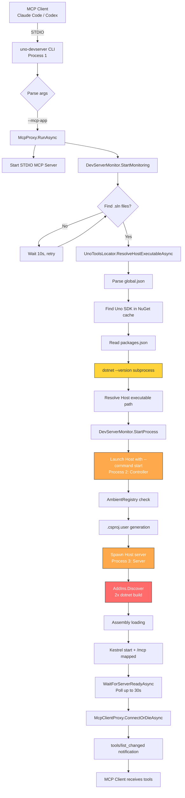

---

## 2. Detailed Sequence Diagram

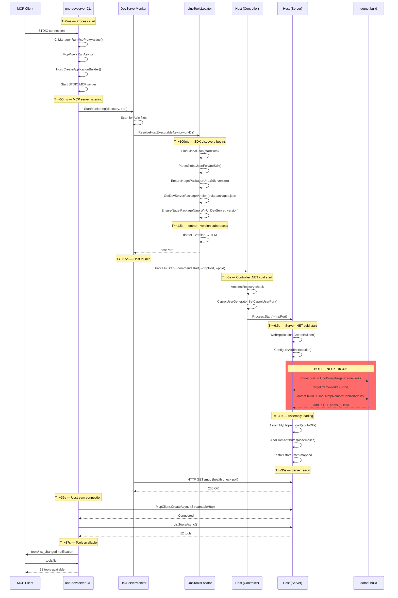

---

## 3. Process Chain Analysis

```mermaid
graph LR
    subgraph "Process 1: CLI (~1.5s cold start)"
        A1[Parse args] --> A2[DI setup]
        A2 --> A3[McpProxy.RunAsync]
        A3 --> A4[STDIO MCP server]
        A3 --> A5[DevServerMonitor]
    end

    subgraph "Process 2: Controller (~1.5s cold start)"
        B1[Parse --command start] --> B2[AmbientRegistry]
        B2 --> B3[CsprojUser gen]
        B3 --> B4[Spawn server]
    end

    subgraph "Process 3: Server (~1.5s cold start)"
        C1[WebApp builder] --> C2[ConfigureAddIns]
        C2 --> C3[AddIns.Discover]
        C3 --> C4["dotnet build #1 (TFM)"]
        C4 --> C5["dotnet build #2 (AddIns)"]
        C5 --> C6[Assembly loading]
        C6 --> C7[Kestrel start]
    end

    A5 -->|"launches"| B1
    B4 -->|"launches"| C1
    C7 -->|"HTTP /mcp"| A4

    style C3 fill:#ff6b6b,stroke:#333,color:#fff
    style C4 fill:#ff6b6b,stroke:#333,color:#fff
    style C5 fill:#ff6b6b,stroke:#333,color:#fff
```

**Overhead of 3-process chain**: Each .NET process cold start adds ~1.5s. The controller process (Process 2) adds no value in MCP mode — its responsibilities (AmbientRegistry, port allocation, .csproj.user) are either unnecessary or already handled by the CLI.

---

## 4. Add-in Discovery Deep Dive

### Current Flow (MSBuild-based)

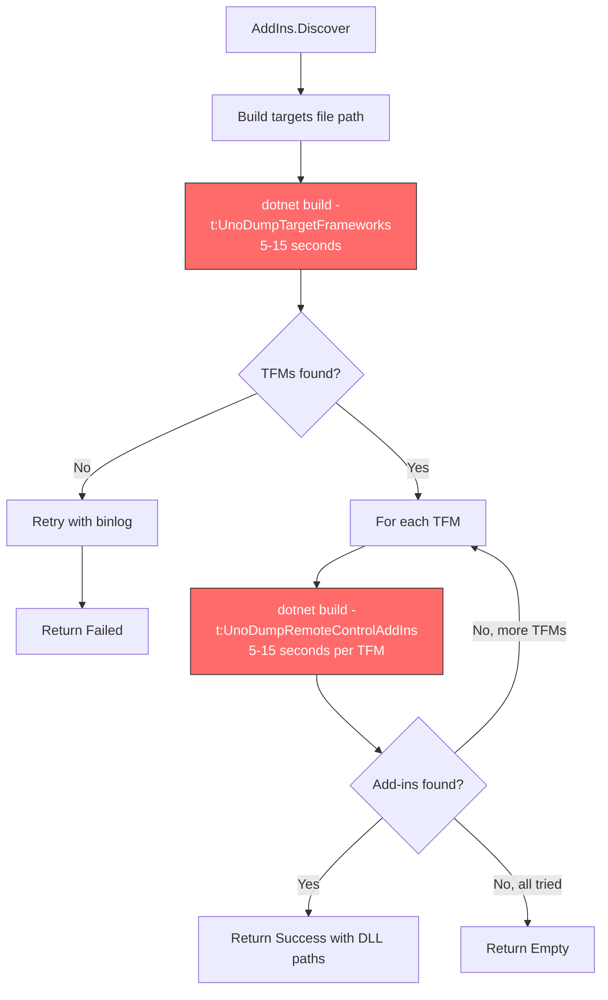

### What MSBuild Actually Resolves

The MSBuild targets (`UnoDumpRemoteControlAddIns`) collect the `UnoRemoteControlAddIns` item group. In practice, this comes from NuGet package `.targets` files:

```xml
<!-- From uno.settings.devserver: buildTransitive/Uno.Settings.DevServer.targets -->
<ItemGroup>
  <UnoRemoteControlAddIns
    Include="$(MSBuildThisFileDirectory)../tools/devserver/Uno.Settings.DevServer.dll" />
</ItemGroup>

<!-- From uno.ui.app.mcp: buildTransitive/Uno.UI.App.Mcp.targets -->
<PropertyGroup>
  <_UnoMcpServerProcessorPath
    Condition="exists('$(MSBuildThisFileDirectory)../tools/devserver/Uno.UI.App.Mcp.Server.dll')">
    $(MSBuildThisFileDirectory)../tools/devserver/Uno.UI.App.Mcp.Server.dll
  </_UnoMcpServerProcessorPath>
</PropertyGroup>
<ItemGroup>
  <UnoRemoteControlAddIns Include="$(_UnoMcpServerProcessorPath)" />
</ItemGroup>
```

Both follow the same convention:
- `.targets` in `buildTransitive/` folder
- `UnoRemoteControlAddIns` item pointing to `tools/devserver/{Name}.dll`
- `$(MSBuildThisFileDirectory)` = the `buildTransitive/` directory

**These paths are fully deterministic and can be resolved by parsing the XML directly.**

### Proposed Flow (Convention-Based `.targets` Parsing)

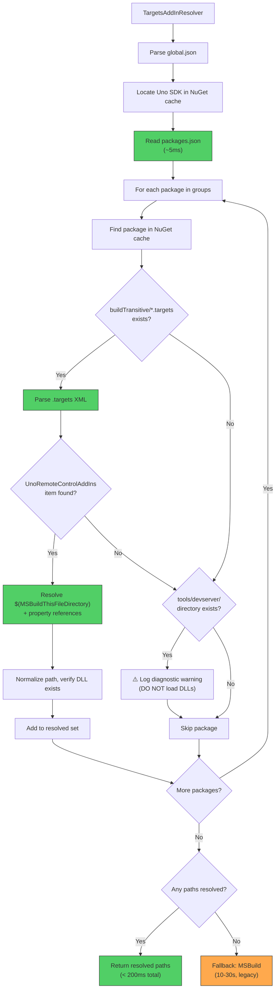

### Known Add-in Packages

| Package | `.targets` Pattern | DLL Path | Source |
|---------|-------------------|----------|--------|
| `uno.ui.app.mcp` | Property indirection + `exists()` | `tools/devserver/Uno.UI.App.Mcp.Server.dll` | `uno.app-mcp` repo |
| `uno.settings.devserver` | Direct include | `tools/devserver/Uno.Settings.DevServer.dll` | `uno.licensing` repo |

Any future add-in package following the convention (`buildTransitive/*.targets` + `tools/devserver/`) is discovered automatically.

### `.targets` Property Resolution

The parser handles a safe subset of MSBuild properties:

| Property | Resolution | Example |
|----------|-----------|---------|
| `$(MSBuildThisFileDirectory)` | Directory of the `.targets` file (with trailing separator) | `{cache}/pkg/1.0/buildTransitive/` |
| `$(MSBuildThisFile)` | Filename of the `.targets` file | `Uno.UI.App.Mcp.targets` |
| `$({UserProperty})` | Resolved from `<PropertyGroup>` elements in the same file | `_UnoMcpServerProcessorPath` |
| `exists('...')` | Checked on disk | File system check |

Properties referencing external state (`$(Configuration)`, `$(UsingUnoSdk)`, etc.) are ignored — these are only used for local development fallback paths that don't apply to NuGet cache resolution.

---

## 5. MCP Proxy Pipeline

### Current STDIO ↔ HTTP Proxy

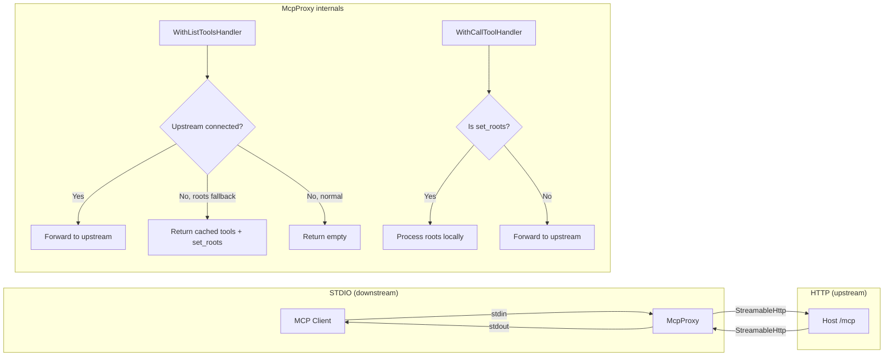

### Tool List Resolution Flow

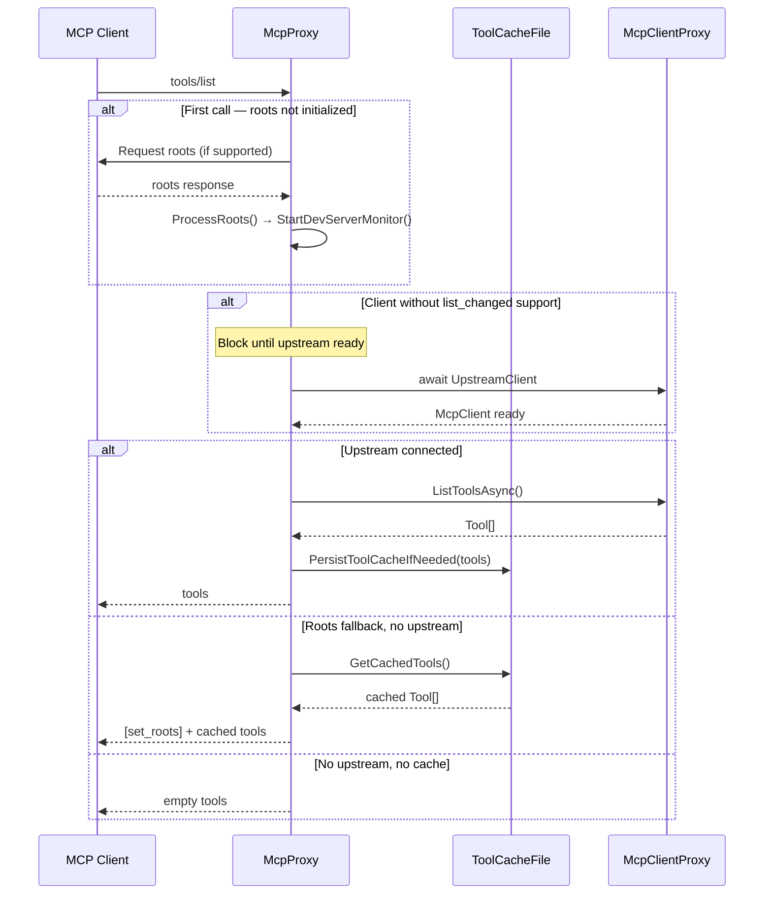

### Clients Without `list_changed` Support

The proxy has special handling for clients that don't support the `tools/list_changed` notification:

```csharp
// McpProxy.cs line 41
private static readonly string[] ClientsWithoutListUpdateSupport =
    ["claude-code", "codex", "codex-mcp-client"];
```

For these clients, the first `tools/list` call **blocks** until the upstream server is ready (line 559-567). This means the full 37s startup delay is experienced synchronously by the client.

This is the primary motivation for Phase 1a (serve cached tools immediately).

---

## 6. Proposed Workflow: Phase 0+1b (Fast Discovery + Direct Launch)

> **Maps to spec phases**: Phase 0 (convention-based `.targets` parsing, `--addins` flag) + Phase 1b (controller bypass, direct Host launch). This workflow shows the optimized path after both phases ship.

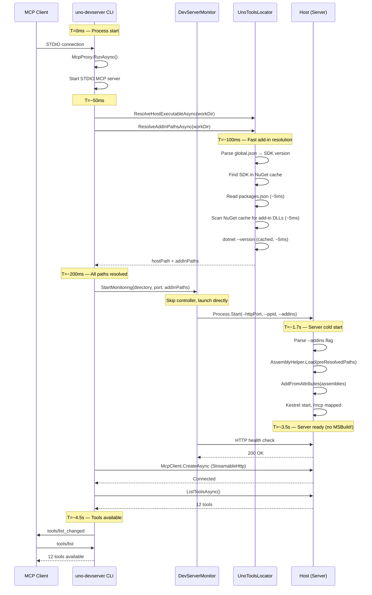

### Timing Comparison

```mermaid
gantt
    title Startup Timeline Comparison
    dateFormat X
    axisFormat %ss

    section Current (~37s)
    CLI cold start           :a1, 0, 1500
    SDK discovery            :a2, after a1, 2000
    Launch controller        :a3, after a2, 100
    Controller cold start    :a4, after a3, 1500
    Controller work          :a5, after a4, 400
    Launch server            :a6, after a5, 100
    Server cold start        :a7, after a6, 1500
    MSBuild TFM dump         :crit, a8, after a7, 10000
    MSBuild AddIns dump      :crit, a9, after a8, 10000
    Assembly loading         :a10, after a9, 500
    Kestrel + connect        :a11, after a10, 2000

    section Phase 0+1b (~5s)
    CLI cold start           :b1, 0, 1500
    SDK + addin resolution   :b2, after b1, 200
    Launch server directly   :b3, after b2, 100
    Server cold start        :b4, after b3, 1500
    Assembly loading         :b5, after b4, 500
    Kestrel + connect        :b6, after b5, 1000

    section Phase 1a+2 (<1s)
    CLI cold start (R2R)     :c1, 0, 200
    STDIO MCP + cached tools :done, c2, after c1, 50
    Background: discovery    :active, c3, after c1, 200
    Background: launch host  :active, c4, after c3, 3000
    Background: connect      :active, c5, after c4, 1000
```

---

## 7. Proposed Workflow: Phase 1a+2 (Instant MCP Start + R2R)

> **Maps to spec phases**: Phase 1a (instant MCP start, cached tools, structured errors) + Phase 2 (ReadyToRun compilation). This workflow shows the end-state where MCP tools are served from cache in < 1s.

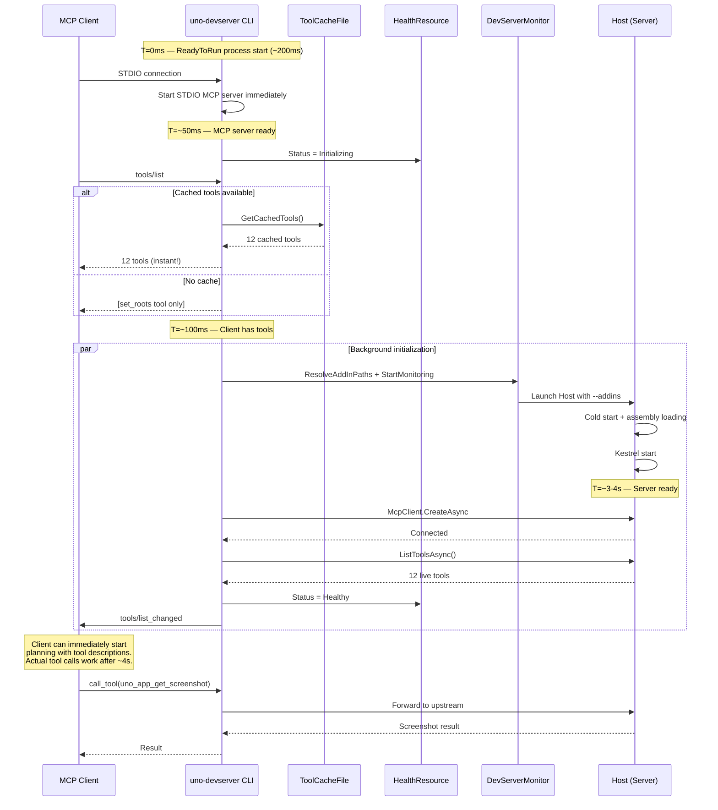

### Always-Start Pattern State Machine

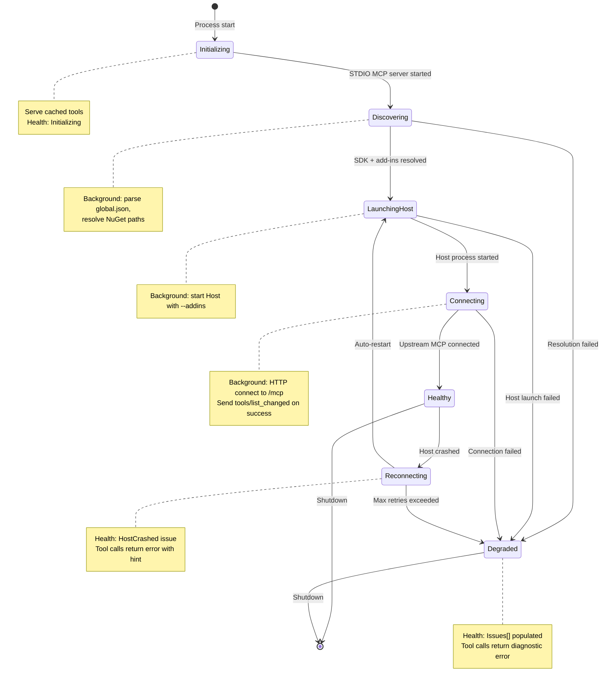

---

## 8. Data Flow: packages.json to Add-in DLLs

This diagram shows how the fast path resolves add-in DLL paths by parsing `.targets` files directly from NuGet packages.

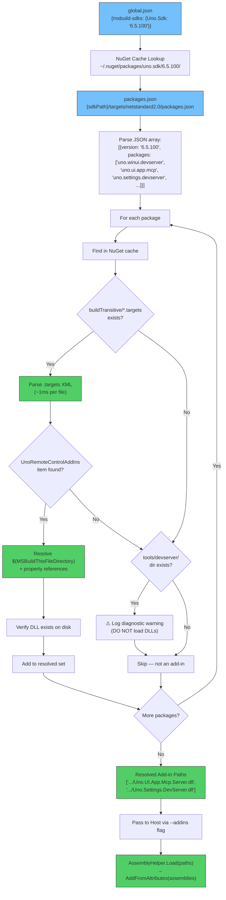

### `.targets` Parsing Example

**Simple pattern** (`uno.settings.devserver`):
```xml
<!-- {cache}/uno.settings.devserver/1.2.3/buildTransitive/Uno.Settings.DevServer.targets -->
<ItemGroup>
  <UnoRemoteControlAddIns Include="$(MSBuildThisFileDirectory)../tools/devserver/Uno.Settings.DevServer.dll" />
</ItemGroup>
```
→ `$(MSBuildThisFileDirectory)` = `{cache}/uno.settings.devserver/1.2.3/buildTransitive/`
→ Resolved: `{cache}/uno.settings.devserver/1.2.3/tools/devserver/Uno.Settings.DevServer.dll`

**Property indirection** (`uno.ui.app.mcp`):
```xml
<!-- {cache}/uno.ui.app.mcp/6.5.100/buildTransitive/Uno.UI.App.Mcp.targets -->
<PropertyGroup>
  <_UnoMcpServerProcessorPath
    Condition="exists('$(MSBuildThisFileDirectory)../tools/devserver/Uno.UI.App.Mcp.Server.dll')">
    $(MSBuildThisFileDirectory)../tools/devserver/Uno.UI.App.Mcp.Server.dll
  </_UnoMcpServerProcessorPath>
</PropertyGroup>
<ItemGroup>
  <UnoRemoteControlAddIns Include="$(_UnoMcpServerProcessorPath)" />
</ItemGroup>
```
→ Resolve `_UnoMcpServerProcessorPath` property first, then substitute in Include
→ `exists()` condition verified on disk
→ Resolved: `{cache}/uno.ui.app.mcp/6.5.100/tools/devserver/Uno.UI.App.Mcp.Server.dll`

### NuGet Cache Locations Checked

The `UnoToolsLocator.EnsureNugetPackage()` method already checks these locations (in order):

| Priority | Path | Platform |
|----------|------|----------|
| 1 | `%USERPROFILE%\.nuget\packages\{id}\{version}` | Windows |
| 1 | `~/.nuget/packages/{id}/{version}` | Linux/macOS |
| 2 | `%ProgramData%\NuGet\packages\{id}\{version}` | Windows global |
| 3 | `$NUGET_PACKAGES/{id}/{version}` | Custom env var |

### Add-in Identification Strategy

The system identifies add-in entry points using **`.targets` parsing only**:

1. **`.targets` parsing** (primary, produces loadable paths): Scan `buildTransitive/*.targets` for `UnoRemoteControlAddIns` items. Resolve `$(MSBuildThisFileDirectory)` and property references. The resolved path is the **specific entry point DLL** to load.

2. **Directory presence check** (diagnostic only, NO loading): Check if `{packageDir}/tools/devserver/` exists for packages not already resolved by step 1. Log a diagnostic warning — this package might be an add-in but its entry point couldn't be determined.

> **WARNING**: `tools/devserver/` contains the entry point DLL + ALL its dependencies (dozens of DLLs). Blindly loading all `*.dll` from this directory via `Assembly.LoadFrom()` would cause load errors, DI conflicts, and non-deterministic behavior. Only the specific DLL identified by `.targets` parsing should be loaded.

Both layers are self-discovering — no hardcoded package names. A new add-in package following the convention is found automatically.

---

## Appendix: Key Code References

### CLI Entry Point

**`CliManager.RunMcpProxyAsync()`** (`src/Uno.UI.DevServer.Cli/CliManager.cs:176-242`):
- Parses MCP-specific flags: `--port`, `--mcp-wait-tools-list`, `--force-roots-fallback`, `--force-generate-tool-cache`
- Delegates to `McpProxy.RunAsync()`

### MCP Proxy

**`McpProxy.RunAsync()`** (`src/Uno.UI.DevServer.Cli/Mcp/McpProxy.cs:53-90`):
- Entry point for MCP mode
- Calls `EnsureDevServerStartedFromSolutionDirectory()` → `StartDevServerMonitor()`
- Calls `StartMcpStdIoProxyAsync()` to start the STDIO server

**`McpProxy.StartMcpStdIoProxyAsync()`** (`McpProxy.cs:377-515`):
- Creates the STDIO MCP server via `Host.CreateApplicationBuilder().AddMcpServer().WithStdioServerTransport()`
- Registers `WithCallToolHandler` (forwards to upstream) and `WithListToolsHandler` (returns tools)
- Handles `tools/list_changed` notification from upstream via `McpClientProxy`

### DevServer Monitor

**`DevServerMonitor.RunMonitor()`** (`src/Uno.UI.DevServer.Cli/Mcp/DevServerMonitor.cs:44-146`):
- Scans for `.sln`/`.slnx` files in the working directory
- Resolves host executable via `UnoToolsLocator.ResolveHostExecutableAsync()`
- Allocates TCP port via `EnsureTcpPort()`
- Launches host with `--command start` via `StartProcess()`
- Polls `WaitForServerReadyAsync()` up to 30 attempts

### Upstream MCP Client

**`McpClientProxy.ConnectOrDieAsync()`** (`src/Uno.UI.DevServer.Cli/Mcp/McpClientProxy.cs:48-105`):
- Creates `HttpClientTransport` with `StreamableHttp` mode
- Connects to upstream at `http://localhost:{port}/mcp`
- Registers `ToolListChangedNotification` handler
- Calls `ListToolsAsync()` and triggers callback if tools found

### Host Add-ins

**`AddIns.Discover()`** (`src/Uno.UI.RemoteControl.Host/Extensibility/AddIns.cs:20-126`):
- Runs `dotnet build -t:UnoDumpTargetFrameworks` to get TFMs
- Runs `dotnet build -t:UnoDumpRemoteControlAddIns` per TFM to get DLL paths
- Returns `AddInsDiscoveryResult` with list of DLL paths

**`AddInsExtensions.ConfigureAddIns()`** (`src/Uno.UI.RemoteControl.Host/Extensibility/AddInsExtensions.cs:15-31`):
- Calls `AddIns.Discover(solutionFile)` — the bottleneck
- Loads assemblies via `AssemblyHelper.Load()`
- Registers services via `AddFromAttributes()`
- Stores `AddInsStatus` singleton

### Tool Cache

**`ToolCacheFile`** (`src/Uno.UI.DevServer.Cli/Mcp/ToolCacheFile.cs`):
- Persists tool definitions to `%LocalAppData%\Uno Platform\uno.devserver\tools-cache.json`
- Validates with SHA256 checksum and version number
- Used by `--force-roots-fallback` and `--force-generate-tool-cache` modes
- Phase 1a makes this cache the primary source for instant tool list responses
