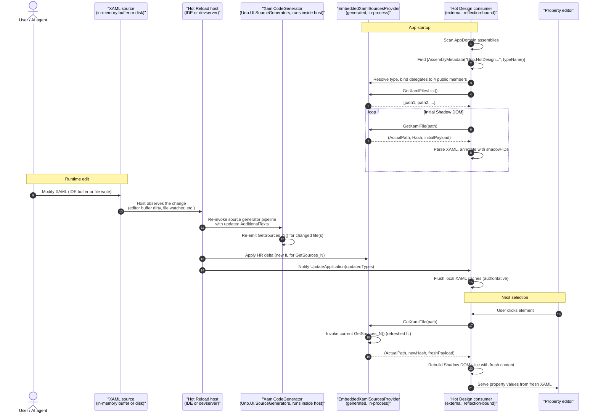

# Feature Specification: Embedded XAML Sources Provider for Hot Design

**Repo**: `uno` (Uno.UI.SourceGenerators)
**Created**: 2026-04-21
**Status**: Draft
**Input**: During a Hot Design session, the property editor shows pre-edit values after an XAML file is modified at runtime (by an AI agent, by user typing, or by any external file mutation). Selection may also fail with *"Unable to find XAML for selected element"* when the live visual tree's shadow IDs diverge from the XAML snapshot served by the provider.

---

## Overview

`EmbeddedXamlSourcesProvider` is a source-generated static class emitted per application/library by the Uno XAML source generator when the MSBuild property `UnoGenerateXamlSourcesProvider=True` is set. It exposes the project's XAML files (their content and path) to out-of-process and in-process tooling — notably the Hot Design runtime designer — via a stable reflection-friendly contract discoverable through an assembly-level `AssemblyMetadata` attribute.

This document specifies the contract the generator produces, the invariants consumers rely on, the correctness requirements that follow from the Hot Reload integration, and the responsibilities of any Hot Reload host that wants Hot Design to observe live XAML edits.

## Why a provider exists

At runtime, Hot Design needs the **source text** of every XAML file (not just the compiled visual tree) so it can:

1. Build a *Shadow DOM*: a parsed XAML document annotated with shadow-IDs (`file.xaml#Lline,Ccolumn`) that maps every live visual element back to its XAML source location.
2. Serve that XAML back to the property editor so edits in the designer can be written to disk with correct formatting/scope preservation.
3. Track which XAML files belong to the app/library versus framework assets.

Reading `.xaml` files directly from disk at runtime is **not acceptable** as an implementation strategy:

- **Cross-platform**: WebAssembly, iOS, Android, and deployed Debug builds do not generally have access to the source path recorded at build time (`ActualPath` points at the build machine's filesystem, not the runtime host's).
- **Unsaved edits**: the authoritative version of a `.xaml` being edited interactively is the **in-memory buffer of the IDE/host** (Visual Studio keeps unsaved changes in memory; Hot Reload operates on that in-memory text). A disk read lags that buffer and returns stale content for the primary developer scenario.

The provider therefore ships the XAML content *embedded* in the assembly as UTF-8 literals, produced at generator-execution time. Fresh content is delivered to the app **by the generator being re-executed during Hot Reload**, not by runtime filesystem access.

## Architecture

### Generator (Uno.UI.SourceGenerators)

- **Generator class**: `Uno.UI.SourceGenerators.XamlGenerator.XamlCodeGenerator` — a Roslyn `[Generator]`-attributed `ISourceGenerator` (legacy API, not `IIncrementalGenerator`), shipped in `Uno.UI.SourceGenerators.dll`. Declaration: `src/SourceGenerators/Uno.UI.SourceGenerators/XamlGenerator/XamlCodeGenerator.cs:15-16`.
- **Trigger**: compiler-visible MSBuild property `UnoGenerateXamlSourcesProvider=True`. Read by the generator at execution time (`src/SourceGenerators/Uno.UI.SourceGenerators/XamlGenerator/XamlCodeGeneration.cs:254`). Currently enabled in `src/SamplesApp/Directory.Build.props` and `src/Uno.UI.RuntimeTests/Directory.Build.props`.
- **Entry point for the provider emission**: `XamlCodeGeneration.GenerateEmbeddedXamlSources` in `src/SourceGenerators/Uno.UI.SourceGenerators/XamlGenerator/XamlCodeGeneration.XamlSources.cs`, invoked from `XamlCodeGenerator.Execute(GeneratorExecutionContext)`.
- **Inputs**: the generator reads the project's XAML files via Roslyn's `GeneratorExecutionContext.AdditionalFiles` at every `Execute` call. Because `XamlCodeGenerator` is a legacy `ISourceGenerator`, each host invocation runs the full `Execute` pass and re-reads all additional texts — there is no Roslyn-level incremental caching keyed on file content. Consequently, fresh XAML content propagates end-to-end as soon as the host re-invokes the generator pipeline with an updated `AdditionalFiles` collection.
- **Output**: a single generated file declaring `{RootNamespace}.__Sources__.EmbeddedXamlSourcesProvider` with:
  - An assembly-level discovery attribute (see §"Public contract").
  - A static class with a private dictionary `_XamlSources` of method-group delegates, a `_updateCounter`, and the four public API members.
  - One `GetSources_N()` method per XAML file, each returning a tuple `(hash, payload)` where `payload` is the XAML content as observed by the generator at execution time, embedded as a UTF-8 raw string literal (`"""..."""u8`).
- **Generation is gated by `UnoGenerateXamlSourcesProvider`**, not by the build configuration directly. The Uno SDK conventions default this property to `True` for Debug/Hot-Reload scenarios and `False` otherwise, so in practice the provider is absent from Release builds — but nothing in the contract prevents a project from opting in.

### Public contract (stable)

The following surface MUST be preserved across generator evolutions. It is the sole interop point with external consumers.

**Assembly-level discovery attribute:**

```csharp
[assembly: AssemblyMetadata(
    "Uno.HotDesign.HotReloadEmbeddedXamlSourceFilesProvider",
    "<FullyQualifiedProviderTypeName>")]
```

**Public static API of the emitted type:**

| Member | Signature | Contract |
|---|---|---|
| `GetNormalizedFileName` | `public static string? GetNormalizedFileName(string path)` | Returns the normalized form of a known file path, or `null` if the path is not tracked. Normalization replaces `\` with `/`; the returned string preserves the original casing. Lookup is case-insensitive (the internal dictionary uses `StringComparer.OrdinalIgnoreCase`), so callers may pass any casing for `path`. The returned value is stable and safe to use as an ordinal dictionary key. |
| `GetXamlFilesList` | `public static IReadOnlyList<string> GetXamlFilesList()` | Exhaustive, deterministic list of every tracked XAML file (normalized paths). Stable for the process lifetime unless the file set changes through Hot Reload. |
| `GetXamlFile` | `public static (string ActualPath, string Hash, string Payload)? GetXamlFile(string path)` | Returns the source content for a tracked file as seen by the generator at its last execution (initial build, or HR re-execution). `Payload` MUST NOT be computed by reading the runtime filesystem (see §"Freshness" below). `Hash` MUST be stable for a given `Payload`. |
| `UpdateCounter` | `public static uint UpdateCounter { get; }` | Monotonically increasing observable counter. Observable, not decisional: consumers MUST NOT rely on it to decide whether to invalidate — they flush authoritatively on hot-reload notifications. Exposed for diagnostics and for potential third-party pull/polling consumers. |

### Freshness model

The freshness of `GetXamlFile(path).Payload` derives **exclusively** from the generator being re-executed with updated inputs. There is no runtime refresh mechanism inside the provider itself; the provider is a passive carrier of whatever IL the last successful generator execution emitted.

This means the Hot Reload host is responsible for ensuring the source generator participates in every HR emission that touches XAML (see FR-006 below). When it does:

1. The generator re-runs with the updated `AdditionalText` for the changed `.xaml`.
2. A new IL body for the relevant `GetSources_N()` method is emitted in the HR delta.
3. The delta is applied to the running app; subsequent calls to `GetXamlFile(path)` return the new payload through the same (unchanged) dictionary of method-group delegates.

If the host does not re-invoke the generator, the provider has no way to notice and will keep serving the compile-time initial payload indefinitely — the bug described in §"Problem Statement".

### Consumer pipeline (conceptual, not implementation-prescriptive)



Key conceptual points:

- The consumer is **not assumed** to use `UpdateCounter` for cache invalidation. It flushes authoritatively on each hot-reload notification. The counter is an observable diagnostic, not a synchronization primitive.
- There can be zero, one, or many providers per process (one per app/library with XAML). The consumer treats them as a composite.
- **The provider is a passive carrier**. Every arrow between `Source` and `Provider` goes through `Host` and `Generator`. There is no direct runtime link between `Source` and `Provider`.

### Hot Reload behaviour of the generated type

- `ClientHotReloadProcessor.Common.Status.cs` explicitly filters `EmbeddedXamlSourcesProvider` out of the user-visible hot-reload types list (so users do not see the generator's internal artifact in HR reports). See `src/Uno.UI.RemoteControl/HotReload/ClientHotReloadProcessor.Common.Status.cs` (see `GetCuratedTypes` / the `"EmbeddedXamlSourcesProvider"` filter).
- Delegates inside `_XamlSources` MUST be method groups (not lambdas). Closures capture the enclosing lexical scope and defeat HR delta retargeting; method groups do not. Historical comment in the generator: *"Use method groups to avoid closure allocation and ensure no lambda is created, to allow proper HR support"*.
- Because `XamlCodeGenerator` is an `ISourceGenerator` (not `IIncrementalGenerator`), it has no internal caching keyed on file content — every `Execute` call processes the current `AdditionalFiles` from scratch. Fresh XAML therefore flows into `GetSources_N()` as soon as the host re-invokes the generator. **But that only matters if the host actually runs the generator on each HR emission** (FR-007).

## Problem Statement

Observed symptom: when a `.xaml` file is edited at runtime in a Hot Design session hosted by a custom Hot Reload host (not Visual Studio), `GetXamlFile(path)` continues to return the compile-time baked payload despite the runtime visual tree being correctly updated.

Empirical diagnosis showed that after three distinct edits of the same file, the provider's returned hash, payload length, and key content markers are all identical to the initial build output. The visual tree is updated (other types in the HR delta carry new IL), but `GetSources_N()` method bodies remain frozen for the lifetime of the process.

**Root cause**: the Hot Reload host does not re-invoke `Uno.UI.SourceGenerators.XamlGenerator.XamlCodeGenerator` during its HR delta-emission pipeline. The generator is therefore never given the opportunity to observe the modified `AdditionalFiles` entry and re-emit the corresponding `GetSources_N()` body. The IL in the HR delta contains only updates to user types, not to the generated provider.

This is **not** a bug in the provider or in the generator code path itself — both behave correctly when the generator runs. It is a gap in the host's HR pipeline. This specification captures the contract so that every host implementer knows what they are responsible for (FR-006).

Attempted workarounds that should be rejected:

- **Runtime disk read in `GetXamlFile`**: introduces a dependency on the build-machine path being reachable from the runtime host — fails on WebAssembly, iOS, Android, deployed Debug builds. Also lags the IDE's in-memory buffer for unsaved edits. Does not fix the real problem; masks it on one narrow configuration.
- **MetadataUpdateHandler that invalidates `_XamlSources`**: the cache is correctly invalidated, but the dictionary's method-group delegates still point at the same `GetSources_N()` methods whose IL has not been refreshed. Has no observable effect on the symptom.

## Requirements

### Functional Requirements

- **FR-001 — Discovery key**: the assembly MUST expose `[AssemblyMetadata("Uno.HotDesign.HotReloadEmbeddedXamlSourceFilesProvider", "<FullTypeName>")]` unchanged. This is the only interop point with external consumers.
- **FR-002 — Public static surface**: the generated type MUST expose `GetNormalizedFileName(string)`, `GetXamlFilesList()`, `GetXamlFile(string)`, and `UpdateCounter { get; }` with the exact historical signatures.
- **FR-003 — `GetXamlFile` content source**: `Payload` MUST be the XAML content as observed by the generator at its most recent execution. The provider MUST NOT perform runtime filesystem I/O to obtain or refresh `Payload`. Rationale: (a) runtime file paths are not generally reachable on WebAssembly, iOS, Android, and deployed Debug builds; (b) IDE-hosted interactive edits exist only in memory until the user saves — disk is by construction stale for that primary scenario.
- **FR-004 — Hash stability**: `Hash` MUST be stable for a given `Payload` (identical content ⇒ identical hash) across repeated calls within a process. Consumers treat the hash as opaque; the specific algorithm is an implementation detail but MUST satisfy content-sensitivity.
- **FR-005 — File list stability**: `GetXamlFilesList()` MUST return the complete set of tracked XAML files, in a deterministic order, stable across process lifetime unless Hot Reload adds or removes files.
- **FR-006 — Generator input freshness**: each `Execute` call of `Uno.UI.SourceGenerators.XamlGenerator.XamlCodeGenerator` re-reads XAML content from `GeneratorExecutionContext.AdditionalFiles`. The emitted `GetSources_N()` bodies reflect the content available through that collection at that moment. Any host that wants fresh XAML in the provider MUST therefore ensure the `AdditionalFiles` passed to the generator at HR time reflects the authoritative current source.
- **FR-007 — Hot Reload host responsibility**: any environment that performs Hot Reload against an Uno app using this provider MUST re-invoke the Roslyn source-generator pipeline (including `XamlCodeGenerator`) as part of its HR delta emission, passing updated `AdditionalFiles` that reflect the authoritative current source — the IDE's in-memory buffer for interactive editors, or the file content at the moment of delta emission for headless hosts. Hosts that skip generator re-execution will cause `GetXamlFile` to serve the compile-time initial payload indefinitely; this is a host-side bug, not a provider-side one.
- **FR-008 — Method-group delegates**: getters in `_XamlSources` MUST remain method-group references to private static methods (no lambdas, no closures), preserving HR compatibility. The HR runtime relies on this to retarget delegate invocations to the newly-emitted method bodies.
- **FR-009 — Release configuration**: the provider is NOT emitted when `UnoGenerateXamlSourcesProvider` is false/unset. Unchanged from historical behaviour.
- **FR-010 — Clean operation**: the provider MUST NOT write to `Console.Out` or `Console.Error` under any code path. Any diagnostics MUST flow through the Uno logging channel.
- **FR-011 — Snapshot test parity**: the generator output snapshots under `src/SourceGenerators/Uno.UI.SourceGenerators.Tests/XamlCodeGeneratorTests/Out/Given_HotReloadEnabledInBuild/**` and `Out/Given_GenerateEmbeddedXamlSources/**` MUST match the generator's current emission. Any change to the emission format requires updating the snapshots in the same commit.

### Non-Goals

- Providing a runtime refresh mechanism inside the provider (e.g. disk fallback, file watcher, WebSocket listener). The provider is intentionally passive — the HR host is the source of freshness.
- Rewriting any Hot Reload host (Visual Studio's, `dotnet watch`'s, or custom hosts). This spec describes what the contract expects from them; their internals are out of scope.
- Providing this provider in Release builds.
- Supporting a write API on the provider. Writes go through the regular file system / editor buffer.
- Guaranteeing byte-for-byte identity between the payload emitted at compile time and the payload emitted by a later HR re-execution, beyond what the generator's deterministic output guarantees (e.g. encoding normalization may differ if the input `AdditionalText` carries a BOM).

## Success Criteria

- **SC-001 — Observed freshness with a compliant host**: when the Hot Reload host re-invokes the generator on XAML edits (FR-007), a subsequent call to `GetXamlFile(path)` returns content equal to the host's view of the current source. Verifiable end-to-end by editing an element's property in Visual Studio and observing the updated value in Hot Design's property editor on the next selection.
- **SC-002 — Diagnosability with a non-compliant host**: when the host fails to re-invoke the generator after a content-only edit, the `GetXamlFile(path)` payload stays **bit-identical to the compile-time baked output across edits** — this is the primary signal that localises the bug to the host (not to the provider or to Hot Design). Note: `UpdateCounter` alone is **not** a reliable diagnostic because the generator only bumps it when `_filesListHash` changes (i.e. the set of tracked paths changed); a host that re-invokes the generator on content-only edits does not necessarily bump the counter either. The `Payload`/`Hash` identity check across edits is the authoritative signal.
- **SC-003 — No stdout noise**: exercising a full Hot Design session with several XAML edits produces zero `stdout` lines originating from the provider.
- **SC-004 — Snapshot tests pass**: `Uno.UI.SourceGenerators.Tests` filtered on `Given_HotReloadEnabledInBuild` and `Given_GenerateEmbeddedXamlSources` all pass against the current generator output.
- **SC-005 — Cross-platform parity**: the provider's contract holds identically on WebAssembly, iOS, Android, Linux, macOS, and Windows — because correctness never depends on runtime filesystem access.

## Edge Cases

- **File path casing on Windows**: path normalization replaces `\` with `/` but preserves casing; the dictionary used for lookup applies `StringComparer.OrdinalIgnoreCase`, so callers may pass any casing.
- **File encoding / BOM**: the generator observes `AdditionalText` content as Roslyn provides it (encoding already normalized by the compiler's input pipeline). There is no BOM mismatch at the runtime side because no runtime file reads occur.
- **File added / removed via Hot Reload**: on a compliant host, the generator re-runs with the new file set and `GetXamlFilesList()` returns the updated list after the delta is applied. `UpdateCounter` bumps when `_filesListHash` changes (i.e. when the set of tracked paths changes) — it does not bump on pure content edits to existing files.
- **Multi-ALC scenarios**: each ALC loads its own assemblies, so discovery via `AppDomain.CurrentDomain.GetAssemblies()` may yield duplicates or per-ALC providers. Deduplication and ALC scoping are the consumer's responsibility — see `specs/039-alc-aware-hotreload-handlers/spec.md` for the broader ALC-scoped hot-reload handler design.
- **Concurrent HR emissions**: the provider's `EnsureInitialize` uses `Interlocked.CompareExchange` to race-resolve; duplicate work is idempotent and does not corrupt state.
- **Very large XAML files**: each `GetSources_N()` invocation materializes the payload string from a baked UTF-8 blob. Cost is proportional to file size but is paid only on first access per flush cycle, not on every provider call.

## Related Documents

- `doc/articles/uno-development/uno-internals-hotreload.md` — Hot Reload phases, `MetadataUpdateHandlerAttribute` pattern, visual-tree traversal hooks.
- `specs/039-alc-aware-hotreload-handlers/spec.md` — ALC scoping for hot-reload handlers and discovery.
- `src/SourceGenerators/Uno.UI.SourceGenerators/XamlGenerator/XamlCodeGenerator.cs` — the `[Generator]`-attributed class (`Uno.UI.SourceGenerators.XamlGenerator.XamlCodeGenerator`).
- `src/SourceGenerators/Uno.UI.SourceGenerators/XamlGenerator/XamlCodeGeneration.XamlSources.cs` — provider-emission logic invoked from the generator.
- `src/SourceGenerators/Uno.UI.SourceGenerators.Tests/XamlCodeGeneratorTests/Given_GenerateEmbeddedXamlSources.cs` and `Given_HotReloadEnabledInBuild.cs` — behavioural snapshot tests.
- `src/Uno.UI.RemoteControl/HotReload/ClientHotReloadProcessor.Common.Status.cs` (see `GetCuratedTypes` / the `"EmbeddedXamlSourcesProvider"` filter) — filtering of `EmbeddedXamlSourcesProvider` out of user-visible HR type lists.
