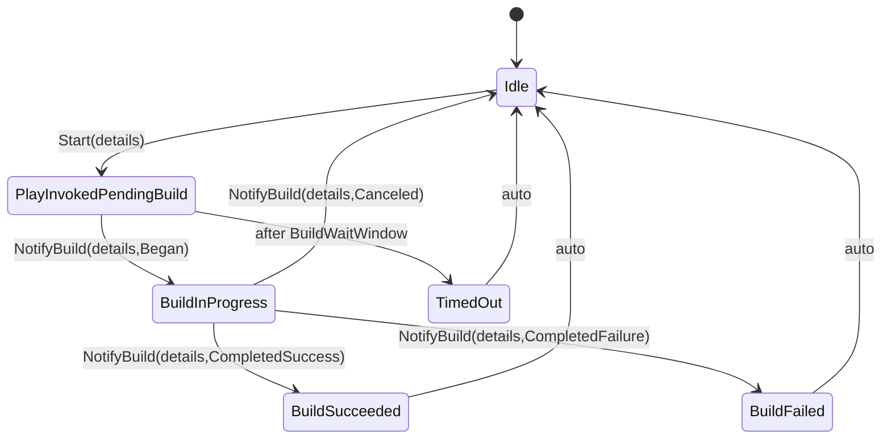

# VsAppLaunchStateService<TStateDetails>

A small, deterministic state machine that decides when a VS "Play" (Debug/Run) should be considered an application launch. It correlates a Play intent with the next build within a short time window and reports state transitions.

## Highlights
- Generic correlation payload `TStateDetails` chosen by the caller (project path, Guid, tuple, etc.).
- Small API: `Start`, `NotifyBuild`, `Reset`.
- Single `StateChanged` event with the correlated `StateDetails` in the payload.
- Time is virtualizable via `System.TimeProvider` (polyfilled on net48) to make tests deterministic.

## API
- `Start(TStateDetails details)`: mark a Play intent and open a short window for a build to begin.
- `NotifyBuild(TStateDetails details, BuildNotification notification)`: inform the state machine of build events for the same details.
  - `BuildNotification`: `Began` | `Canceled` | `CompletedSuccess` | `CompletedFailure`
- `Reset()`: cancel the current wait/build and return to `Idle` (clears the correlated details).
- `event StateChanged(object sender, StateChangedEventArgs<TStateDetails> e)`: raised on every state transition with `TimestampUtc`, `Previous`, `Current`, `StateDetails`. The convenience property `e.Succeeded` is true only when `Current == BuildSucceeded`.

## Options
- `Options.BuildWaitWindow` (default 5 seconds): time to wait after `Start` for a build to begin.

## States
- `Idle`
- `PlayInvokedPendingBuild`
- `BuildInProgress`
- `BuildSucceeded` (transient)
- `BuildFailed` (transient)
- `TimedOut` (transient)

Mermaid

## Notes
- Correlation: only events with the same `TStateDetails` affect the in‑flight cycle; others are ignored.
- Threading: events may be raised from a thread pool callback; marshal to UI if needed.
- Reset semantics: `Reset()` clears any active correlated `StateDetails` so `Idle` states are emitted without an active payload.
- Out-of-order completion: reporting `CompletedSuccess`/`CompletedFailure` is supported even if `Began` wasn't observed; the cycle transitions to the corresponding outcome and then `Idle`.
